```python
import pandas as pd
import numpy as np
import matplotlib.pyplot as plt
```


```python
pd.options.display.float_format = '{:.4f}'.format
```


```python
SUB_TICKERS = ['2059', '3529', '2383', '2330', '8069', '5274', '3008', '2454', '3533']
```

## 月營收


```python
mon_df = pd.read_feather('/Users/roberthsu/Documents/TrendForce_project/cmoney_warehouse/monthly/monthly_revenue.ftr')
```


```python
mon_df = mon_df[mon_df['股票代號'].isin(SUB_TICKERS)]
mon_df = mon_df[~mon_df['公告日'].isna()]
```


```python
mon_df['公告日_dt'] = pd.to_datetime(mon_df['公告日'])
mon_df.sort_values('公告日_dt', inplace=True, ascending=True)
mon_df.reset_index(drop=True, inplace=True)
```

## 收盤價


```python
price_df = pd.read_feather('/Users/roberthsu/Documents/TrendForce_project/cmoney_warehouse/daily/org_price.ftr')
```


```python
price0050 = price_df[price_df['股票代號']=='0050']
```


```python
price0050['日期_dt'] = pd.to_datetime(price0050['日期'])
price0050.sort_values('日期_dt', inplace=True, ascending=True)
price0050.reset_index(drop=True, inplace=True)
```

    /var/folders/l8/m7cjxss57kbc_bplh66qpmy40000gn/T/ipykernel_4023/1320320034.py:1: SettingWithCopyWarning: 
    A value is trying to be set on a copy of a slice from a DataFrame.
    Try using .loc[row_indexer,col_indexer] = value instead
    
    See the caveats in the documentation: https://pandas.pydata.org/pandas-docs/stable/user_guide/indexing.html#returning-a-view-versus-a-copy
      price0050['日期_dt'] = pd.to_datetime(price0050['日期'])
    /var/folders/l8/m7cjxss57kbc_bplh66qpmy40000gn/T/ipykernel_4023/1320320034.py:2: SettingWithCopyWarning: 
    A value is trying to be set on a copy of a slice from a DataFrame
    
    See the caveats in the documentation: https://pandas.pydata.org/pandas-docs/stable/user_guide/indexing.html#returning-a-view-versus-a-copy
      price0050.sort_values('日期_dt', inplace=True, ascending=True)


```python
price_df = price_df[price_df['股票代號'].isin(SUB_TICKERS)]
```


```python
price_df['日期_dt'] = pd.to_datetime(price_df['日期'])
price_df.sort_values('日期_dt', inplace=True, ascending=True)
price_df.reset_index(drop=True, inplace=True)
```


```python
def holding_nDays(df):
    for n in [5, 10, 20, 60, 120]:
        df[f'hold_{n}Days_ret'] = (df['收盤價'].shift(-n) / df['收盤價']) - 1
        df[f'hold_{n}Days_ret'] = df[f'hold_{n}Days_ret'].shift(-1) # 實際上隔日才能操作
        df[f'last_{n}Days_ret'] = df[f'hold_{n}Days_ret'].shift(n + 2) # 實際上隔日才能操作

        df[f'hold_{n}Days_winrate'] = df[f'hold_{n}Days_ret'].apply(lambda x : 1 if x > 0 else 0)
    return df
```


```python
price_df = price_df.groupby('股票代號').apply(holding_nDays).reset_index(drop=True)
```

    /var/folders/l8/m7cjxss57kbc_bplh66qpmy40000gn/T/ipykernel_4023/392270890.py:1: DeprecationWarning: DataFrameGroupBy.apply operated on the grouping columns. This behavior is deprecated, and in a future version of pandas the grouping columns will be excluded from the operation. Either pass `include_groups=False` to exclude the groupings or explicitly select the grouping columns after groupby to silence this warning.
      price_df = price_df.groupby('股票代號').apply(holding_nDays).reset_index(drop=True)


```python
price0050 = price0050.groupby('股票代號').apply(holding_nDays).reset_index(drop=True)
```

    /var/folders/l8/m7cjxss57kbc_bplh66qpmy40000gn/T/ipykernel_4023/2395123834.py:1: DeprecationWarning: DataFrameGroupBy.apply operated on the grouping columns. This behavior is deprecated, and in a future version of pandas the grouping columns will be excluded from the operation. Either pass `include_groups=False` to exclude the groupings or explicitly select the grouping columns after groupby to silence this warning.
      price0050 = price0050.groupby('股票代號').apply(holding_nDays).reset_index(drop=True)


```python
price_df = price_df.merge(price0050, how='left', left_on=(['日期_dt']), right_on=(['日期_dt']), suffixes=('', '_0050'))
```

## 融資


```python
margin_df = pd.read_feather('/Users/roberthsu/Documents/TrendForce_project/cmoney_warehouse/daily/dayMarginTrading.ftr', columns=['日期', '股票代號', '資餘', '券餘', '券資比', '當沖比率', '融資成本(推估)', '融券成本(推估)', '融資維持率(%)', '融券維持率(%)','整體維持率(%)'])
```


```python
price_df = price_df.merge(margin_df, how='left', left_on=(['日期', '股票代號']), right_on=(['日期', '股票代號']))
```


```python
price_df['維持率反推融資平均損益'] = ((price_df['融資維持率(%)'] * 0.6) - 100) /100
```

## 週集保


```python
weekly_depostie = pd.read_feather('/Users/roberthsu/Documents/TrendForce_project/cmoney_warehouse/weeklyDepository.ftr')
```


```python
weekly_depostie = weekly_depostie[weekly_depostie['股票代號'].isin(SUB_TICKERS)]
```


```python
weekly_depostie.sort_values('日期', inplace=True)
weekly_depostie.reset_index(drop=True, inplace=True)
```


```python
agg = weekly_depostie[weekly_depostie['持股分級'].isin(['0400001-0600000', '0600001-0800000', '0800001-1000000', '1000001以上'])].groupby(['日期', '股票代號'])['佔集保庫存數比例(%)'].sum().to_frame()
```


```python
agg.reset_index(drop=False, inplace=True)
```


```python
company_event = pd.read_feather('/Users/roberthsu/Documents/TrendForce_project/cmoney_warehouse/daily/company_event.ftr')
```


```python
company_event = company_event[company_event['股票代號'].isin(SUB_TICKERS)]
```


```python
date_pattern = r'^\d{8}$'
company_event = company_event[company_event['日期'].str.contains(date_pattern)]
```


```python
company_event['日期_dt'] = pd.to_datetime(company_event['日期'])
```


```python
company_event['friday_of_week'] = company_event['日期_dt'] + pd.offsets.Week(weekday=4)
company_event['adjust_week'] = 0
company_event.loc[(company_event['新股上市']==0) | (company_event['減資前']==0), 'adjust_week'] = 1
```


```python
agg['日期_dt'] = pd.to_datetime(agg['日期'])
agg['year'] = agg['日期_dt'].dt.year
```


```python
agg['週集保月線'] = agg.groupby(['股票代號'])['佔集保庫存數比例(%)'].rolling(4).mean().reset_index(level=0, drop=True)
agg['週集保半年線'] = agg.groupby(['股票代號'])['佔集保庫存數比例(%)'].rolling(24).mean().reset_index(level=0, drop=True)
```


```python
agg['週集保diff'] = agg.groupby(['股票代號'])['佔集保庫存數比例(%)'].diff().reset_index(level=0, drop=True)
```


```python
agg = agg.merge(company_event.loc[company_event['adjust_week']==1, ['friday_of_week', '股票代號', '減資前', '新股上市', 'adjust_week']], how='left', left_on=(['日期_dt', '股票代號']), right_on=(['friday_of_week', '股票代號']))
```


```python
# 有股數異動 當周週集保diff -> 0
agg.loc[agg['adjust_week']==1, '週集保diff'] = 0

```


```python
agg['週集保diff4week'] = agg.groupby(['股票代號'])['週集保diff'].rolling(4).sum().reset_index(level=0, drop=True)
```


```python
price_df = price_df.merge(agg, how='left', left_on=(['日期', '股票代號']), right_on=(['日期', '股票代號']))
```


```python
price_df['cut'] = pd.qcut(price_df['last_20Days_ret_0050'], 10)
res = price_df.groupby(['cut', '股票代號'])['hold_20Days_ret'].mean().reset_index(drop=False)
res['hold_20Days_winrate'] = price_df.groupby(['cut', '股票代號'])['hold_20Days_winrate'].mean().reset_index(drop=True) 
res['signal_count'] = price_df.groupby(['cut', '股票代號'])['hold_20Days_winrate'].count().reset_index(drop=True)
res
```

    /var/folders/l8/m7cjxss57kbc_bplh66qpmy40000gn/T/ipykernel_17654/3876432843.py:2: FutureWarning: The default of observed=False is deprecated and will be changed to True in a future version of pandas. Pass observed=False to retain current behavior or observed=True to adopt the future default and silence this warning.
      res = price_df.groupby(['cut', '股票代號'])['hold_20Days_ret'].mean().reset_index(drop=False)
    /var/folders/l8/m7cjxss57kbc_bplh66qpmy40000gn/T/ipykernel_17654/3876432843.py:3: FutureWarning: The default of observed=False is deprecated and will be changed to True in a future version of pandas. Pass observed=False to retain current behavior or observed=True to adopt the future default and silence this warning.
      res['hold_20Days_winrate'] = price_df.groupby(['cut', '股票代號'])['hold_20Days_winrate'].mean().reset_index(drop=True)
    /var/folders/l8/m7cjxss57kbc_bplh66qpmy40000gn/T/ipykernel_17654/3876432843.py:4: FutureWarning: The default of observed=False is deprecated and will be changed to True in a future version of pandas. Pass observed=False to retain current behavior or observed=True to adopt the future default and silence this warning.
      res['signal_count'] = price_df.groupby(['cut', '股票代號'])['hold_20Days_winrate'].count().reset_index(drop=True)


<div>
<style scoped>
    .dataframe tbody tr th:only-of-type {
        vertical-align: middle;
    }

    .dataframe tbody tr th {
        vertical-align: top;
    }

    .dataframe thead th {
        text-align: right;
    }
</style>
<table border="1" class="dataframe">
  <thead>
    <tr style="text-align: right;">
      <th></th>
      <th>cut</th>
      <th>股票代號</th>
      <th>hold_20Days_ret</th>
      <th>hold_20Days_winrate</th>
      <th>signal_count</th>
    </tr>
  </thead>
  <tbody>
    <tr>
      <th>0</th>
      <td>(-0.332, -0.052]</td>
      <td>2059</td>
      <td>0.0105</td>
      <td>0.5371</td>
      <td>499</td>
    </tr>
    <tr>
      <th>1</th>
      <td>(-0.332, -0.052]</td>
      <td>2330</td>
      <td>0.0194</td>
      <td>0.6019</td>
      <td>540</td>
    </tr>
    <tr>
      <th>2</th>
      <td>(-0.332, -0.052]</td>
      <td>2383</td>
      <td>0.0275</td>
      <td>0.6037</td>
      <td>540</td>
    </tr>
    <tr>
      <th>3</th>
      <td>(-0.332, -0.052]</td>
      <td>2454</td>
      <td>0.0239</td>
      <td>0.5889</td>
      <td>540</td>
    </tr>
    <tr>
      <th>4</th>
      <td>(-0.332, -0.052]</td>
      <td>3008</td>
      <td>0.0184</td>
      <td>0.5852</td>
      <td>540</td>
    </tr>
    <tr>
      <th>...</th>
      <td>...</td>
      <td>...</td>
      <td>...</td>
      <td>...</td>
      <td>...</td>
    </tr>
    <tr>
      <th>85</th>
      <td>(0.0713, 0.229]</td>
      <td>3008</td>
      <td>0.0168</td>
      <td>0.4422</td>
      <td>536</td>
    </tr>
    <tr>
      <th>86</th>
      <td>(0.0713, 0.229]</td>
      <td>3529</td>
      <td>0.0177</td>
      <td>0.4730</td>
      <td>296</td>
    </tr>
    <tr>
      <th>87</th>
      <td>(0.0713, 0.229]</td>
      <td>3533</td>
      <td>0.0300</td>
      <td>0.4904</td>
      <td>418</td>
    </tr>
    <tr>
      <th>88</th>
      <td>(0.0713, 0.229]</td>
      <td>5274</td>
      <td>0.0291</td>
      <td>0.5131</td>
      <td>267</td>
    </tr>
    <tr>
      <th>89</th>
      <td>(0.0713, 0.229]</td>
      <td>8069</td>
      <td>0.0766</td>
      <td>0.6094</td>
      <td>512</td>
    </tr>
  </tbody>
</table>
<p>90 rows × 5 columns</p>
</div>


```python
res = res.merge(price_df.groupby('股票代號')['hold_20Days_ret'].mean().reset_index(drop=False), how='left', left_on=('股票代號'), right_on=('股票代號'), suffixes=('', '_baseline'))
```


```python
res['diff_ret'] = res['hold_20Days_ret'] - res['hold_20Days_ret_baseline']
```


```python
for ticker in SUB_TICKERS:
    print(res.loc[res['股票代號']==ticker, ['cut', '股票代號', 'diff_ret', 'hold_20Days_winrate', 'signal_count']])
```

                         cut  股票代號  diff_ret  hold_20Days_winrate  signal_count
    0      (-7.381, -0.0403]  2059    0.0074               0.5253           297
    9     (-0.0403, -0.0209]  2059   -0.0003               0.5539           612
    18    (-0.0209, -0.0112]  2059   -0.0105               0.5278           612
    27   (-0.0112, -0.00457]  2059    0.0055               0.6105           493
    36  (-0.00457, 0.000588]  2059   -0.0055               0.5302           464
    45    (0.000588, 0.0064]  2059   -0.0165               0.5211           474
    54      (0.0064, 0.0132]  2059   -0.0066               0.5511           470
    63      (0.0132, 0.0236]  2059    0.0048               0.5630           579
    72      (0.0236, 0.0459]  2059    0.0154               0.4592           368
    81       (0.0459, 6.477]  2059   -0.0042               0.4848           330
                         cut  股票代號  diff_ret  hold_20Days_winrate  signal_count
    5      (-7.381, -0.0403]  3529    0.0076               0.5681           639
    14    (-0.0403, -0.0209]  3529    0.0057               0.5977           430
    23    (-0.0209, -0.0112]  3529    0.0197               0.6016           251
    32   (-0.0112, -0.00457]  3529   -0.0115               0.4541           185
    41  (-0.00457, 0.000588]  3529   -0.0182               0.4237           118
    50    (0.000588, 0.0064]  3529    0.0286               0.5524           105
    59      (0.0064, 0.0132]  3529    0.0080               0.5088           114
    68      (0.0132, 0.0236]  3529    0.0233               0.6364           132
    77      (0.0236, 0.0459]  3529   -0.0101               0.5516           368
    86       (0.0459, 6.477]  3529   -0.0001               0.5152           924
                         cut  股票代號  diff_ret  hold_20Days_winrate  signal_count
    2      (-7.381, -0.0403]  2383   -0.0163               0.5163           337
    11    (-0.0403, -0.0209]  2383   -0.0155               0.6022           450
    20    (-0.0209, -0.0112]  2383    0.0208               0.5992           509
    29   (-0.0112, -0.00457]  2383    0.0109               0.6031           456
    38  (-0.00457, 0.000588]  2383   -0.0056               0.5408           845
    47    (0.000588, 0.0064]  2383    0.0085               0.5935           866
    56      (0.0064, 0.0132]  2383    0.0112               0.5605           860
    65      (0.0132, 0.0236]  2383   -0.0099               0.4559           601
    74      (0.0236, 0.0459]  2383    0.0042               0.4363           314
    83       (0.0459, 6.477]  2383    0.0311               0.5296           287
                         cut  股票代號  diff_ret  hold_20Days_winrate  signal_count
    1      (-7.381, -0.0403]  2330   -0.0388               0.4315           788
    10    (-0.0403, -0.0209]  2330    0.0045               0.5472           424
    19    (-0.0209, -0.0112]  2330   -0.0026               0.5797           364
    28   (-0.0112, -0.00457]  2330    0.0076               0.6842           741
    37  (-0.00457, 0.000588]  2330   -0.0034               0.6103           839
    46    (0.000588, 0.0064]  2330   -0.0058               0.5833           768
    55      (0.0064, 0.0132]  2330   -0.0045               0.6129           824
    64      (0.0132, 0.0236]  2330    0.0027               0.6062           617
    73      (0.0236, 0.0459]  2330    0.0221               0.6621           441
    82       (0.0459, 6.477]  2330   -0.0033               0.5289           484
                         cut  股票代號  diff_ret  hold_20Days_winrate  signal_count
    8      (-7.381, -0.0403]  8069   -0.0083               0.4898           786
    17    (-0.0403, -0.0209]  8069    0.0377               0.6390           313
    26    (-0.0209, -0.0112]  8069    0.0130               0.5763           321
    35   (-0.0112, -0.00457]  8069   -0.0059               0.5538           316
    44  (-0.00457, 0.000588]  8069    0.0035               0.5430           256
    53    (0.000588, 0.0064]  8069   -0.0044               0.5430           291
    62      (0.0064, 0.0132]  8069    0.0173               0.6335           352
    71      (0.0132, 0.0236]  8069    0.0035               0.5276           381
    80      (0.0236, 0.0459]  8069   -0.0176               0.4596           594
    89       (0.0459, 6.477]  8069   -0.0020               0.5591           744
                         cut  股票代號  diff_ret  hold_20Days_winrate  signal_count
    7      (-7.381, -0.0403]  5274    0.0202               0.6256           438
    16    (-0.0403, -0.0209]  5274   -0.0428               0.5028           179
    25    (-0.0209, -0.0112]  5274   -0.0071               0.6331           169
    34   (-0.0112, -0.00457]  5274    0.0072               0.6823           192
    43  (-0.00457, 0.000588]  5274    0.0079               0.6508           126
    52    (0.000588, 0.0064]  5274    0.0453               0.7287           129
    61      (0.0064, 0.0132]  5274    0.0348               0.7063           160
    70      (0.0132, 0.0236]  5274    0.0197               0.6702           188
    79      (0.0236, 0.0459]  5274    0.0036               0.6394           416
    88       (0.0459, 6.477]  5274   -0.0205               0.5478           712
                         cut  股票代號  diff_ret  hold_20Days_winrate  signal_count
    4      (-7.381, -0.0403]  3008    0.0105               0.4967           449
    13    (-0.0403, -0.0209]  3008    0.0191               0.6574           788
    22    (-0.0209, -0.0112]  3008    0.0128               0.6181           720
    31   (-0.0112, -0.00457]  3008    0.0030               0.5690           652
    40  (-0.00457, 0.000588]  3008   -0.0275               0.4177           565
    49    (0.000588, 0.0064]  3008   -0.0320               0.3731           453
    58      (0.0064, 0.0132]  3008   -0.0063               0.4907           377
    67      (0.0132, 0.0236]  3008    0.0032               0.5278           485
    76      (0.0236, 0.0459]  3008   -0.0048               0.5455           627
    85       (0.0459, 6.477]  3008    0.0236               0.5260           365
                         cut  股票代號  diff_ret  hold_20Days_winrate  signal_count
    3      (-7.381, -0.0403]  2454   -0.0014               0.5589           433
    12    (-0.0403, -0.0209]  2454   -0.0161               0.4977           663
    21    (-0.0209, -0.0112]  2454    0.0020               0.6016           728
    30   (-0.0112, -0.00457]  2454   -0.0285               0.4292           643
    39  (-0.00457, 0.000588]  2454    0.0040               0.5687           466
    48    (0.000588, 0.0064]  2454    0.0165               0.6183           503
    57      (0.0064, 0.0132]  2454   -0.0053               0.5879           512
    66      (0.0132, 0.0236]  2454    0.0106               0.6314           681
    75      (0.0236, 0.0459]  2454   -0.0067               0.5551           726
    84       (0.0459, 6.477]  2454   -0.0048               0.5616           276
                         cut  股票代號  diff_ret  hold_20Days_winrate  signal_count
    6      (-7.381, -0.0403]  3533   -0.0589               0.2222            36
    15    (-0.0403, -0.0209]  3533    0.0147               0.6366           344
    24    (-0.0209, -0.0112]  3533    0.0306               0.6929           521
    33   (-0.0112, -0.00457]  3533   -0.0040               0.5455           528
    42  (-0.00457, 0.000588]  3533   -0.0483               0.3852           527
    51    (0.000588, 0.0064]  3533   -0.0313               0.4356           606
    60      (0.0064, 0.0132]  3533    0.0060               0.5898           529
    69      (0.0132, 0.0236]  3533    0.0259               0.6311           534
    78      (0.0236, 0.0459]  3533    0.0143               0.4725           345
    87       (0.0459, 6.477]  3533    0.1118               0.8333            78


```python
import pandas as pd

# Sample data
data = {
    'date': pd.date_range(start='2025-01-01', periods=20, freq='D'),  # 20 consecutive dates
    'value': [i ** 2 for i in range(20)]  # Example values (can be any time series data)
}

# Convert to a DataFrame
df = pd.DataFrame(data)

# Convert date to numeric (e.g., number of days since the first date)
df['date_numeric'] = (df['date'] - df['date'].min()).dt.days

# Function to calculate slope for a window
def calculate_slope(window):
    date_numeric = window[:, 0]  # Extract the first column (date_numeric)
    value = window[:, 1]         # Extract the second column (value)
    x_diff = date_numeric[-1] - date_numeric[0]  # Time difference
    y_diff = value[-1] - value[0]                # Value difference
    return y_diff / x_diff if x_diff != 0 else None

# Apply rolling window calculation
def rolling_slope(df, window_size):
    slopes = []
    for i in range(len(df) - window_size + 1):
        window = df.iloc[i:i + window_size][['date_numeric', 'value']].to_numpy()
        slopes.append(calculate_slope(window))
    return [None] * (window_size - 1) + slopes  # Fill the start with NaNs for alignment

# Add slope to the DataFrame
df['slope'] = rolling_slope(df, window_size=5)

# Output the result
print(df)

```

             date  value  date_numeric   slope
    0  2025-01-01      0             0     NaN
    1  2025-01-02      1             1     NaN
    2  2025-01-03      4             2     NaN
    3  2025-01-04      9             3     NaN
    4  2025-01-05     16             4  4.0000
    5  2025-01-06     25             5  6.0000
    6  2025-01-07     36             6  8.0000
    7  2025-01-08     49             7 10.0000
    8  2025-01-09     64             8 12.0000
    9  2025-01-10     81             9 14.0000
    10 2025-01-11    100            10 16.0000
    11 2025-01-12    121            11 18.0000
    12 2025-01-13    144            12 20.0000
    13 2025-01-14    169            13 22.0000
    14 2025-01-15    196            14 24.0000
    15 2025-01-16    225            15 26.0000
    16 2025-01-17    256            16 28.0000
    17 2025-01-18    289            17 30.0000
    18 2025-01-19    324            18 32.0000
    19 2025-01-20    361            19 34.0000


```python
import pandas as pd

# Sample data
data = {
    'date': pd.date_range(start='2025-01-01', periods=20, freq='D'),  # 20 consecutive dates
    'value': [i ** 2 for i in range(20)]  # Example values (can be any time series data)
}

# Convert to a DataFrame
df = pd.DataFrame(data)

# Convert date to numeric (e.g., number of days since the first date)
df['date_numeric'] = (df['date'] - df['date'].min()).dt.days

# Function to calculate slope for a window
def calculate_slope(window_df):
    x_diff = window_df['date_numeric'].iloc[-1] - window_df['date_numeric'].iloc[0]  # Time difference
    y_diff = window_df['value'].iloc[-1] - window_df['value'].iloc[0]               # Value difference
    return y_diff / x_diff if x_diff != 0 else None

# Apply rolling window calculation
def rolling_slope(df, window_size):
    slopes = []
    for i in range(len(df) - window_size + 1):
        window = df.iloc[i:i + window_size]  # Get the rolling window as a DataFrame
        slopes.append(calculate_slope(window))
    return [None] * (window_size - 1) + slopes  # Fill the start with NaNs for alignment

# Add slope to the DataFrame
df['slope'] = rolling_slope(df, window_size=5)

# Output the result
print(df)

```

             date  value  date_numeric   slope
    0  2025-01-01      0             0     NaN
    1  2025-01-02      1             1     NaN
    2  2025-01-03      4             2     NaN
    3  2025-01-04      9             3     NaN
    4  2025-01-05     16             4  4.0000
    5  2025-01-06     25             5  6.0000
    6  2025-01-07     36             6  8.0000
    7  2025-01-08     49             7 10.0000
    8  2025-01-09     64             8 12.0000
    9  2025-01-10     81             9 14.0000
    10 2025-01-11    100            10 16.0000
    11 2025-01-12    121            11 18.0000
    12 2025-01-13    144            12 20.0000
    13 2025-01-14    169            13 22.0000
    14 2025-01-15    196            14 24.0000
    15 2025-01-16    225            15 26.0000
    16 2025-01-17    256            16 28.0000
    17 2025-01-18    289            17 30.0000
    18 2025-01-19    324            18 32.0000
    19 2025-01-20    361            19 34.0000


```python
price_df['date_numeric'] = (price_df['日期_dt'] - price_df['日期_dt'].min()).dt.days
```


```python
price_df.columns
```


    Index(['日期', '股票代號', '股票名稱', '開盤價', '最高價', '最低價', '收盤價', '漲跌', '漲幅(%)',
           '振幅(%)', '成交量', '成交筆數', '成交金額(千)', '均張', '成交量變動(%)', '均張變動(%)',
           '股本(百萬)', '總市值(億)', '市值比重(%)', '本益比', '股價淨值比', '本益比(近四季)', '週轉率(%)',
           '成交值比重(%)', '漲跌停', 'RTIME', '日期_dt', 'hold_5Days_ret', 'last_5Days_ret',
           'hold_5Days_winrate', 'hold_10Days_ret', 'last_10Days_ret',
           'hold_10Days_winrate', 'hold_20Days_ret', 'last_20Days_ret',
           'hold_20Days_winrate', 'hold_60Days_ret', 'last_60Days_ret',
           'hold_60Days_winrate', 'hold_120Days_ret', 'last_120Days_ret',
           'hold_120Days_winrate', '日期_0050', '股票代號_0050', '股票名稱_0050', '開盤價_0050',
           '最高價_0050', '最低價_0050', '收盤價_0050', '漲跌_0050', '漲幅(%)_0050',
           '振幅(%)_0050', '成交量_0050', '成交筆數_0050', '成交金額(千)_0050', '均張_0050',
           '成交量變動(%)_0050', '均張變動(%)_0050', '股本(百萬)_0050', '總市值(億)_0050',
           '市值比重(%)_0050', '本益比_0050', '股價淨值比_0050', '本益比(近四季)_0050',
           '週轉率(%)_0050', '成交值比重(%)_0050', '漲跌停_0050', 'RTIME_0050',
           'hold_5Days_ret_0050', 'last_5Days_ret_0050', 'hold_5Days_winrate_0050',
           'hold_10Days_ret_0050', 'last_10Days_ret_0050',
           'hold_10Days_winrate_0050', 'hold_20Days_ret_0050',
           'last_20Days_ret_0050', 'hold_20Days_winrate_0050',
           'hold_60Days_ret_0050', 'last_60Days_ret_0050',
           'hold_60Days_winrate_0050', 'hold_120Days_ret_0050',
           'last_120Days_ret_0050', 'hold_120Days_winrate_0050', 'date_numeric'],
          dtype='object')


```python
# 120日本益比的切線斜率
# Function to calculate slope for a window
def calculate_slope(window_df):
    x_diff = window_df['date_numeric'].iloc[-1] - window_df['date_numeric'].iloc[0] - 1 # Time difference
    y_diff = (window_df['本益比(近四季)'].iloc[-1] - window_df['本益比(近四季)'].iloc[0] )/ window_df['本益比(近四季)'].iloc[0]            # Value difference
    return y_diff / x_diff if x_diff != 0 else None

# Apply rolling window calculation
def rolling_slope(df, window_size):
    slopes = []
    for i in range(len(df) - window_size + 1):
        window = df.iloc[i:i + window_size]  # Get the rolling window as a DataFrame
        slopes.append(calculate_slope(window))
    df[f'slope_{window_size}'] = [None] * (window_size - 1) + slopes  # Fill the start with NaNs for alignment
    df[f'slope_{window_size}'] = df[f'slope_{window_size}'].shift(1) # 本益比用今天的收盤價去計算 明天才知道result
    return df
# Add slope to the DataFrame
# price_df['slope'] = rolling_slope(price_df, window_size=5)
for w in [5, 10, 20, 60, 120]:
    price_df = price_df.groupby('股票代號').apply(lambda df : rolling_slope(df, window_size=w)).reset_index(drop=True)
```

    /var/folders/l8/m7cjxss57kbc_bplh66qpmy40000gn/T/ipykernel_4023/2524162785.py:20: DeprecationWarning: DataFrameGroupBy.apply operated on the grouping columns. This behavior is deprecated, and in a future version of pandas the grouping columns will be excluded from the operation. Either pass `include_groups=False` to exclude the groupings or explicitly select the grouping columns after groupby to silence this warning.
      price_df = price_df.groupby('股票代號').apply(lambda df : rolling_slope(df, window_size=w)).reset_index(drop=True)
    /var/folders/l8/m7cjxss57kbc_bplh66qpmy40000gn/T/ipykernel_4023/2524162785.py:20: DeprecationWarning: DataFrameGroupBy.apply operated on the grouping columns. This behavior is deprecated, and in a future version of pandas the grouping columns will be excluded from the operation. Either pass `include_groups=False` to exclude the groupings or explicitly select the grouping columns after groupby to silence this warning.
      price_df = price_df.groupby('股票代號').apply(lambda df : rolling_slope(df, window_size=w)).reset_index(drop=True)
    /var/folders/l8/m7cjxss57kbc_bplh66qpmy40000gn/T/ipykernel_4023/2524162785.py:20: DeprecationWarning: DataFrameGroupBy.apply operated on the grouping columns. This behavior is deprecated, and in a future version of pandas the grouping columns will be excluded from the operation. Either pass `include_groups=False` to exclude the groupings or explicitly select the grouping columns after groupby to silence this warning.
      price_df = price_df.groupby('股票代號').apply(lambda df : rolling_slope(df, window_size=w)).reset_index(drop=True)
    /var/folders/l8/m7cjxss57kbc_bplh66qpmy40000gn/T/ipykernel_4023/2524162785.py:20: DeprecationWarning: DataFrameGroupBy.apply operated on the grouping columns. This behavior is deprecated, and in a future version of pandas the grouping columns will be excluded from the operation. Either pass `include_groups=False` to exclude the groupings or explicitly select the grouping columns after groupby to silence this warning.
      price_df = price_df.groupby('股票代號').apply(lambda df : rolling_slope(df, window_size=w)).reset_index(drop=True)
    /var/folders/l8/m7cjxss57kbc_bplh66qpmy40000gn/T/ipykernel_4023/2524162785.py:20: DeprecationWarning: DataFrameGroupBy.apply operated on the grouping columns. This behavior is deprecated, and in a future version of pandas the grouping columns will be excluded from the operation. Either pass `include_groups=False` to exclude the groupings or explicitly select the grouping columns after groupby to silence this warning.
      price_df = price_df.groupby('股票代號').apply(lambda df : rolling_slope(df, window_size=w)).reset_index(drop=True)


```python
price_df.loc[price_df['股票代號']=='2330', ['日期','本益比(近四季)', 'slope_5', 'date_numeric']].iloc[-20::]
```


<div>
<style scoped>
    .dataframe tbody tr th:only-of-type {
        vertical-align: middle;
    }

    .dataframe tbody tr th {
        vertical-align: top;
    }

    .dataframe thead th {
        text-align: right;
    }
</style>
<table border="1" class="dataframe">
  <thead>
    <tr style="text-align: right;">
      <th></th>
      <th>日期</th>
      <th>本益比(近四季)</th>
      <th>slope_5</th>
      <th>date_numeric</th>
    </tr>
  </thead>
  <tbody>
    <tr>
      <th>12443</th>
      <td>20241022</td>
      <td>30.2000</td>
      <td>0.0027</td>
      <td>11005</td>
    </tr>
    <tr>
      <th>12444</th>
      <td>20241023</td>
      <td>29.8000</td>
      <td>0.0054</td>
      <td>11006</td>
    </tr>
    <tr>
      <th>12445</th>
      <td>20241024</td>
      <td>29.8000</td>
      <td>0.0048</td>
      <td>11007</td>
    </tr>
    <tr>
      <th>12446</th>
      <td>20241025</td>
      <td>29.9000</td>
      <td>-0.0046</td>
      <td>11008</td>
    </tr>
    <tr>
      <th>12447</th>
      <td>20241028</td>
      <td>29.5000</td>
      <td>-0.0066</td>
      <td>11011</td>
    </tr>
    <tr>
      <th>12448</th>
      <td>20241029</td>
      <td>29.2000</td>
      <td>-0.0046</td>
      <td>11012</td>
    </tr>
    <tr>
      <th>12449</th>
      <td>20241030</td>
      <td>28.9000</td>
      <td>-0.0040</td>
      <td>11013</td>
    </tr>
    <tr>
      <th>12450</th>
      <td>20241101</td>
      <td>28.8000</td>
      <td>-0.0060</td>
      <td>11015</td>
    </tr>
    <tr>
      <th>12451</th>
      <td>20241104</td>
      <td>29.2000</td>
      <td>-0.0061</td>
      <td>11018</td>
    </tr>
    <tr>
      <th>12452</th>
      <td>20241105</td>
      <td>29.5000</td>
      <td>-0.0017</td>
      <td>11019</td>
    </tr>
    <tr>
      <th>12453</th>
      <td>20241106</td>
      <td>29.8000</td>
      <td>0.0017</td>
      <td>11020</td>
    </tr>
    <tr>
      <th>12454</th>
      <td>20241107</td>
      <td>29.9000</td>
      <td>0.0052</td>
      <td>11021</td>
    </tr>
    <tr>
      <th>12455</th>
      <td>20241108</td>
      <td>30.6000</td>
      <td>0.0076</td>
      <td>11022</td>
    </tr>
    <tr>
      <th>12456</th>
      <td>20241111</td>
      <td>30.5000</td>
      <td>0.0160</td>
      <td>11025</td>
    </tr>
    <tr>
      <th>12457</th>
      <td>20241112</td>
      <td>29.5000</td>
      <td>0.0068</td>
      <td>11026</td>
    </tr>
    <tr>
      <th>12458</th>
      <td>20241113</td>
      <td>29.1000</td>
      <td>-0.0020</td>
      <td>11027</td>
    </tr>
    <tr>
      <th>12459</th>
      <td>20241114</td>
      <td>29.1000</td>
      <td>-0.0054</td>
      <td>11028</td>
    </tr>
    <tr>
      <th>12460</th>
      <td>20241115</td>
      <td>25.9000</td>
      <td>-0.0098</td>
      <td>11029</td>
    </tr>
    <tr>
      <th>12461</th>
      <td>20241118</td>
      <td>25.6000</td>
      <td>-0.0503</td>
      <td>11032</td>
    </tr>
    <tr>
      <th>12462</th>
      <td>20241119</td>
      <td>26.0000</td>
      <td>-0.0264</td>
      <td>11033</td>
    </tr>
  </tbody>
</table>
</div>


```python
((25.6-29.5)/29.5)/5
```


    -0.026440677966101684


```python
for w in [5, 10, 20, 60, 120]:
    for j in [5, 10, 20, 60, 120]:
        price_df[f'slope_{w}_rolling_{j}'] = price_df.groupby('股票代號')[f'slope_{w}'].rolling(j).mean().reset_index(drop=True)
        price_df[f'slope_{w}_rolling_{j}_SUM'] = price_df.groupby('股票代號')[f'slope_{w}'].rolling(j).sum().reset_index(drop=True)

```


```python
ret_cols = [f'hold_{i}Days_ret' for i in [5, 10, 20, 60, 120]]
winrate_cols = [f'hold_{i}Days_winrate' for i in [5, 10, 20, 60, 120]]
```


```python
for w in [5, 10, 20, 60, 120]:
    for j in [5, 10, 20, 60, 120]:
        print(price_df.loc[price_df[f'slope_{w}_rolling_{j}']>0, ret_cols].mean())
```


```python
# price_df.groupby('股票代號').apply(lambda df : rolling_slope(df, window_size=5))
```


```python
w = 60
j = 60

for ticker in SUB_TICKERS:
    tmp = price_df[(price_df['股票代號']==ticker) & (price_df['日期_dt']>='20150101')]
    fig = plt.figure(figsize=(16, 8))
    ax1 = fig.add_subplot(111)
    tmp['本益比(近四季)_rolling5'] = tmp['本益比(近四季)'].rolling(5).mean()
    
    ax1.plot(tmp['日期_dt'], tmp['本益比(近四季)_rolling5'], label='PE')
    ax2 = ax1.twinx()
    ax2.plot(tmp['日期_dt'], tmp[f'slope_{w}_rolling_{j}_SUM'],color='green', label='PE slope')
    ax3 = ax1.twinx()
    ax3.plot(tmp['日期_dt'], tmp['收盤價'],color='orange', label='price')
    ax1.set_title(ticker)

    indices = tmp.loc[(tmp[f'slope_{w}_rolling_{j}_SUM'] >= 0.02), '日期_dt'].values
    
    # Plot vertical lines
    for x in indices:
        plt.axvline(x=x, color='r', linestyle='--', linewidth=1, alpha=0.4)
    ax1.legend()
    ax2.legend()
    

```


```python

def vector_backtest(df):
    # input: df, 需要有signa columns, output : [[trade_data1], [trade_data2], ...] (list中包含多個list)
    # df['signal'] != df['signal'].shift(1) 會return boolean, 對此用cumsum
    # 在false的時候 就不會+1 就可以讓連續的組出現一樣的數字
    # [0  , 1, 1, 0, 0, 1, 1, 1] (df['signal'])
    # [nan, 0, 1, 1, 0, 0, 1, 1] (df['signal'].shift(1))
    # [T, T, F, T, F, T, F, F] -> [1, 2, 2, 3, 3, 4, 4, 4]
    # 然而連續組 同時包含signal==1 & signal==0 部分
    # 利用df[signal]==1 來取得signal==1的index
    if not all(col in df.columns for col in ['日期', '股票代號', '收盤價', 'signal']):
        raise KeyError("df.columns should have 日期, 股票代號, 收盤價, signal")

    df['次日收盤價'] = df['收盤價'].shift(-1)
    df['次二日收盤價'] = df['收盤價'].shift(-2)

    # 將所有連續的事件相同數字表示, 而事件轉換時, 數字不相同
    change_indices = (df['signal'] != df['signal'].shift(1)).cumsum() 
    # 只想要group signal==1的事件
    groups = df[df['signal'] == 1].groupby(change_indices[df['signal'] == 1])
    
    event_list_all = []
    for _, group in groups:
        '''
        盤後才知道訊號, 故操作都會在後續日期...
        訊號開始日期(start_date): 該日收盤後有符合訊號, 故買入價會是隔一日的收盤價
        訊號最後日期(end_date): 代表隔日收盤後就無訊號, 故賣出價是訊號最後日的隔二日收盤價
        ex: date=[10/1, 10/2, 10/3, 10/4], signal = [1, 1, 0, 0]
        則10/1為訊號開始日期 -> 10/2收盤價買入
        10/2為訊號最後日期 -> 10/3收盤才知道訊號結束 -> 10/4收盤賣出 
        '''
        com_code = group['股票代號'].iloc[-1]
        start_date = group['日期'].iloc[0]
        end_date = group['日期'].iloc[-1]
        buy_price = group['次日收盤價'].iloc[0]
        sell_price = group['次二日收盤價'].iloc[-1]
        ret = (sell_price/buy_price) - 1
        holding_days = len(group)

        event_list = [com_code, start_date, end_date, buy_price, sell_price, ret, holding_days]
        event_list_all.append(event_list)
    return event_list_all
```


```python
print(f'slope_{w}_rolling_{j}_SUM')
```

    slope_60_rolling_60_SUM


```python
price_df['本益比_rolling5'] = price_df.groupby('股票代號')['本益比(近四季)'].rolling(5).mean().reset_index(drop=True)
price_df['本益比_rolling20'] = price_df.groupby('股票代號')['本益比(近四季)'].rolling(20).mean().reset_index(drop=True)
```

## 看起來本益比切線斜率 累積增加>0 對捕捉上升趨勢還不錯


```python
price_df.reset_index(drop=True, inplace=True)
```


```python
w, j = 60, 60
price_df['signal'] = 0
# & (price_df['本益比_rolling5']>=price_df['本益比_rolling20'])
#  | (price_df[f'slope_{w}'] < price_df[f'slope_{w}_rolling_{j}'])
price_df.loc[(price_df[f'slope_{w}_rolling_{j}_SUM'] > 0.02) & (price_df['last_20Days_ret_0050'] >= 0) , 'signal'] = 1
res_list = price_df[(price_df['日期_dt']>='20150101')].groupby('股票代號').apply(vector_backtest)
```

    /var/folders/l8/m7cjxss57kbc_bplh66qpmy40000gn/T/ipykernel_4023/312944587.py:6: DeprecationWarning: DataFrameGroupBy.apply operated on the grouping columns. This behavior is deprecated, and in a future version of pandas the grouping columns will be excluded from the operation. Either pass `include_groups=False` to exclude the groupings or explicitly select the grouping columns after groupby to silence this warning.
      res_list = price_df[(price_df['日期_dt']>='20150101')].groupby('股票代號').apply(vector_backtest)


```python
price_df.loc[(price_df['last_20Days_ret_0050'] > price_df['last_60Days_ret_0050']), ret_cols].mean()
```


    hold_5Days_ret     0.0080
    hold_10Days_ret    0.0148
    hold_20Days_ret    0.0310
    hold_60Days_ret    0.0807
    hold_120Days_ret   0.1454
    dtype: float64


```python

price_df['signal'] = 0
# & (price_df['本益比_rolling5']>=price_df['本益比_rolling20'])
price_df.loc[(price_df['last_20Days_ret_0050'] > price_df['last_60Days_ret_0050']), 'signal'] = 1
res_list = price_df[(price_df['日期_dt']>='20150101')].groupby('股票代號').apply(vector_backtest)
```

    /var/folders/l8/m7cjxss57kbc_bplh66qpmy40000gn/T/ipykernel_4023/3156983121.py:4: DeprecationWarning: DataFrameGroupBy.apply operated on the grouping columns. This behavior is deprecated, and in a future version of pandas the grouping columns will be excluded from the operation. Either pass `include_groups=False` to exclude the groupings or explicitly select the grouping columns after groupby to silence this warning.
      res_list = price_df[(price_df['日期_dt']>='20150101')].groupby('股票代號').apply(vector_backtest)


```python
w, j = 60, 60
price_df['signal'] = 0
# & (price_df['本益比_rolling5']>=price_df['本益比_rolling20'])
price_df.loc[(price_df[f'slope_{w}_rolling_{j}_SUM'] > 0.02) | (price_df['last_60Days_ret_0050'] <= -0.1) , 'signal'] = 1
res_list = price_df[(price_df['日期_dt']>='20150101')].groupby('股票代號').apply(vector_backtest)
```

    /var/folders/l8/m7cjxss57kbc_bplh66qpmy40000gn/T/ipykernel_17654/95528996.py:5: DeprecationWarning: DataFrameGroupBy.apply operated on the grouping columns. This behavior is deprecated, and in a future version of pandas the grouping columns will be excluded from the operation. Either pass `include_groups=False` to exclude the groupings or explicitly select the grouping columns after groupby to silence this warning.
      res_list = price_df[(price_df['日期_dt']>='20150101')].groupby('股票代號').apply(vector_backtest)


```python
price_df.columns[-140:-120]
```


    Index(['收盤價', '漲跌', '漲幅(%)', '振幅(%)', '成交量', '成交筆數', '成交金額(千)', '均張',
           '成交量變動(%)', '均張變動(%)', '股本(百萬)', '總市值(億)', '市值比重(%)', '本益比', '股價淨值比',
           '本益比(近四季)', '週轉率(%)', '成交值比重(%)', '漲跌停', 'RTIME'],
          dtype='object')


```python
price_df['20MA'] = price_df.groupby('股票代號')['收盤價'].rolling(20).mean().reset_index(drop=True)
price_df['60MA'] = price_df.groupby('股票代號')['收盤價'].rolling(60).mean().reset_index(drop=True)
price_df['200MA'] = price_df.groupby('股票代號')['收盤價'].rolling(200).mean().reset_index(drop=True)
```

## Local Minima, maxima


```python
from scipy.signal import argrelextrema
def groupby_extrema(df, col):
    df.reset_index(drop=True, inplace=True)
    # 1. Identify Local Minima and Maxima
    window = 10  # Window size for extrema detection

    local_max_indices = argrelextrema(df[col].values, np.greater, order=window)[0]
    local_min_indices = argrelextrema(df[col].values, np.less, order=window)[0]

    # Extract local maxima and minima, ensuring proper alignment (avoid leakage)
    local_maxima = pd.Series(df.loc[local_max_indices, col].values, index=local_max_indices)
    local_minima = pd.Series(df.loc[local_min_indices, col].values, index=local_min_indices)

    # Step 2: Compare successive maxima
    max_comparisons_larger_idx = []
    max_comparisons_smaller_idx = []
    if len(local_maxima) > 1:
        for i in range(len(local_maxima) - 1):
            current_max = local_maxima.iloc[i]
            next_max = local_maxima.iloc[i + 1]
            if next_max > current_max:
                max_comparisons_larger_idx.append(local_maxima.index[i+1])
            else:
                max_comparisons_smaller_idx.append(local_maxima.index[i+1])
    
    df['max_comparisons_larger'] = None
    df.loc[max_comparisons_larger_idx, 'max_comparisons_larger'] = 1
    df.loc[max_comparisons_smaller_idx, 'max_comparisons_larger'] = 0
    df['max_comparisons_larger'].ffill(inplace=True)
    df['max_comparisons_larger'] = df['max_comparisons_larger'].shift(window)

    df['local_maxima'] = None
    df.loc[max_comparisons_larger_idx, 'local_maxima'] = local_maxima.loc[max_comparisons_larger_idx].values.tolist()
    df['local_maxima'].ffill(inplace=True)
    df['local_maxima'] = df['local_maxima'].shift(window)

    return df

```


```python
## 反向 股價跌破 local minima 又這個local minima < 上一個 在谷底的感覺
def groupby_extrema_sup(df, col):
    df.reset_index(drop=True, inplace=True)
    # 1. Identify Local Minima and Maxima
    window = 10  # Window size for extrema detection

    local_max_indices = argrelextrema(df[col].values, np.greater, order=window)[0]
    local_min_indices = argrelextrema(df[col].values, np.less, order=window)[0]

    # Extract local maxima and minima, ensuring proper alignment (avoid leakage)
    local_maxima = pd.Series(df.loc[local_max_indices, col].values, index=local_max_indices)
    local_minima = pd.Series(df.loc[local_min_indices, col].values, index=local_min_indices)
    # print(local_minima)

    # Step 2: Compare successive maxima
    min_comparisons_larger_idx = []
    min_comparisons_smaller_idx = []
    if len(local_minima) > 1:
        for i in range(len(local_minima) - 1):
            current_min = local_minima.iloc[i]
            next_min = local_minima.iloc[i + 1]
            if next_min < current_min:
                min_comparisons_smaller_idx.append(local_minima.index[i+1])
            else:
                min_comparisons_larger_idx.append(local_minima.index[i+1])
    print(min_comparisons_smaller_idx)

    
    df['min_comparisons_smaller'] = None
    df.loc[min_comparisons_smaller_idx, 'min_comparisons_smaller'] = 1
    df.loc[min_comparisons_larger_idx, 'min_comparisons_smaller'] = 0
    df['min_comparisons_smaller'].ffill(inplace=True)
    df['min_comparisons_smaller'] = df['min_comparisons_smaller'].shift(window)

    df['local_minima'] = None
    df.loc[min_comparisons_smaller_idx, 'local_minima'] = local_minima.loc[min_comparisons_smaller_idx].values.tolist()
    df['local_minima'].ffill(inplace=True)
    df['local_minima'] = df['local_minima'].shift(window)

    return df
```


```python
w, j = 60, 60
price_df = price_df.groupby('股票代號').apply(lambda df : groupby_extrema(df, f'slope_{w}_rolling_{j}_SUM'))
```

    /var/folders/l8/m7cjxss57kbc_bplh66qpmy40000gn/T/ipykernel_4023/326216370.py:29: FutureWarning: A value is trying to be set on a copy of a DataFrame or Series through chained assignment using an inplace method.
    The behavior will change in pandas 3.0. This inplace method will never work because the intermediate object on which we are setting values always behaves as a copy.
    
    For example, when doing 'df[col].method(value, inplace=True)', try using 'df.method({col: value}, inplace=True)' or df[col] = df[col].method(value) instead, to perform the operation inplace on the original object.
    
    
      df['max_comparisons_larger'].ffill(inplace=True)
    /var/folders/l8/m7cjxss57kbc_bplh66qpmy40000gn/T/ipykernel_4023/326216370.py:29: FutureWarning: Downcasting object dtype arrays on .fillna, .ffill, .bfill is deprecated and will change in a future version. Call result.infer_objects(copy=False) instead. To opt-in to the future behavior, set `pd.set_option('future.no_silent_downcasting', True)`
      df['max_comparisons_larger'].ffill(inplace=True)
    /var/folders/l8/m7cjxss57kbc_bplh66qpmy40000gn/T/ipykernel_4023/326216370.py:34: FutureWarning: A value is trying to be set on a copy of a DataFrame or Series through chained assignment using an inplace method.
    The behavior will change in pandas 3.0. This inplace method will never work because the intermediate object on which we are setting values always behaves as a copy.
    
    For example, when doing 'df[col].method(value, inplace=True)', try using 'df.method({col: value}, inplace=True)' or df[col] = df[col].method(value) instead, to perform the operation inplace on the original object.
    
    
      df['local_maxima'].ffill(inplace=True)
    /var/folders/l8/m7cjxss57kbc_bplh66qpmy40000gn/T/ipykernel_4023/326216370.py:34: FutureWarning: Downcasting object dtype arrays on .fillna, .ffill, .bfill is deprecated and will change in a future version. Call result.infer_objects(copy=False) instead. To opt-in to the future behavior, set `pd.set_option('future.no_silent_downcasting', True)`
      df['local_maxima'].ffill(inplace=True)
    /var/folders/l8/m7cjxss57kbc_bplh66qpmy40000gn/T/ipykernel_4023/326216370.py:29: FutureWarning: A value is trying to be set on a copy of a DataFrame or Series through chained assignment using an inplace method.
    The behavior will change in pandas 3.0. This inplace method will never work because the intermediate object on which we are setting values always behaves as a copy.
    
    For example, when doing 'df[col].method(value, inplace=True)', try using 'df.method({col: value}, inplace=True)' or df[col] = df[col].method(value) instead, to perform the operation inplace on the original object.
    
    
      df['max_comparisons_larger'].ffill(inplace=True)
    /var/folders/l8/m7cjxss57kbc_bplh66qpmy40000gn/T/ipykernel_4023/326216370.py:29: FutureWarning: Downcasting object dtype arrays on .fillna, .ffill, .bfill is deprecated and will change in a future version. Call result.infer_objects(copy=False) instead. To opt-in to the future behavior, set `pd.set_option('future.no_silent_downcasting', True)`
      df['max_comparisons_larger'].ffill(inplace=True)
    /var/folders/l8/m7cjxss57kbc_bplh66qpmy40000gn/T/ipykernel_4023/326216370.py:34: FutureWarning: A value is trying to be set on a copy of a DataFrame or Series through chained assignment using an inplace method.
    The behavior will change in pandas 3.0. This inplace method will never work because the intermediate object on which we are setting values always behaves as a copy.
    
    For example, when doing 'df[col].method(value, inplace=True)', try using 'df.method({col: value}, inplace=True)' or df[col] = df[col].method(value) instead, to perform the operation inplace on the original object.
    
    
      df['local_maxima'].ffill(inplace=True)
    /var/folders/l8/m7cjxss57kbc_bplh66qpmy40000gn/T/ipykernel_4023/326216370.py:34: FutureWarning: Downcasting object dtype arrays on .fillna, .ffill, .bfill is deprecated and will change in a future version. Call result.infer_objects(copy=False) instead. To opt-in to the future behavior, set `pd.set_option('future.no_silent_downcasting', True)`
      df['local_maxima'].ffill(inplace=True)
    /var/folders/l8/m7cjxss57kbc_bplh66qpmy40000gn/T/ipykernel_4023/326216370.py:29: FutureWarning: A value is trying to be set on a copy of a DataFrame or Series through chained assignment using an inplace method.
    The behavior will change in pandas 3.0. This inplace method will never work because the intermediate object on which we are setting values always behaves as a copy.
    
    For example, when doing 'df[col].method(value, inplace=True)', try using 'df.method({col: value}, inplace=True)' or df[col] = df[col].method(value) instead, to perform the operation inplace on the original object.
    
    
      df['max_comparisons_larger'].ffill(inplace=True)
    /var/folders/l8/m7cjxss57kbc_bplh66qpmy40000gn/T/ipykernel_4023/326216370.py:29: FutureWarning: Downcasting object dtype arrays on .fillna, .ffill, .bfill is deprecated and will change in a future version. Call result.infer_objects(copy=False) instead. To opt-in to the future behavior, set `pd.set_option('future.no_silent_downcasting', True)`
      df['max_comparisons_larger'].ffill(inplace=True)
    /var/folders/l8/m7cjxss57kbc_bplh66qpmy40000gn/T/ipykernel_4023/326216370.py:34: FutureWarning: A value is trying to be set on a copy of a DataFrame or Series through chained assignment using an inplace method.
    The behavior will change in pandas 3.0. This inplace method will never work because the intermediate object on which we are setting values always behaves as a copy.
    
    For example, when doing 'df[col].method(value, inplace=True)', try using 'df.method({col: value}, inplace=True)' or df[col] = df[col].method(value) instead, to perform the operation inplace on the original object.
    
    
      df['local_maxima'].ffill(inplace=True)
    /var/folders/l8/m7cjxss57kbc_bplh66qpmy40000gn/T/ipykernel_4023/326216370.py:34: FutureWarning: Downcasting object dtype arrays on .fillna, .ffill, .bfill is deprecated and will change in a future version. Call result.infer_objects(copy=False) instead. To opt-in to the future behavior, set `pd.set_option('future.no_silent_downcasting', True)`
      df['local_maxima'].ffill(inplace=True)
    /var/folders/l8/m7cjxss57kbc_bplh66qpmy40000gn/T/ipykernel_4023/326216370.py:29: FutureWarning: A value is trying to be set on a copy of a DataFrame or Series through chained assignment using an inplace method.
    The behavior will change in pandas 3.0. This inplace method will never work because the intermediate object on which we are setting values always behaves as a copy.
    
    For example, when doing 'df[col].method(value, inplace=True)', try using 'df.method({col: value}, inplace=True)' or df[col] = df[col].method(value) instead, to perform the operation inplace on the original object.
    
    
      df['max_comparisons_larger'].ffill(inplace=True)
    /var/folders/l8/m7cjxss57kbc_bplh66qpmy40000gn/T/ipykernel_4023/326216370.py:29: FutureWarning: Downcasting object dtype arrays on .fillna, .ffill, .bfill is deprecated and will change in a future version. Call result.infer_objects(copy=False) instead. To opt-in to the future behavior, set `pd.set_option('future.no_silent_downcasting', True)`
      df['max_comparisons_larger'].ffill(inplace=True)
    /var/folders/l8/m7cjxss57kbc_bplh66qpmy40000gn/T/ipykernel_4023/326216370.py:34: FutureWarning: A value is trying to be set on a copy of a DataFrame or Series through chained assignment using an inplace method.
    The behavior will change in pandas 3.0. This inplace method will never work because the intermediate object on which we are setting values always behaves as a copy.
    
    For example, when doing 'df[col].method(value, inplace=True)', try using 'df.method({col: value}, inplace=True)' or df[col] = df[col].method(value) instead, to perform the operation inplace on the original object.
    
    
      df['local_maxima'].ffill(inplace=True)
    /var/folders/l8/m7cjxss57kbc_bplh66qpmy40000gn/T/ipykernel_4023/326216370.py:34: FutureWarning: Downcasting object dtype arrays on .fillna, .ffill, .bfill is deprecated and will change in a future version. Call result.infer_objects(copy=False) instead. To opt-in to the future behavior, set `pd.set_option('future.no_silent_downcasting', True)`
      df['local_maxima'].ffill(inplace=True)
    /var/folders/l8/m7cjxss57kbc_bplh66qpmy40000gn/T/ipykernel_4023/326216370.py:29: FutureWarning: A value is trying to be set on a copy of a DataFrame or Series through chained assignment using an inplace method.
    The behavior will change in pandas 3.0. This inplace method will never work because the intermediate object on which we are setting values always behaves as a copy.
    
    For example, when doing 'df[col].method(value, inplace=True)', try using 'df.method({col: value}, inplace=True)' or df[col] = df[col].method(value) instead, to perform the operation inplace on the original object.
    
    
      df['max_comparisons_larger'].ffill(inplace=True)
    /var/folders/l8/m7cjxss57kbc_bplh66qpmy40000gn/T/ipykernel_4023/326216370.py:29: FutureWarning: Downcasting object dtype arrays on .fillna, .ffill, .bfill is deprecated and will change in a future version. Call result.infer_objects(copy=False) instead. To opt-in to the future behavior, set `pd.set_option('future.no_silent_downcasting', True)`
      df['max_comparisons_larger'].ffill(inplace=True)
    /var/folders/l8/m7cjxss57kbc_bplh66qpmy40000gn/T/ipykernel_4023/326216370.py:34: FutureWarning: A value is trying to be set on a copy of a DataFrame or Series through chained assignment using an inplace method.
    The behavior will change in pandas 3.0. This inplace method will never work because the intermediate object on which we are setting values always behaves as a copy.
    
    For example, when doing 'df[col].method(value, inplace=True)', try using 'df.method({col: value}, inplace=True)' or df[col] = df[col].method(value) instead, to perform the operation inplace on the original object.
    
    
      df['local_maxima'].ffill(inplace=True)
    /var/folders/l8/m7cjxss57kbc_bplh66qpmy40000gn/T/ipykernel_4023/326216370.py:34: FutureWarning: Downcasting object dtype arrays on .fillna, .ffill, .bfill is deprecated and will change in a future version. Call result.infer_objects(copy=False) instead. To opt-in to the future behavior, set `pd.set_option('future.no_silent_downcasting', True)`
      df['local_maxima'].ffill(inplace=True)
    /var/folders/l8/m7cjxss57kbc_bplh66qpmy40000gn/T/ipykernel_4023/326216370.py:29: FutureWarning: A value is trying to be set on a copy of a DataFrame or Series through chained assignment using an inplace method.
    The behavior will change in pandas 3.0. This inplace method will never work because the intermediate object on which we are setting values always behaves as a copy.
    
    For example, when doing 'df[col].method(value, inplace=True)', try using 'df.method({col: value}, inplace=True)' or df[col] = df[col].method(value) instead, to perform the operation inplace on the original object.
    
    
      df['max_comparisons_larger'].ffill(inplace=True)
    /var/folders/l8/m7cjxss57kbc_bplh66qpmy40000gn/T/ipykernel_4023/326216370.py:29: FutureWarning: Downcasting object dtype arrays on .fillna, .ffill, .bfill is deprecated and will change in a future version. Call result.infer_objects(copy=False) instead. To opt-in to the future behavior, set `pd.set_option('future.no_silent_downcasting', True)`
      df['max_comparisons_larger'].ffill(inplace=True)
    /var/folders/l8/m7cjxss57kbc_bplh66qpmy40000gn/T/ipykernel_4023/326216370.py:34: FutureWarning: A value is trying to be set on a copy of a DataFrame or Series through chained assignment using an inplace method.
    The behavior will change in pandas 3.0. This inplace method will never work because the intermediate object on which we are setting values always behaves as a copy.
    
    For example, when doing 'df[col].method(value, inplace=True)', try using 'df.method({col: value}, inplace=True)' or df[col] = df[col].method(value) instead, to perform the operation inplace on the original object.
    
    
      df['local_maxima'].ffill(inplace=True)
    /var/folders/l8/m7cjxss57kbc_bplh66qpmy40000gn/T/ipykernel_4023/326216370.py:34: FutureWarning: Downcasting object dtype arrays on .fillna, .ffill, .bfill is deprecated and will change in a future version. Call result.infer_objects(copy=False) instead. To opt-in to the future behavior, set `pd.set_option('future.no_silent_downcasting', True)`
      df['local_maxima'].ffill(inplace=True)
    /var/folders/l8/m7cjxss57kbc_bplh66qpmy40000gn/T/ipykernel_4023/326216370.py:29: FutureWarning: A value is trying to be set on a copy of a DataFrame or Series through chained assignment using an inplace method.
    The behavior will change in pandas 3.0. This inplace method will never work because the intermediate object on which we are setting values always behaves as a copy.
    
    For example, when doing 'df[col].method(value, inplace=True)', try using 'df.method({col: value}, inplace=True)' or df[col] = df[col].method(value) instead, to perform the operation inplace on the original object.
    
    
      df['max_comparisons_larger'].ffill(inplace=True)
    /var/folders/l8/m7cjxss57kbc_bplh66qpmy40000gn/T/ipykernel_4023/326216370.py:29: FutureWarning: Downcasting object dtype arrays on .fillna, .ffill, .bfill is deprecated and will change in a future version. Call result.infer_objects(copy=False) instead. To opt-in to the future behavior, set `pd.set_option('future.no_silent_downcasting', True)`
      df['max_comparisons_larger'].ffill(inplace=True)
    /var/folders/l8/m7cjxss57kbc_bplh66qpmy40000gn/T/ipykernel_4023/326216370.py:34: FutureWarning: A value is trying to be set on a copy of a DataFrame or Series through chained assignment using an inplace method.
    The behavior will change in pandas 3.0. This inplace method will never work because the intermediate object on which we are setting values always behaves as a copy.
    
    For example, when doing 'df[col].method(value, inplace=True)', try using 'df.method({col: value}, inplace=True)' or df[col] = df[col].method(value) instead, to perform the operation inplace on the original object.
    
    
      df['local_maxima'].ffill(inplace=True)
    /var/folders/l8/m7cjxss57kbc_bplh66qpmy40000gn/T/ipykernel_4023/326216370.py:34: FutureWarning: Downcasting object dtype arrays on .fillna, .ffill, .bfill is deprecated and will change in a future version. Call result.infer_objects(copy=False) instead. To opt-in to the future behavior, set `pd.set_option('future.no_silent_downcasting', True)`
      df['local_maxima'].ffill(inplace=True)
    /var/folders/l8/m7cjxss57kbc_bplh66qpmy40000gn/T/ipykernel_4023/326216370.py:29: FutureWarning: A value is trying to be set on a copy of a DataFrame or Series through chained assignment using an inplace method.
    The behavior will change in pandas 3.0. This inplace method will never work because the intermediate object on which we are setting values always behaves as a copy.
    
    For example, when doing 'df[col].method(value, inplace=True)', try using 'df.method({col: value}, inplace=True)' or df[col] = df[col].method(value) instead, to perform the operation inplace on the original object.
    
    
      df['max_comparisons_larger'].ffill(inplace=True)
    /var/folders/l8/m7cjxss57kbc_bplh66qpmy40000gn/T/ipykernel_4023/326216370.py:29: FutureWarning: Downcasting object dtype arrays on .fillna, .ffill, .bfill is deprecated and will change in a future version. Call result.infer_objects(copy=False) instead. To opt-in to the future behavior, set `pd.set_option('future.no_silent_downcasting', True)`
      df['max_comparisons_larger'].ffill(inplace=True)
    /var/folders/l8/m7cjxss57kbc_bplh66qpmy40000gn/T/ipykernel_4023/326216370.py:34: FutureWarning: A value is trying to be set on a copy of a DataFrame or Series through chained assignment using an inplace method.
    The behavior will change in pandas 3.0. This inplace method will never work because the intermediate object on which we are setting values always behaves as a copy.
    
    For example, when doing 'df[col].method(value, inplace=True)', try using 'df.method({col: value}, inplace=True)' or df[col] = df[col].method(value) instead, to perform the operation inplace on the original object.
    
    
      df['local_maxima'].ffill(inplace=True)
    /var/folders/l8/m7cjxss57kbc_bplh66qpmy40000gn/T/ipykernel_4023/326216370.py:34: FutureWarning: Downcasting object dtype arrays on .fillna, .ffill, .bfill is deprecated and will change in a future version. Call result.infer_objects(copy=False) instead. To opt-in to the future behavior, set `pd.set_option('future.no_silent_downcasting', True)`
      df['local_maxima'].ffill(inplace=True)
    /var/folders/l8/m7cjxss57kbc_bplh66qpmy40000gn/T/ipykernel_4023/326216370.py:29: FutureWarning: A value is trying to be set on a copy of a DataFrame or Series through chained assignment using an inplace method.
    The behavior will change in pandas 3.0. This inplace method will never work because the intermediate object on which we are setting values always behaves as a copy.
    
    For example, when doing 'df[col].method(value, inplace=True)', try using 'df.method({col: value}, inplace=True)' or df[col] = df[col].method(value) instead, to perform the operation inplace on the original object.
    
    
      df['max_comparisons_larger'].ffill(inplace=True)
    /var/folders/l8/m7cjxss57kbc_bplh66qpmy40000gn/T/ipykernel_4023/326216370.py:29: FutureWarning: Downcasting object dtype arrays on .fillna, .ffill, .bfill is deprecated and will change in a future version. Call result.infer_objects(copy=False) instead. To opt-in to the future behavior, set `pd.set_option('future.no_silent_downcasting', True)`
      df['max_comparisons_larger'].ffill(inplace=True)
    /var/folders/l8/m7cjxss57kbc_bplh66qpmy40000gn/T/ipykernel_4023/326216370.py:34: FutureWarning: A value is trying to be set on a copy of a DataFrame or Series through chained assignment using an inplace method.
    The behavior will change in pandas 3.0. This inplace method will never work because the intermediate object on which we are setting values always behaves as a copy.
    
    For example, when doing 'df[col].method(value, inplace=True)', try using 'df.method({col: value}, inplace=True)' or df[col] = df[col].method(value) instead, to perform the operation inplace on the original object.
    
    
      df['local_maxima'].ffill(inplace=True)
    /var/folders/l8/m7cjxss57kbc_bplh66qpmy40000gn/T/ipykernel_4023/326216370.py:34: FutureWarning: Downcasting object dtype arrays on .fillna, .ffill, .bfill is deprecated and will change in a future version. Call result.infer_objects(copy=False) instead. To opt-in to the future behavior, set `pd.set_option('future.no_silent_downcasting', True)`
      df['local_maxima'].ffill(inplace=True)
    /var/folders/l8/m7cjxss57kbc_bplh66qpmy40000gn/T/ipykernel_4023/2373799201.py:2: DeprecationWarning: DataFrameGroupBy.apply operated on the grouping columns. This behavior is deprecated, and in a future version of pandas the grouping columns will be excluded from the operation. Either pass `include_groups=False` to exclude the groupings or explicitly select the grouping columns after groupby to silence this warning.
      price_df = price_df.groupby('股票代號').apply(lambda df : groupby_extrema(df, f'slope_{w}_rolling_{j}_SUM'))


```python
w, j = 60, 60
price_df = price_df.groupby('股票代號').apply(lambda df : groupby_extrema_sup(df, f'slope_{w}_rolling_{j}_SUM'))
```

    [np.int64(647), np.int64(727), np.int64(916), np.int64(1198), np.int64(1314), np.int64(1388), np.int64(1801), np.int64(2151), np.int64(2358), np.int64(2549), np.int64(2999), np.int64(3101), np.int64(3290), np.int64(4081), np.int64(4249), np.int64(4392), np.int64(4752)]
    [np.int64(388), np.int64(960), np.int64(1098), np.int64(1504), np.int64(1633), np.int64(1760), np.int64(2227), np.int64(2331), np.int64(2519), np.int64(2642), np.int64(2956), np.int64(3136), np.int64(3325), np.int64(3444), np.int64(3646), np.int64(3675), np.int64(3740), np.int64(4131), np.int64(4369), np.int64(4417), np.int64(4677), np.int64(4757), np.int64(4858), np.int64(4902), np.int64(5019), np.int64(5178), np.int64(5262), np.int64(5381), np.int64(5749), np.int64(6100), np.int64(6562), np.int64(6835), np.int64(6941), np.int64(7077), np.int64(7161)]
    [np.int64(799), np.int64(1099), np.int64(2475), np.int64(2879), np.int64(2999), np.int64(3090), np.int64(3347), np.int64(3469), np.int64(3750), np.int64(4090), np.int64(4196), np.int64(4293), np.int64(4472), np.int64(4599), np.int64(4716), np.int64(4844), np.int64(5076), np.int64(5188), np.int64(5317), np.int64(5535), np.int64(5556), np.int64(5818), np.int64(5899), np.int64(6264), np.int64(6430), np.int64(6451), np.int64(6795), np.int64(6893)]
    [np.int64(380), np.int64(624), np.int64(749), np.int64(1254), np.int64(1441), np.int64(1629), np.int64(1859), np.int64(2107), np.int64(2236), np.int64(2638), np.int64(2710), np.int64(2894), np.int64(2993), np.int64(3240), np.int64(3541), np.int64(3848), np.int64(4122), np.int64(4240), np.int64(4639), np.int64(4952), np.int64(5171), np.int64(5380), np.int64(5662), np.int64(5684), np.int64(5735)]
    [np.int64(345), np.int64(628), np.int64(1091), np.int64(1513), np.int64(1715), np.int64(1910), np.int64(1946), np.int64(2023), np.int64(2086), np.int64(2190), np.int64(2438), np.int64(2813), np.int64(3199), np.int64(3389), np.int64(3426), np.int64(3459), np.int64(3681), np.int64(3819), np.int64(3965), np.int64(4515), np.int64(4766), np.int64(4890), np.int64(5135), np.int64(5230), np.int64(5349), np.int64(5502)]
    [np.int64(374), np.int64(465), np.int64(598), np.int64(624), np.int64(1017), np.int64(1173), np.int64(1588), np.int64(1710), np.int64(1939), np.int64(2157), np.int64(2286), np.int64(2761), np.int64(2816), np.int64(3084), np.int64(3111), np.int64(3293)]
    [np.int64(653), np.int64(953), np.int64(1046), np.int64(1150), np.int64(1469), np.int64(1596), np.int64(1628), np.int64(1706), np.int64(1826), np.int64(1922), np.int64(2362), np.int64(2518), np.int64(2731), np.int64(3190), np.int64(3637), np.int64(3741), np.int64(3757), np.int64(3873), np.int64(4145)]
    [np.int64(318), np.int64(534), np.int64(796), np.int64(1031), np.int64(1068), np.int64(1110), np.int64(1153), np.int64(1328), np.int64(1394), np.int64(1716), np.int64(1835), np.int64(2269)]
    [np.int64(765), np.int64(952), np.int64(1659), np.int64(1962), np.int64(2577), np.int64(3066), np.int64(3310), np.int64(3626), np.int64(3773), np.int64(3796), np.int64(3961), np.int64(4354), np.int64(4559), np.int64(4661), np.int64(4841)]


    /var/folders/l8/m7cjxss57kbc_bplh66qpmy40000gn/T/ipykernel_4023/1558634327.py:32: FutureWarning: A value is trying to be set on a copy of a DataFrame or Series through chained assignment using an inplace method.
    The behavior will change in pandas 3.0. This inplace method will never work because the intermediate object on which we are setting values always behaves as a copy.
    
    For example, when doing 'df[col].method(value, inplace=True)', try using 'df.method({col: value}, inplace=True)' or df[col] = df[col].method(value) instead, to perform the operation inplace on the original object.
    
    
      df['min_comparisons_smaller'].ffill(inplace=True)
    /var/folders/l8/m7cjxss57kbc_bplh66qpmy40000gn/T/ipykernel_4023/1558634327.py:32: FutureWarning: Downcasting object dtype arrays on .fillna, .ffill, .bfill is deprecated and will change in a future version. Call result.infer_objects(copy=False) instead. To opt-in to the future behavior, set `pd.set_option('future.no_silent_downcasting', True)`
      df['min_comparisons_smaller'].ffill(inplace=True)
    /var/folders/l8/m7cjxss57kbc_bplh66qpmy40000gn/T/ipykernel_4023/1558634327.py:37: FutureWarning: A value is trying to be set on a copy of a DataFrame or Series through chained assignment using an inplace method.
    The behavior will change in pandas 3.0. This inplace method will never work because the intermediate object on which we are setting values always behaves as a copy.
    
    For example, when doing 'df[col].method(value, inplace=True)', try using 'df.method({col: value}, inplace=True)' or df[col] = df[col].method(value) instead, to perform the operation inplace on the original object.
    
    
      df['local_minima'].ffill(inplace=True)
    /var/folders/l8/m7cjxss57kbc_bplh66qpmy40000gn/T/ipykernel_4023/1558634327.py:37: FutureWarning: Downcasting object dtype arrays on .fillna, .ffill, .bfill is deprecated and will change in a future version. Call result.infer_objects(copy=False) instead. To opt-in to the future behavior, set `pd.set_option('future.no_silent_downcasting', True)`
      df['local_minima'].ffill(inplace=True)
    /var/folders/l8/m7cjxss57kbc_bplh66qpmy40000gn/T/ipykernel_4023/1558634327.py:32: FutureWarning: A value is trying to be set on a copy of a DataFrame or Series through chained assignment using an inplace method.
    The behavior will change in pandas 3.0. This inplace method will never work because the intermediate object on which we are setting values always behaves as a copy.
    
    For example, when doing 'df[col].method(value, inplace=True)', try using 'df.method({col: value}, inplace=True)' or df[col] = df[col].method(value) instead, to perform the operation inplace on the original object.
    
    
      df['min_comparisons_smaller'].ffill(inplace=True)
    /var/folders/l8/m7cjxss57kbc_bplh66qpmy40000gn/T/ipykernel_4023/1558634327.py:32: FutureWarning: Downcasting object dtype arrays on .fillna, .ffill, .bfill is deprecated and will change in a future version. Call result.infer_objects(copy=False) instead. To opt-in to the future behavior, set `pd.set_option('future.no_silent_downcasting', True)`
      df['min_comparisons_smaller'].ffill(inplace=True)
    /var/folders/l8/m7cjxss57kbc_bplh66qpmy40000gn/T/ipykernel_4023/1558634327.py:37: FutureWarning: A value is trying to be set on a copy of a DataFrame or Series through chained assignment using an inplace method.
    The behavior will change in pandas 3.0. This inplace method will never work because the intermediate object on which we are setting values always behaves as a copy.
    
    For example, when doing 'df[col].method(value, inplace=True)', try using 'df.method({col: value}, inplace=True)' or df[col] = df[col].method(value) instead, to perform the operation inplace on the original object.
    
    
      df['local_minima'].ffill(inplace=True)
    /var/folders/l8/m7cjxss57kbc_bplh66qpmy40000gn/T/ipykernel_4023/1558634327.py:37: FutureWarning: Downcasting object dtype arrays on .fillna, .ffill, .bfill is deprecated and will change in a future version. Call result.infer_objects(copy=False) instead. To opt-in to the future behavior, set `pd.set_option('future.no_silent_downcasting', True)`
      df['local_minima'].ffill(inplace=True)
    /var/folders/l8/m7cjxss57kbc_bplh66qpmy40000gn/T/ipykernel_4023/1558634327.py:32: FutureWarning: A value is trying to be set on a copy of a DataFrame or Series through chained assignment using an inplace method.
    The behavior will change in pandas 3.0. This inplace method will never work because the intermediate object on which we are setting values always behaves as a copy.
    
    For example, when doing 'df[col].method(value, inplace=True)', try using 'df.method({col: value}, inplace=True)' or df[col] = df[col].method(value) instead, to perform the operation inplace on the original object.
    
    
      df['min_comparisons_smaller'].ffill(inplace=True)
    /var/folders/l8/m7cjxss57kbc_bplh66qpmy40000gn/T/ipykernel_4023/1558634327.py:32: FutureWarning: Downcasting object dtype arrays on .fillna, .ffill, .bfill is deprecated and will change in a future version. Call result.infer_objects(copy=False) instead. To opt-in to the future behavior, set `pd.set_option('future.no_silent_downcasting', True)`
      df['min_comparisons_smaller'].ffill(inplace=True)
    /var/folders/l8/m7cjxss57kbc_bplh66qpmy40000gn/T/ipykernel_4023/1558634327.py:37: FutureWarning: A value is trying to be set on a copy of a DataFrame or Series through chained assignment using an inplace method.
    The behavior will change in pandas 3.0. This inplace method will never work because the intermediate object on which we are setting values always behaves as a copy.
    
    For example, when doing 'df[col].method(value, inplace=True)', try using 'df.method({col: value}, inplace=True)' or df[col] = df[col].method(value) instead, to perform the operation inplace on the original object.
    
    
      df['local_minima'].ffill(inplace=True)
    /var/folders/l8/m7cjxss57kbc_bplh66qpmy40000gn/T/ipykernel_4023/1558634327.py:37: FutureWarning: Downcasting object dtype arrays on .fillna, .ffill, .bfill is deprecated and will change in a future version. Call result.infer_objects(copy=False) instead. To opt-in to the future behavior, set `pd.set_option('future.no_silent_downcasting', True)`
      df['local_minima'].ffill(inplace=True)
    /var/folders/l8/m7cjxss57kbc_bplh66qpmy40000gn/T/ipykernel_4023/1558634327.py:32: FutureWarning: A value is trying to be set on a copy of a DataFrame or Series through chained assignment using an inplace method.
    The behavior will change in pandas 3.0. This inplace method will never work because the intermediate object on which we are setting values always behaves as a copy.
    
    For example, when doing 'df[col].method(value, inplace=True)', try using 'df.method({col: value}, inplace=True)' or df[col] = df[col].method(value) instead, to perform the operation inplace on the original object.
    
    
      df['min_comparisons_smaller'].ffill(inplace=True)
    /var/folders/l8/m7cjxss57kbc_bplh66qpmy40000gn/T/ipykernel_4023/1558634327.py:32: FutureWarning: Downcasting object dtype arrays on .fillna, .ffill, .bfill is deprecated and will change in a future version. Call result.infer_objects(copy=False) instead. To opt-in to the future behavior, set `pd.set_option('future.no_silent_downcasting', True)`
      df['min_comparisons_smaller'].ffill(inplace=True)
    /var/folders/l8/m7cjxss57kbc_bplh66qpmy40000gn/T/ipykernel_4023/1558634327.py:37: FutureWarning: A value is trying to be set on a copy of a DataFrame or Series through chained assignment using an inplace method.
    The behavior will change in pandas 3.0. This inplace method will never work because the intermediate object on which we are setting values always behaves as a copy.
    
    For example, when doing 'df[col].method(value, inplace=True)', try using 'df.method({col: value}, inplace=True)' or df[col] = df[col].method(value) instead, to perform the operation inplace on the original object.
    
    
      df['local_minima'].ffill(inplace=True)
    /var/folders/l8/m7cjxss57kbc_bplh66qpmy40000gn/T/ipykernel_4023/1558634327.py:37: FutureWarning: Downcasting object dtype arrays on .fillna, .ffill, .bfill is deprecated and will change in a future version. Call result.infer_objects(copy=False) instead. To opt-in to the future behavior, set `pd.set_option('future.no_silent_downcasting', True)`
      df['local_minima'].ffill(inplace=True)
    /var/folders/l8/m7cjxss57kbc_bplh66qpmy40000gn/T/ipykernel_4023/1558634327.py:32: FutureWarning: A value is trying to be set on a copy of a DataFrame or Series through chained assignment using an inplace method.
    The behavior will change in pandas 3.0. This inplace method will never work because the intermediate object on which we are setting values always behaves as a copy.
    
    For example, when doing 'df[col].method(value, inplace=True)', try using 'df.method({col: value}, inplace=True)' or df[col] = df[col].method(value) instead, to perform the operation inplace on the original object.
    
    
      df['min_comparisons_smaller'].ffill(inplace=True)
    /var/folders/l8/m7cjxss57kbc_bplh66qpmy40000gn/T/ipykernel_4023/1558634327.py:32: FutureWarning: Downcasting object dtype arrays on .fillna, .ffill, .bfill is deprecated and will change in a future version. Call result.infer_objects(copy=False) instead. To opt-in to the future behavior, set `pd.set_option('future.no_silent_downcasting', True)`
      df['min_comparisons_smaller'].ffill(inplace=True)
    /var/folders/l8/m7cjxss57kbc_bplh66qpmy40000gn/T/ipykernel_4023/1558634327.py:37: FutureWarning: A value is trying to be set on a copy of a DataFrame or Series through chained assignment using an inplace method.
    The behavior will change in pandas 3.0. This inplace method will never work because the intermediate object on which we are setting values always behaves as a copy.
    
    For example, when doing 'df[col].method(value, inplace=True)', try using 'df.method({col: value}, inplace=True)' or df[col] = df[col].method(value) instead, to perform the operation inplace on the original object.
    
    
      df['local_minima'].ffill(inplace=True)
    /var/folders/l8/m7cjxss57kbc_bplh66qpmy40000gn/T/ipykernel_4023/1558634327.py:37: FutureWarning: Downcasting object dtype arrays on .fillna, .ffill, .bfill is deprecated and will change in a future version. Call result.infer_objects(copy=False) instead. To opt-in to the future behavior, set `pd.set_option('future.no_silent_downcasting', True)`
      df['local_minima'].ffill(inplace=True)
    /var/folders/l8/m7cjxss57kbc_bplh66qpmy40000gn/T/ipykernel_4023/1558634327.py:32: FutureWarning: A value is trying to be set on a copy of a DataFrame or Series through chained assignment using an inplace method.
    The behavior will change in pandas 3.0. This inplace method will never work because the intermediate object on which we are setting values always behaves as a copy.
    
    For example, when doing 'df[col].method(value, inplace=True)', try using 'df.method({col: value}, inplace=True)' or df[col] = df[col].method(value) instead, to perform the operation inplace on the original object.
    
    
      df['min_comparisons_smaller'].ffill(inplace=True)
    /var/folders/l8/m7cjxss57kbc_bplh66qpmy40000gn/T/ipykernel_4023/1558634327.py:32: FutureWarning: Downcasting object dtype arrays on .fillna, .ffill, .bfill is deprecated and will change in a future version. Call result.infer_objects(copy=False) instead. To opt-in to the future behavior, set `pd.set_option('future.no_silent_downcasting', True)`
      df['min_comparisons_smaller'].ffill(inplace=True)
    /var/folders/l8/m7cjxss57kbc_bplh66qpmy40000gn/T/ipykernel_4023/1558634327.py:37: FutureWarning: A value is trying to be set on a copy of a DataFrame or Series through chained assignment using an inplace method.
    The behavior will change in pandas 3.0. This inplace method will never work because the intermediate object on which we are setting values always behaves as a copy.
    
    For example, when doing 'df[col].method(value, inplace=True)', try using 'df.method({col: value}, inplace=True)' or df[col] = df[col].method(value) instead, to perform the operation inplace on the original object.
    
    
      df['local_minima'].ffill(inplace=True)
    /var/folders/l8/m7cjxss57kbc_bplh66qpmy40000gn/T/ipykernel_4023/1558634327.py:37: FutureWarning: Downcasting object dtype arrays on .fillna, .ffill, .bfill is deprecated and will change in a future version. Call result.infer_objects(copy=False) instead. To opt-in to the future behavior, set `pd.set_option('future.no_silent_downcasting', True)`
      df['local_minima'].ffill(inplace=True)
    /var/folders/l8/m7cjxss57kbc_bplh66qpmy40000gn/T/ipykernel_4023/1558634327.py:32: FutureWarning: A value is trying to be set on a copy of a DataFrame or Series through chained assignment using an inplace method.
    The behavior will change in pandas 3.0. This inplace method will never work because the intermediate object on which we are setting values always behaves as a copy.
    
    For example, when doing 'df[col].method(value, inplace=True)', try using 'df.method({col: value}, inplace=True)' or df[col] = df[col].method(value) instead, to perform the operation inplace on the original object.
    
    
      df['min_comparisons_smaller'].ffill(inplace=True)
    /var/folders/l8/m7cjxss57kbc_bplh66qpmy40000gn/T/ipykernel_4023/1558634327.py:32: FutureWarning: Downcasting object dtype arrays on .fillna, .ffill, .bfill is deprecated and will change in a future version. Call result.infer_objects(copy=False) instead. To opt-in to the future behavior, set `pd.set_option('future.no_silent_downcasting', True)`
      df['min_comparisons_smaller'].ffill(inplace=True)
    /var/folders/l8/m7cjxss57kbc_bplh66qpmy40000gn/T/ipykernel_4023/1558634327.py:37: FutureWarning: A value is trying to be set on a copy of a DataFrame or Series through chained assignment using an inplace method.
    The behavior will change in pandas 3.0. This inplace method will never work because the intermediate object on which we are setting values always behaves as a copy.
    
    For example, when doing 'df[col].method(value, inplace=True)', try using 'df.method({col: value}, inplace=True)' or df[col] = df[col].method(value) instead, to perform the operation inplace on the original object.
    
    
      df['local_minima'].ffill(inplace=True)
    /var/folders/l8/m7cjxss57kbc_bplh66qpmy40000gn/T/ipykernel_4023/1558634327.py:37: FutureWarning: Downcasting object dtype arrays on .fillna, .ffill, .bfill is deprecated and will change in a future version. Call result.infer_objects(copy=False) instead. To opt-in to the future behavior, set `pd.set_option('future.no_silent_downcasting', True)`
      df['local_minima'].ffill(inplace=True)
    /var/folders/l8/m7cjxss57kbc_bplh66qpmy40000gn/T/ipykernel_4023/1558634327.py:32: FutureWarning: A value is trying to be set on a copy of a DataFrame or Series through chained assignment using an inplace method.
    The behavior will change in pandas 3.0. This inplace method will never work because the intermediate object on which we are setting values always behaves as a copy.
    
    For example, when doing 'df[col].method(value, inplace=True)', try using 'df.method({col: value}, inplace=True)' or df[col] = df[col].method(value) instead, to perform the operation inplace on the original object.
    
    
      df['min_comparisons_smaller'].ffill(inplace=True)
    /var/folders/l8/m7cjxss57kbc_bplh66qpmy40000gn/T/ipykernel_4023/1558634327.py:32: FutureWarning: Downcasting object dtype arrays on .fillna, .ffill, .bfill is deprecated and will change in a future version. Call result.infer_objects(copy=False) instead. To opt-in to the future behavior, set `pd.set_option('future.no_silent_downcasting', True)`
      df['min_comparisons_smaller'].ffill(inplace=True)
    /var/folders/l8/m7cjxss57kbc_bplh66qpmy40000gn/T/ipykernel_4023/1558634327.py:37: FutureWarning: A value is trying to be set on a copy of a DataFrame or Series through chained assignment using an inplace method.
    The behavior will change in pandas 3.0. This inplace method will never work because the intermediate object on which we are setting values always behaves as a copy.
    
    For example, when doing 'df[col].method(value, inplace=True)', try using 'df.method({col: value}, inplace=True)' or df[col] = df[col].method(value) instead, to perform the operation inplace on the original object.
    
    
      df['local_minima'].ffill(inplace=True)
    /var/folders/l8/m7cjxss57kbc_bplh66qpmy40000gn/T/ipykernel_4023/1558634327.py:37: FutureWarning: Downcasting object dtype arrays on .fillna, .ffill, .bfill is deprecated and will change in a future version. Call result.infer_objects(copy=False) instead. To opt-in to the future behavior, set `pd.set_option('future.no_silent_downcasting', True)`
      df['local_minima'].ffill(inplace=True)
    /var/folders/l8/m7cjxss57kbc_bplh66qpmy40000gn/T/ipykernel_4023/1558634327.py:32: FutureWarning: A value is trying to be set on a copy of a DataFrame or Series through chained assignment using an inplace method.
    The behavior will change in pandas 3.0. This inplace method will never work because the intermediate object on which we are setting values always behaves as a copy.
    
    For example, when doing 'df[col].method(value, inplace=True)', try using 'df.method({col: value}, inplace=True)' or df[col] = df[col].method(value) instead, to perform the operation inplace on the original object.
    
    
      df['min_comparisons_smaller'].ffill(inplace=True)
    /var/folders/l8/m7cjxss57kbc_bplh66qpmy40000gn/T/ipykernel_4023/1558634327.py:32: FutureWarning: Downcasting object dtype arrays on .fillna, .ffill, .bfill is deprecated and will change in a future version. Call result.infer_objects(copy=False) instead. To opt-in to the future behavior, set `pd.set_option('future.no_silent_downcasting', True)`
      df['min_comparisons_smaller'].ffill(inplace=True)
    /var/folders/l8/m7cjxss57kbc_bplh66qpmy40000gn/T/ipykernel_4023/1558634327.py:37: FutureWarning: A value is trying to be set on a copy of a DataFrame or Series through chained assignment using an inplace method.
    The behavior will change in pandas 3.0. This inplace method will never work because the intermediate object on which we are setting values always behaves as a copy.
    
    For example, when doing 'df[col].method(value, inplace=True)', try using 'df.method({col: value}, inplace=True)' or df[col] = df[col].method(value) instead, to perform the operation inplace on the original object.
    
    
      df['local_minima'].ffill(inplace=True)
    /var/folders/l8/m7cjxss57kbc_bplh66qpmy40000gn/T/ipykernel_4023/1558634327.py:37: FutureWarning: Downcasting object dtype arrays on .fillna, .ffill, .bfill is deprecated and will change in a future version. Call result.infer_objects(copy=False) instead. To opt-in to the future behavior, set `pd.set_option('future.no_silent_downcasting', True)`
      df['local_minima'].ffill(inplace=True)
    /var/folders/l8/m7cjxss57kbc_bplh66qpmy40000gn/T/ipykernel_4023/3911248321.py:2: DeprecationWarning: DataFrameGroupBy.apply operated on the grouping columns. This behavior is deprecated, and in a future version of pandas the grouping columns will be excluded from the operation. Either pass `include_groups=False` to exclude the groupings or explicitly select the grouping columns after groupby to silence this warning.
      price_df = price_df.groupby('股票代號').apply(lambda df : groupby_extrema_sup(df, f'slope_{w}_rolling_{j}_SUM'))


```python
w, j = 60, 60
price_df = price_df.groupby('股票代號').apply(lambda df : groupby_extrema(df, '收盤價'))
```

    /var/folders/l8/m7cjxss57kbc_bplh66qpmy40000gn/T/ipykernel_4023/326216370.py:29: FutureWarning: A value is trying to be set on a copy of a DataFrame or Series through chained assignment using an inplace method.
    The behavior will change in pandas 3.0. This inplace method will never work because the intermediate object on which we are setting values always behaves as a copy.
    
    For example, when doing 'df[col].method(value, inplace=True)', try using 'df.method({col: value}, inplace=True)' or df[col] = df[col].method(value) instead, to perform the operation inplace on the original object.
    
    
      df['max_comparisons_larger'].ffill(inplace=True)
    /var/folders/l8/m7cjxss57kbc_bplh66qpmy40000gn/T/ipykernel_4023/326216370.py:29: FutureWarning: Downcasting object dtype arrays on .fillna, .ffill, .bfill is deprecated and will change in a future version. Call result.infer_objects(copy=False) instead. To opt-in to the future behavior, set `pd.set_option('future.no_silent_downcasting', True)`
      df['max_comparisons_larger'].ffill(inplace=True)
    /var/folders/l8/m7cjxss57kbc_bplh66qpmy40000gn/T/ipykernel_4023/326216370.py:34: FutureWarning: A value is trying to be set on a copy of a DataFrame or Series through chained assignment using an inplace method.
    The behavior will change in pandas 3.0. This inplace method will never work because the intermediate object on which we are setting values always behaves as a copy.
    
    For example, when doing 'df[col].method(value, inplace=True)', try using 'df.method({col: value}, inplace=True)' or df[col] = df[col].method(value) instead, to perform the operation inplace on the original object.
    
    
      df['local_maxima'].ffill(inplace=True)
    /var/folders/l8/m7cjxss57kbc_bplh66qpmy40000gn/T/ipykernel_4023/326216370.py:34: FutureWarning: Downcasting object dtype arrays on .fillna, .ffill, .bfill is deprecated and will change in a future version. Call result.infer_objects(copy=False) instead. To opt-in to the future behavior, set `pd.set_option('future.no_silent_downcasting', True)`
      df['local_maxima'].ffill(inplace=True)
    /var/folders/l8/m7cjxss57kbc_bplh66qpmy40000gn/T/ipykernel_4023/326216370.py:29: FutureWarning: A value is trying to be set on a copy of a DataFrame or Series through chained assignment using an inplace method.
    The behavior will change in pandas 3.0. This inplace method will never work because the intermediate object on which we are setting values always behaves as a copy.
    
    For example, when doing 'df[col].method(value, inplace=True)', try using 'df.method({col: value}, inplace=True)' or df[col] = df[col].method(value) instead, to perform the operation inplace on the original object.
    
    
      df['max_comparisons_larger'].ffill(inplace=True)
    /var/folders/l8/m7cjxss57kbc_bplh66qpmy40000gn/T/ipykernel_4023/326216370.py:29: FutureWarning: Downcasting object dtype arrays on .fillna, .ffill, .bfill is deprecated and will change in a future version. Call result.infer_objects(copy=False) instead. To opt-in to the future behavior, set `pd.set_option('future.no_silent_downcasting', True)`
      df['max_comparisons_larger'].ffill(inplace=True)
    /var/folders/l8/m7cjxss57kbc_bplh66qpmy40000gn/T/ipykernel_4023/326216370.py:34: FutureWarning: A value is trying to be set on a copy of a DataFrame or Series through chained assignment using an inplace method.
    The behavior will change in pandas 3.0. This inplace method will never work because the intermediate object on which we are setting values always behaves as a copy.
    
    For example, when doing 'df[col].method(value, inplace=True)', try using 'df.method({col: value}, inplace=True)' or df[col] = df[col].method(value) instead, to perform the operation inplace on the original object.
    
    
      df['local_maxima'].ffill(inplace=True)
    /var/folders/l8/m7cjxss57kbc_bplh66qpmy40000gn/T/ipykernel_4023/326216370.py:34: FutureWarning: Downcasting object dtype arrays on .fillna, .ffill, .bfill is deprecated and will change in a future version. Call result.infer_objects(copy=False) instead. To opt-in to the future behavior, set `pd.set_option('future.no_silent_downcasting', True)`
      df['local_maxima'].ffill(inplace=True)
    /var/folders/l8/m7cjxss57kbc_bplh66qpmy40000gn/T/ipykernel_4023/326216370.py:29: FutureWarning: A value is trying to be set on a copy of a DataFrame or Series through chained assignment using an inplace method.
    The behavior will change in pandas 3.0. This inplace method will never work because the intermediate object on which we are setting values always behaves as a copy.
    
    For example, when doing 'df[col].method(value, inplace=True)', try using 'df.method({col: value}, inplace=True)' or df[col] = df[col].method(value) instead, to perform the operation inplace on the original object.
    
    
      df['max_comparisons_larger'].ffill(inplace=True)
    /var/folders/l8/m7cjxss57kbc_bplh66qpmy40000gn/T/ipykernel_4023/326216370.py:29: FutureWarning: Downcasting object dtype arrays on .fillna, .ffill, .bfill is deprecated and will change in a future version. Call result.infer_objects(copy=False) instead. To opt-in to the future behavior, set `pd.set_option('future.no_silent_downcasting', True)`
      df['max_comparisons_larger'].ffill(inplace=True)
    /var/folders/l8/m7cjxss57kbc_bplh66qpmy40000gn/T/ipykernel_4023/326216370.py:34: FutureWarning: A value is trying to be set on a copy of a DataFrame or Series through chained assignment using an inplace method.
    The behavior will change in pandas 3.0. This inplace method will never work because the intermediate object on which we are setting values always behaves as a copy.
    
    For example, when doing 'df[col].method(value, inplace=True)', try using 'df.method({col: value}, inplace=True)' or df[col] = df[col].method(value) instead, to perform the operation inplace on the original object.
    
    
      df['local_maxima'].ffill(inplace=True)
    /var/folders/l8/m7cjxss57kbc_bplh66qpmy40000gn/T/ipykernel_4023/326216370.py:34: FutureWarning: Downcasting object dtype arrays on .fillna, .ffill, .bfill is deprecated and will change in a future version. Call result.infer_objects(copy=False) instead. To opt-in to the future behavior, set `pd.set_option('future.no_silent_downcasting', True)`
      df['local_maxima'].ffill(inplace=True)
    /var/folders/l8/m7cjxss57kbc_bplh66qpmy40000gn/T/ipykernel_4023/326216370.py:29: FutureWarning: A value is trying to be set on a copy of a DataFrame or Series through chained assignment using an inplace method.
    The behavior will change in pandas 3.0. This inplace method will never work because the intermediate object on which we are setting values always behaves as a copy.
    
    For example, when doing 'df[col].method(value, inplace=True)', try using 'df.method({col: value}, inplace=True)' or df[col] = df[col].method(value) instead, to perform the operation inplace on the original object.
    
    
      df['max_comparisons_larger'].ffill(inplace=True)
    /var/folders/l8/m7cjxss57kbc_bplh66qpmy40000gn/T/ipykernel_4023/326216370.py:29: FutureWarning: Downcasting object dtype arrays on .fillna, .ffill, .bfill is deprecated and will change in a future version. Call result.infer_objects(copy=False) instead. To opt-in to the future behavior, set `pd.set_option('future.no_silent_downcasting', True)`
      df['max_comparisons_larger'].ffill(inplace=True)
    /var/folders/l8/m7cjxss57kbc_bplh66qpmy40000gn/T/ipykernel_4023/326216370.py:34: FutureWarning: A value is trying to be set on a copy of a DataFrame or Series through chained assignment using an inplace method.
    The behavior will change in pandas 3.0. This inplace method will never work because the intermediate object on which we are setting values always behaves as a copy.
    
    For example, when doing 'df[col].method(value, inplace=True)', try using 'df.method({col: value}, inplace=True)' or df[col] = df[col].method(value) instead, to perform the operation inplace on the original object.
    
    
      df['local_maxima'].ffill(inplace=True)
    /var/folders/l8/m7cjxss57kbc_bplh66qpmy40000gn/T/ipykernel_4023/326216370.py:34: FutureWarning: Downcasting object dtype arrays on .fillna, .ffill, .bfill is deprecated and will change in a future version. Call result.infer_objects(copy=False) instead. To opt-in to the future behavior, set `pd.set_option('future.no_silent_downcasting', True)`
      df['local_maxima'].ffill(inplace=True)
    /var/folders/l8/m7cjxss57kbc_bplh66qpmy40000gn/T/ipykernel_4023/326216370.py:29: FutureWarning: A value is trying to be set on a copy of a DataFrame or Series through chained assignment using an inplace method.
    The behavior will change in pandas 3.0. This inplace method will never work because the intermediate object on which we are setting values always behaves as a copy.
    
    For example, when doing 'df[col].method(value, inplace=True)', try using 'df.method({col: value}, inplace=True)' or df[col] = df[col].method(value) instead, to perform the operation inplace on the original object.
    
    
      df['max_comparisons_larger'].ffill(inplace=True)
    /var/folders/l8/m7cjxss57kbc_bplh66qpmy40000gn/T/ipykernel_4023/326216370.py:29: FutureWarning: Downcasting object dtype arrays on .fillna, .ffill, .bfill is deprecated and will change in a future version. Call result.infer_objects(copy=False) instead. To opt-in to the future behavior, set `pd.set_option('future.no_silent_downcasting', True)`
      df['max_comparisons_larger'].ffill(inplace=True)
    /var/folders/l8/m7cjxss57kbc_bplh66qpmy40000gn/T/ipykernel_4023/326216370.py:34: FutureWarning: A value is trying to be set on a copy of a DataFrame or Series through chained assignment using an inplace method.
    The behavior will change in pandas 3.0. This inplace method will never work because the intermediate object on which we are setting values always behaves as a copy.
    
    For example, when doing 'df[col].method(value, inplace=True)', try using 'df.method({col: value}, inplace=True)' or df[col] = df[col].method(value) instead, to perform the operation inplace on the original object.
    
    
      df['local_maxima'].ffill(inplace=True)
    /var/folders/l8/m7cjxss57kbc_bplh66qpmy40000gn/T/ipykernel_4023/326216370.py:34: FutureWarning: Downcasting object dtype arrays on .fillna, .ffill, .bfill is deprecated and will change in a future version. Call result.infer_objects(copy=False) instead. To opt-in to the future behavior, set `pd.set_option('future.no_silent_downcasting', True)`
      df['local_maxima'].ffill(inplace=True)
    /var/folders/l8/m7cjxss57kbc_bplh66qpmy40000gn/T/ipykernel_4023/326216370.py:29: FutureWarning: A value is trying to be set on a copy of a DataFrame or Series through chained assignment using an inplace method.
    The behavior will change in pandas 3.0. This inplace method will never work because the intermediate object on which we are setting values always behaves as a copy.
    
    For example, when doing 'df[col].method(value, inplace=True)', try using 'df.method({col: value}, inplace=True)' or df[col] = df[col].method(value) instead, to perform the operation inplace on the original object.
    
    
      df['max_comparisons_larger'].ffill(inplace=True)
    /var/folders/l8/m7cjxss57kbc_bplh66qpmy40000gn/T/ipykernel_4023/326216370.py:29: FutureWarning: Downcasting object dtype arrays on .fillna, .ffill, .bfill is deprecated and will change in a future version. Call result.infer_objects(copy=False) instead. To opt-in to the future behavior, set `pd.set_option('future.no_silent_downcasting', True)`
      df['max_comparisons_larger'].ffill(inplace=True)
    /var/folders/l8/m7cjxss57kbc_bplh66qpmy40000gn/T/ipykernel_4023/326216370.py:34: FutureWarning: A value is trying to be set on a copy of a DataFrame or Series through chained assignment using an inplace method.
    The behavior will change in pandas 3.0. This inplace method will never work because the intermediate object on which we are setting values always behaves as a copy.
    
    For example, when doing 'df[col].method(value, inplace=True)', try using 'df.method({col: value}, inplace=True)' or df[col] = df[col].method(value) instead, to perform the operation inplace on the original object.
    
    
      df['local_maxima'].ffill(inplace=True)
    /var/folders/l8/m7cjxss57kbc_bplh66qpmy40000gn/T/ipykernel_4023/326216370.py:34: FutureWarning: Downcasting object dtype arrays on .fillna, .ffill, .bfill is deprecated and will change in a future version. Call result.infer_objects(copy=False) instead. To opt-in to the future behavior, set `pd.set_option('future.no_silent_downcasting', True)`
      df['local_maxima'].ffill(inplace=True)
    /var/folders/l8/m7cjxss57kbc_bplh66qpmy40000gn/T/ipykernel_4023/326216370.py:29: FutureWarning: A value is trying to be set on a copy of a DataFrame or Series through chained assignment using an inplace method.
    The behavior will change in pandas 3.0. This inplace method will never work because the intermediate object on which we are setting values always behaves as a copy.
    
    For example, when doing 'df[col].method(value, inplace=True)', try using 'df.method({col: value}, inplace=True)' or df[col] = df[col].method(value) instead, to perform the operation inplace on the original object.
    
    
      df['max_comparisons_larger'].ffill(inplace=True)
    /var/folders/l8/m7cjxss57kbc_bplh66qpmy40000gn/T/ipykernel_4023/326216370.py:29: FutureWarning: Downcasting object dtype arrays on .fillna, .ffill, .bfill is deprecated and will change in a future version. Call result.infer_objects(copy=False) instead. To opt-in to the future behavior, set `pd.set_option('future.no_silent_downcasting', True)`
      df['max_comparisons_larger'].ffill(inplace=True)
    /var/folders/l8/m7cjxss57kbc_bplh66qpmy40000gn/T/ipykernel_4023/326216370.py:34: FutureWarning: A value is trying to be set on a copy of a DataFrame or Series through chained assignment using an inplace method.
    The behavior will change in pandas 3.0. This inplace method will never work because the intermediate object on which we are setting values always behaves as a copy.
    
    For example, when doing 'df[col].method(value, inplace=True)', try using 'df.method({col: value}, inplace=True)' or df[col] = df[col].method(value) instead, to perform the operation inplace on the original object.
    
    
      df['local_maxima'].ffill(inplace=True)
    /var/folders/l8/m7cjxss57kbc_bplh66qpmy40000gn/T/ipykernel_4023/326216370.py:34: FutureWarning: Downcasting object dtype arrays on .fillna, .ffill, .bfill is deprecated and will change in a future version. Call result.infer_objects(copy=False) instead. To opt-in to the future behavior, set `pd.set_option('future.no_silent_downcasting', True)`
      df['local_maxima'].ffill(inplace=True)
    /var/folders/l8/m7cjxss57kbc_bplh66qpmy40000gn/T/ipykernel_4023/326216370.py:29: FutureWarning: A value is trying to be set on a copy of a DataFrame or Series through chained assignment using an inplace method.
    The behavior will change in pandas 3.0. This inplace method will never work because the intermediate object on which we are setting values always behaves as a copy.
    
    For example, when doing 'df[col].method(value, inplace=True)', try using 'df.method({col: value}, inplace=True)' or df[col] = df[col].method(value) instead, to perform the operation inplace on the original object.
    
    
      df['max_comparisons_larger'].ffill(inplace=True)
    /var/folders/l8/m7cjxss57kbc_bplh66qpmy40000gn/T/ipykernel_4023/326216370.py:29: FutureWarning: Downcasting object dtype arrays on .fillna, .ffill, .bfill is deprecated and will change in a future version. Call result.infer_objects(copy=False) instead. To opt-in to the future behavior, set `pd.set_option('future.no_silent_downcasting', True)`
      df['max_comparisons_larger'].ffill(inplace=True)
    /var/folders/l8/m7cjxss57kbc_bplh66qpmy40000gn/T/ipykernel_4023/326216370.py:34: FutureWarning: A value is trying to be set on a copy of a DataFrame or Series through chained assignment using an inplace method.
    The behavior will change in pandas 3.0. This inplace method will never work because the intermediate object on which we are setting values always behaves as a copy.
    
    For example, when doing 'df[col].method(value, inplace=True)', try using 'df.method({col: value}, inplace=True)' or df[col] = df[col].method(value) instead, to perform the operation inplace on the original object.
    
    
      df['local_maxima'].ffill(inplace=True)
    /var/folders/l8/m7cjxss57kbc_bplh66qpmy40000gn/T/ipykernel_4023/326216370.py:34: FutureWarning: Downcasting object dtype arrays on .fillna, .ffill, .bfill is deprecated and will change in a future version. Call result.infer_objects(copy=False) instead. To opt-in to the future behavior, set `pd.set_option('future.no_silent_downcasting', True)`
      df['local_maxima'].ffill(inplace=True)
    /var/folders/l8/m7cjxss57kbc_bplh66qpmy40000gn/T/ipykernel_4023/326216370.py:29: FutureWarning: A value is trying to be set on a copy of a DataFrame or Series through chained assignment using an inplace method.
    The behavior will change in pandas 3.0. This inplace method will never work because the intermediate object on which we are setting values always behaves as a copy.
    
    For example, when doing 'df[col].method(value, inplace=True)', try using 'df.method({col: value}, inplace=True)' or df[col] = df[col].method(value) instead, to perform the operation inplace on the original object.
    
    
      df['max_comparisons_larger'].ffill(inplace=True)
    /var/folders/l8/m7cjxss57kbc_bplh66qpmy40000gn/T/ipykernel_4023/326216370.py:29: FutureWarning: Downcasting object dtype arrays on .fillna, .ffill, .bfill is deprecated and will change in a future version. Call result.infer_objects(copy=False) instead. To opt-in to the future behavior, set `pd.set_option('future.no_silent_downcasting', True)`
      df['max_comparisons_larger'].ffill(inplace=True)
    /var/folders/l8/m7cjxss57kbc_bplh66qpmy40000gn/T/ipykernel_4023/326216370.py:34: FutureWarning: A value is trying to be set on a copy of a DataFrame or Series through chained assignment using an inplace method.
    The behavior will change in pandas 3.0. This inplace method will never work because the intermediate object on which we are setting values always behaves as a copy.
    
    For example, when doing 'df[col].method(value, inplace=True)', try using 'df.method({col: value}, inplace=True)' or df[col] = df[col].method(value) instead, to perform the operation inplace on the original object.
    
    
      df['local_maxima'].ffill(inplace=True)
    /var/folders/l8/m7cjxss57kbc_bplh66qpmy40000gn/T/ipykernel_4023/326216370.py:34: FutureWarning: Downcasting object dtype arrays on .fillna, .ffill, .bfill is deprecated and will change in a future version. Call result.infer_objects(copy=False) instead. To opt-in to the future behavior, set `pd.set_option('future.no_silent_downcasting', True)`
      df['local_maxima'].ffill(inplace=True)
    /var/folders/l8/m7cjxss57kbc_bplh66qpmy40000gn/T/ipykernel_4023/2624941152.py:2: DeprecationWarning: DataFrameGroupBy.apply operated on the grouping columns. This behavior is deprecated, and in a future version of pandas the grouping columns will be excluded from the operation. Either pass `include_groups=False` to exclude the groupings or explicitly select the grouping columns after groupby to silence this warning.
      price_df = price_df.groupby('股票代號').apply(lambda df : groupby_extrema(df, '收盤價'))


```python
w, j = 60, 60
price_df = price_df.groupby('股票代號').apply(lambda df : groupby_extrema_sup(df, '收盤價'))
```

    [np.int64(204), np.int64(287), np.int64(387), np.int64(690), np.int64(886), np.int64(1026), np.int64(1259), np.int64(1299), np.int64(1369), np.int64(1471), np.int64(1508), np.int64(1530), np.int64(1583), np.int64(1742), np.int64(2029), np.int64(2081), np.int64(2308), np.int64(2343), np.int64(2501), np.int64(2543), np.int64(2626), np.int64(2713), np.int64(2737), np.int64(2794), np.int64(3012), np.int64(3029), np.int64(3053), np.int64(3107), np.int64(3157), np.int64(3169), np.int64(3267), np.int64(3314), np.int64(3345), np.int64(3420), np.int64(3452), np.int64(3475), np.int64(3494), np.int64(3681), np.int64(3819), np.int64(4028), np.int64(4159), np.int64(4193), np.int64(4316), np.int64(4338), np.int64(4367), np.int64(4410), np.int64(4563), np.int64(4706), np.int64(4746), np.int64(4790)]
    [np.int64(40), np.int64(133), np.int64(185), np.int64(258), np.int64(317), np.int64(343), np.int64(386), np.int64(431), np.int64(615), np.int64(904), np.int64(943), np.int64(1029), np.int64(1069), np.int64(1159), np.int64(1224), np.int64(1537), np.int64(1562), np.int64(1646), np.int64(1704), np.int64(1757), np.int64(1797), np.int64(1823), np.int64(1875), np.int64(1896), np.int64(1942), np.int64(2037), np.int64(2083), np.int64(2110), np.int64(2125), np.int64(2149), np.int64(2193), np.int64(2253), np.int64(2277), np.int64(2491), np.int64(2553), np.int64(2592), np.int64(2616), np.int64(2641), np.int64(2704), np.int64(2912), np.int64(2930), np.int64(2948), np.int64(3039), np.int64(3102), np.int64(3284), np.int64(3333), np.int64(3400), np.int64(3470), np.int64(3508), np.int64(3668), np.int64(3695), np.int64(3713), np.int64(3951), np.int64(4018), np.int64(4088), np.int64(4291), np.int64(4359), np.int64(4375), np.int64(4390), np.int64(4593), np.int64(4802), np.int64(4895), np.int64(4960), np.int64(5006), np.int64(5243), np.int64(5336), np.int64(5389), np.int64(5488), np.int64(5564), np.int64(5962), np.int64(6047), np.int64(6086), np.int64(6169), np.int64(6187), np.int64(6219), np.int64(6310), np.int64(6506), np.int64(6636), np.int64(6754), np.int64(6786), np.int64(6856), np.int64(6991), np.int64(7030), np.int64(7068), np.int64(7145), np.int64(7262), np.int64(7367), np.int64(7573)]
    [np.int64(96), np.int64(147), np.int64(203), np.int64(240), np.int64(401), np.int64(468), np.int64(587), np.int64(715), np.int64(789), np.int64(1042), np.int64(1190), np.int64(1235), np.int64(1283), np.int64(1432), np.int64(1463), np.int64(1489), np.int64(1530), np.int64(1632), np.int64(1646), np.int64(1669), np.int64(1894), np.int64(1986), np.int64(2041), np.int64(2101), np.int64(2167), np.int64(2263), np.int64(2449), np.int64(2622), np.int64(2822), np.int64(2847), np.int64(2976), np.int64(3006), np.int64(3078), np.int64(3287), np.int64(3307), np.int64(3349), np.int64(3437), np.int64(3543), np.int64(3629), np.int64(3673), np.int64(3693), np.int64(3710), np.int64(3737), np.int64(3820), np.int64(3890), np.int64(4051), np.int64(4140), np.int64(4164), np.int64(4193), np.int64(4274), np.int64(4496), np.int64(4577), np.int64(4681), np.int64(4806), np.int64(4827), np.int64(5003), np.int64(5026), np.int64(5273), np.int64(5294), np.int64(5333), np.int64(5387), np.int64(5430), np.int64(5477), np.int64(5508), np.int64(5742), np.int64(5760), np.int64(5812), np.int64(5844), np.int64(5999), np.int64(6123), np.int64(6411), np.int64(6484), np.int64(6574), np.int64(6600), np.int64(6702), np.int64(6727), np.int64(6777), np.int64(6840), np.int64(6911)]
    [np.int64(215), np.int64(229), np.int64(247), np.int64(390), np.int64(584), np.int64(692), np.int64(789), np.int64(833), np.int64(875), np.int64(1018), np.int64(1058), np.int64(1121), np.int64(1136), np.int64(1196), np.int64(1216), np.int64(1234), np.int64(1317), np.int64(1588), np.int64(1622), np.int64(1729), np.int64(1818), np.int64(1829), np.int64(2054), np.int64(2120), np.int64(2193), np.int64(2220), np.int64(2295), np.int64(2394), np.int64(2421), np.int64(2459), np.int64(2476), np.int64(2493), np.int64(2673), np.int64(2817), np.int64(2850), np.int64(2959), np.int64(3232), np.int64(3282), np.int64(3419), np.int64(3494), np.int64(3594), np.int64(3608), np.int64(3664), np.int64(3754), np.int64(3793), np.int64(3845), np.int64(4071), np.int64(4196), np.int64(4214), np.int64(4229), np.int64(4275), np.int64(4324), np.int64(4611), np.int64(4961), np.int64(4997), np.int64(5096), np.int64(5125), np.int64(5173), np.int64(5233), np.int64(5367), np.int64(5429), np.int64(5549), np.int64(5607)]


    /var/folders/l8/m7cjxss57kbc_bplh66qpmy40000gn/T/ipykernel_4023/1558634327.py:32: FutureWarning: A value is trying to be set on a copy of a DataFrame or Series through chained assignment using an inplace method.
    The behavior will change in pandas 3.0. This inplace method will never work because the intermediate object on which we are setting values always behaves as a copy.
    
    For example, when doing 'df[col].method(value, inplace=True)', try using 'df.method({col: value}, inplace=True)' or df[col] = df[col].method(value) instead, to perform the operation inplace on the original object.
    
    
      df['min_comparisons_smaller'].ffill(inplace=True)
    /var/folders/l8/m7cjxss57kbc_bplh66qpmy40000gn/T/ipykernel_4023/1558634327.py:32: FutureWarning: Downcasting object dtype arrays on .fillna, .ffill, .bfill is deprecated and will change in a future version. Call result.infer_objects(copy=False) instead. To opt-in to the future behavior, set `pd.set_option('future.no_silent_downcasting', True)`
      df['min_comparisons_smaller'].ffill(inplace=True)
    /var/folders/l8/m7cjxss57kbc_bplh66qpmy40000gn/T/ipykernel_4023/1558634327.py:37: FutureWarning: A value is trying to be set on a copy of a DataFrame or Series through chained assignment using an inplace method.
    The behavior will change in pandas 3.0. This inplace method will never work because the intermediate object on which we are setting values always behaves as a copy.
    
    For example, when doing 'df[col].method(value, inplace=True)', try using 'df.method({col: value}, inplace=True)' or df[col] = df[col].method(value) instead, to perform the operation inplace on the original object.
    
    
      df['local_minima'].ffill(inplace=True)
    /var/folders/l8/m7cjxss57kbc_bplh66qpmy40000gn/T/ipykernel_4023/1558634327.py:37: FutureWarning: Downcasting object dtype arrays on .fillna, .ffill, .bfill is deprecated and will change in a future version. Call result.infer_objects(copy=False) instead. To opt-in to the future behavior, set `pd.set_option('future.no_silent_downcasting', True)`
      df['local_minima'].ffill(inplace=True)
    /var/folders/l8/m7cjxss57kbc_bplh66qpmy40000gn/T/ipykernel_4023/1558634327.py:32: FutureWarning: A value is trying to be set on a copy of a DataFrame or Series through chained assignment using an inplace method.
    The behavior will change in pandas 3.0. This inplace method will never work because the intermediate object on which we are setting values always behaves as a copy.
    
    For example, when doing 'df[col].method(value, inplace=True)', try using 'df.method({col: value}, inplace=True)' or df[col] = df[col].method(value) instead, to perform the operation inplace on the original object.
    
    
      df['min_comparisons_smaller'].ffill(inplace=True)
    /var/folders/l8/m7cjxss57kbc_bplh66qpmy40000gn/T/ipykernel_4023/1558634327.py:32: FutureWarning: Downcasting object dtype arrays on .fillna, .ffill, .bfill is deprecated and will change in a future version. Call result.infer_objects(copy=False) instead. To opt-in to the future behavior, set `pd.set_option('future.no_silent_downcasting', True)`
      df['min_comparisons_smaller'].ffill(inplace=True)
    /var/folders/l8/m7cjxss57kbc_bplh66qpmy40000gn/T/ipykernel_4023/1558634327.py:37: FutureWarning: A value is trying to be set on a copy of a DataFrame or Series through chained assignment using an inplace method.
    The behavior will change in pandas 3.0. This inplace method will never work because the intermediate object on which we are setting values always behaves as a copy.
    
    For example, when doing 'df[col].method(value, inplace=True)', try using 'df.method({col: value}, inplace=True)' or df[col] = df[col].method(value) instead, to perform the operation inplace on the original object.
    
    
      df['local_minima'].ffill(inplace=True)
    /var/folders/l8/m7cjxss57kbc_bplh66qpmy40000gn/T/ipykernel_4023/1558634327.py:37: FutureWarning: Downcasting object dtype arrays on .fillna, .ffill, .bfill is deprecated and will change in a future version. Call result.infer_objects(copy=False) instead. To opt-in to the future behavior, set `pd.set_option('future.no_silent_downcasting', True)`
      df['local_minima'].ffill(inplace=True)
    /var/folders/l8/m7cjxss57kbc_bplh66qpmy40000gn/T/ipykernel_4023/1558634327.py:32: FutureWarning: A value is trying to be set on a copy of a DataFrame or Series through chained assignment using an inplace method.
    The behavior will change in pandas 3.0. This inplace method will never work because the intermediate object on which we are setting values always behaves as a copy.
    
    For example, when doing 'df[col].method(value, inplace=True)', try using 'df.method({col: value}, inplace=True)' or df[col] = df[col].method(value) instead, to perform the operation inplace on the original object.
    
    
      df['min_comparisons_smaller'].ffill(inplace=True)
    /var/folders/l8/m7cjxss57kbc_bplh66qpmy40000gn/T/ipykernel_4023/1558634327.py:32: FutureWarning: Downcasting object dtype arrays on .fillna, .ffill, .bfill is deprecated and will change in a future version. Call result.infer_objects(copy=False) instead. To opt-in to the future behavior, set `pd.set_option('future.no_silent_downcasting', True)`
      df['min_comparisons_smaller'].ffill(inplace=True)
    /var/folders/l8/m7cjxss57kbc_bplh66qpmy40000gn/T/ipykernel_4023/1558634327.py:37: FutureWarning: A value is trying to be set on a copy of a DataFrame or Series through chained assignment using an inplace method.
    The behavior will change in pandas 3.0. This inplace method will never work because the intermediate object on which we are setting values always behaves as a copy.
    
    For example, when doing 'df[col].method(value, inplace=True)', try using 'df.method({col: value}, inplace=True)' or df[col] = df[col].method(value) instead, to perform the operation inplace on the original object.
    
    
      df['local_minima'].ffill(inplace=True)
    /var/folders/l8/m7cjxss57kbc_bplh66qpmy40000gn/T/ipykernel_4023/1558634327.py:37: FutureWarning: Downcasting object dtype arrays on .fillna, .ffill, .bfill is deprecated and will change in a future version. Call result.infer_objects(copy=False) instead. To opt-in to the future behavior, set `pd.set_option('future.no_silent_downcasting', True)`
      df['local_minima'].ffill(inplace=True)
    /var/folders/l8/m7cjxss57kbc_bplh66qpmy40000gn/T/ipykernel_4023/1558634327.py:32: FutureWarning: A value is trying to be set on a copy of a DataFrame or Series through chained assignment using an inplace method.
    The behavior will change in pandas 3.0. This inplace method will never work because the intermediate object on which we are setting values always behaves as a copy.
    
    For example, when doing 'df[col].method(value, inplace=True)', try using 'df.method({col: value}, inplace=True)' or df[col] = df[col].method(value) instead, to perform the operation inplace on the original object.
    
    
      df['min_comparisons_smaller'].ffill(inplace=True)
    /var/folders/l8/m7cjxss57kbc_bplh66qpmy40000gn/T/ipykernel_4023/1558634327.py:32: FutureWarning: Downcasting object dtype arrays on .fillna, .ffill, .bfill is deprecated and will change in a future version. Call result.infer_objects(copy=False) instead. To opt-in to the future behavior, set `pd.set_option('future.no_silent_downcasting', True)`
      df['min_comparisons_smaller'].ffill(inplace=True)
    /var/folders/l8/m7cjxss57kbc_bplh66qpmy40000gn/T/ipykernel_4023/1558634327.py:37: FutureWarning: A value is trying to be set on a copy of a DataFrame or Series through chained assignment using an inplace method.
    The behavior will change in pandas 3.0. This inplace method will never work because the intermediate object on which we are setting values always behaves as a copy.
    
    For example, when doing 'df[col].method(value, inplace=True)', try using 'df.method({col: value}, inplace=True)' or df[col] = df[col].method(value) instead, to perform the operation inplace on the original object.
    
    
      df['local_minima'].ffill(inplace=True)
    /var/folders/l8/m7cjxss57kbc_bplh66qpmy40000gn/T/ipykernel_4023/1558634327.py:37: FutureWarning: Downcasting object dtype arrays on .fillna, .ffill, .bfill is deprecated and will change in a future version. Call result.infer_objects(copy=False) instead. To opt-in to the future behavior, set `pd.set_option('future.no_silent_downcasting', True)`
      df['local_minima'].ffill(inplace=True)


    [np.int64(86), np.int64(106), np.int64(213), np.int64(429), np.int64(450), np.int64(573), np.int64(592), np.int64(639), np.int64(718), np.int64(1006), np.int64(1066), np.int64(1146), np.int64(1188), np.int64(1217), np.int64(1241), np.int64(1277), np.int64(1472), np.int64(1580), np.int64(1650), np.int64(1679), np.int64(1775), np.int64(1854), np.int64(1965), np.int64(2041), np.int64(2244), np.int64(2354), np.int64(2387), np.int64(2428), np.int64(2507), np.int64(2524), np.int64(2648), np.int64(2708), np.int64(2769), np.int64(2828), np.int64(2868), np.int64(3122), np.int64(3142), np.int64(3332), np.int64(3355), np.int64(3370), np.int64(3423), np.int64(3438), np.int64(3644), np.int64(3742), np.int64(3858), np.int64(3932), np.int64(3950), np.int64(3985), np.int64(4114), np.int64(4136), np.int64(4154), np.int64(4174), np.int64(4271), np.int64(4461), np.int64(4573), np.int64(4602), np.int64(4671), np.int64(4805), np.int64(4847), np.int64(4963), np.int64(4982), np.int64(5085), np.int64(5457), np.int64(5559), np.int64(5594)]
    [np.int64(63), np.int64(113), np.int64(163), np.int64(232), np.int64(292), np.int64(338), np.int64(349), np.int64(424), np.int64(436), np.int64(451), np.int64(520), np.int64(531), np.int64(640), np.int64(671), np.int64(1002), np.int64(1117), np.int64(1129), np.int64(1300), np.int64(1344), np.int64(1529), np.int64(1554), np.int64(1632), np.int64(1645), np.int64(1661), np.int64(1738), np.int64(1798), np.int64(1881), np.int64(1923), np.int64(2102), np.int64(2175), np.int64(2214), np.int64(2246), np.int64(2363), np.int64(2593), np.int64(2704), np.int64(2759), np.int64(2812), np.int64(3083), np.int64(3175), np.int64(3245), np.int64(3313)]
    [np.int64(123), np.int64(149), np.int64(219), np.int64(260), np.int64(280), np.int64(608), np.int64(637), np.int64(727), np.int64(813), np.int64(894), np.int64(921), np.int64(997), np.int64(1090), np.int64(1115), np.int64(1235), np.int64(1275), np.int64(1370), np.int64(1384), np.int64(1482), np.int64(1502), np.int64(1654), np.int64(1826), np.int64(1838), np.int64(1865), np.int64(1896), np.int64(2014), np.int64(2086), np.int64(2190), np.int64(2208), np.int64(2302), np.int64(2471), np.int64(2513), np.int64(2569), np.int64(2583), np.int64(2681), np.int64(2821), np.int64(2838), np.int64(3028), np.int64(3096), np.int64(3264), np.int64(3308), np.int64(3377), np.int64(3513), np.int64(3590), np.int64(3668), np.int64(3728), np.int64(3814), np.int64(3853), np.int64(3908), np.int64(4095)]
    [np.int64(38), np.int64(114), np.int64(255), np.int64(302), np.int64(314), np.int64(335), np.int64(674), np.int64(778), np.int64(922), np.int64(1079), np.int64(1276), np.int64(1310), np.int64(1342), np.int64(1486), np.int64(1781), np.int64(1968), np.int64(2036), np.int64(2161), np.int64(2174), np.int64(2223), np.int64(2255), np.int64(2276), np.int64(2310), np.int64(2328), np.int64(2444), np.int64(2476), np.int64(2498), np.int64(2520), np.int64(2659), np.int64(2826)]
    [np.int64(59), np.int64(146), np.int64(176), np.int64(272), np.int64(395), np.int64(475), np.int64(553), np.int64(571), np.int64(659), np.int64(901), np.int64(960), np.int64(1056), np.int64(1080), np.int64(1112), np.int64(1139), np.int64(1491), np.int64(1530), np.int64(1555), np.int64(1733), np.int64(1809), np.int64(1925), np.int64(1940), np.int64(2024), np.int64(2035), np.int64(2156), np.int64(2201), np.int64(2304), np.int64(2334), np.int64(2395), np.int64(2528), np.int64(2578), np.int64(2629), np.int64(2651), np.int64(2763), np.int64(2811), np.int64(2831), np.int64(2908), np.int64(2930), np.int64(3133), np.int64(3285), np.int64(3345), np.int64(3451), np.int64(3500), np.int64(3582), np.int64(3611), np.int64(3837), np.int64(3914), np.int64(3948), np.int64(4087), np.int64(4230), np.int64(4327), np.int64(4414), np.int64(4433), np.int64(4510), np.int64(4587), np.int64(4607), np.int64(4700), np.int64(4783), np.int64(4799), np.int64(4828), np.int64(4944), np.int64(5083)]


    /var/folders/l8/m7cjxss57kbc_bplh66qpmy40000gn/T/ipykernel_4023/1558634327.py:32: FutureWarning: A value is trying to be set on a copy of a DataFrame or Series through chained assignment using an inplace method.
    The behavior will change in pandas 3.0. This inplace method will never work because the intermediate object on which we are setting values always behaves as a copy.
    
    For example, when doing 'df[col].method(value, inplace=True)', try using 'df.method({col: value}, inplace=True)' or df[col] = df[col].method(value) instead, to perform the operation inplace on the original object.
    
    
      df['min_comparisons_smaller'].ffill(inplace=True)
    /var/folders/l8/m7cjxss57kbc_bplh66qpmy40000gn/T/ipykernel_4023/1558634327.py:32: FutureWarning: Downcasting object dtype arrays on .fillna, .ffill, .bfill is deprecated and will change in a future version. Call result.infer_objects(copy=False) instead. To opt-in to the future behavior, set `pd.set_option('future.no_silent_downcasting', True)`
      df['min_comparisons_smaller'].ffill(inplace=True)
    /var/folders/l8/m7cjxss57kbc_bplh66qpmy40000gn/T/ipykernel_4023/1558634327.py:37: FutureWarning: A value is trying to be set on a copy of a DataFrame or Series through chained assignment using an inplace method.
    The behavior will change in pandas 3.0. This inplace method will never work because the intermediate object on which we are setting values always behaves as a copy.
    
    For example, when doing 'df[col].method(value, inplace=True)', try using 'df.method({col: value}, inplace=True)' or df[col] = df[col].method(value) instead, to perform the operation inplace on the original object.
    
    
      df['local_minima'].ffill(inplace=True)
    /var/folders/l8/m7cjxss57kbc_bplh66qpmy40000gn/T/ipykernel_4023/1558634327.py:37: FutureWarning: Downcasting object dtype arrays on .fillna, .ffill, .bfill is deprecated and will change in a future version. Call result.infer_objects(copy=False) instead. To opt-in to the future behavior, set `pd.set_option('future.no_silent_downcasting', True)`
      df['local_minima'].ffill(inplace=True)
    /var/folders/l8/m7cjxss57kbc_bplh66qpmy40000gn/T/ipykernel_4023/1558634327.py:32: FutureWarning: A value is trying to be set on a copy of a DataFrame or Series through chained assignment using an inplace method.
    The behavior will change in pandas 3.0. This inplace method will never work because the intermediate object on which we are setting values always behaves as a copy.
    
    For example, when doing 'df[col].method(value, inplace=True)', try using 'df.method({col: value}, inplace=True)' or df[col] = df[col].method(value) instead, to perform the operation inplace on the original object.
    
    
      df['min_comparisons_smaller'].ffill(inplace=True)
    /var/folders/l8/m7cjxss57kbc_bplh66qpmy40000gn/T/ipykernel_4023/1558634327.py:32: FutureWarning: Downcasting object dtype arrays on .fillna, .ffill, .bfill is deprecated and will change in a future version. Call result.infer_objects(copy=False) instead. To opt-in to the future behavior, set `pd.set_option('future.no_silent_downcasting', True)`
      df['min_comparisons_smaller'].ffill(inplace=True)
    /var/folders/l8/m7cjxss57kbc_bplh66qpmy40000gn/T/ipykernel_4023/1558634327.py:37: FutureWarning: A value is trying to be set on a copy of a DataFrame or Series through chained assignment using an inplace method.
    The behavior will change in pandas 3.0. This inplace method will never work because the intermediate object on which we are setting values always behaves as a copy.
    
    For example, when doing 'df[col].method(value, inplace=True)', try using 'df.method({col: value}, inplace=True)' or df[col] = df[col].method(value) instead, to perform the operation inplace on the original object.
    
    
      df['local_minima'].ffill(inplace=True)
    /var/folders/l8/m7cjxss57kbc_bplh66qpmy40000gn/T/ipykernel_4023/1558634327.py:37: FutureWarning: Downcasting object dtype arrays on .fillna, .ffill, .bfill is deprecated and will change in a future version. Call result.infer_objects(copy=False) instead. To opt-in to the future behavior, set `pd.set_option('future.no_silent_downcasting', True)`
      df['local_minima'].ffill(inplace=True)
    /var/folders/l8/m7cjxss57kbc_bplh66qpmy40000gn/T/ipykernel_4023/1558634327.py:32: FutureWarning: A value is trying to be set on a copy of a DataFrame or Series through chained assignment using an inplace method.
    The behavior will change in pandas 3.0. This inplace method will never work because the intermediate object on which we are setting values always behaves as a copy.
    
    For example, when doing 'df[col].method(value, inplace=True)', try using 'df.method({col: value}, inplace=True)' or df[col] = df[col].method(value) instead, to perform the operation inplace on the original object.
    
    
      df['min_comparisons_smaller'].ffill(inplace=True)
    /var/folders/l8/m7cjxss57kbc_bplh66qpmy40000gn/T/ipykernel_4023/1558634327.py:32: FutureWarning: Downcasting object dtype arrays on .fillna, .ffill, .bfill is deprecated and will change in a future version. Call result.infer_objects(copy=False) instead. To opt-in to the future behavior, set `pd.set_option('future.no_silent_downcasting', True)`
      df['min_comparisons_smaller'].ffill(inplace=True)
    /var/folders/l8/m7cjxss57kbc_bplh66qpmy40000gn/T/ipykernel_4023/1558634327.py:37: FutureWarning: A value is trying to be set on a copy of a DataFrame or Series through chained assignment using an inplace method.
    The behavior will change in pandas 3.0. This inplace method will never work because the intermediate object on which we are setting values always behaves as a copy.
    
    For example, when doing 'df[col].method(value, inplace=True)', try using 'df.method({col: value}, inplace=True)' or df[col] = df[col].method(value) instead, to perform the operation inplace on the original object.
    
    
      df['local_minima'].ffill(inplace=True)
    /var/folders/l8/m7cjxss57kbc_bplh66qpmy40000gn/T/ipykernel_4023/1558634327.py:37: FutureWarning: Downcasting object dtype arrays on .fillna, .ffill, .bfill is deprecated and will change in a future version. Call result.infer_objects(copy=False) instead. To opt-in to the future behavior, set `pd.set_option('future.no_silent_downcasting', True)`
      df['local_minima'].ffill(inplace=True)
    /var/folders/l8/m7cjxss57kbc_bplh66qpmy40000gn/T/ipykernel_4023/1558634327.py:32: FutureWarning: A value is trying to be set on a copy of a DataFrame or Series through chained assignment using an inplace method.
    The behavior will change in pandas 3.0. This inplace method will never work because the intermediate object on which we are setting values always behaves as a copy.
    
    For example, when doing 'df[col].method(value, inplace=True)', try using 'df.method({col: value}, inplace=True)' or df[col] = df[col].method(value) instead, to perform the operation inplace on the original object.
    
    
      df['min_comparisons_smaller'].ffill(inplace=True)
    /var/folders/l8/m7cjxss57kbc_bplh66qpmy40000gn/T/ipykernel_4023/1558634327.py:32: FutureWarning: Downcasting object dtype arrays on .fillna, .ffill, .bfill is deprecated and will change in a future version. Call result.infer_objects(copy=False) instead. To opt-in to the future behavior, set `pd.set_option('future.no_silent_downcasting', True)`
      df['min_comparisons_smaller'].ffill(inplace=True)
    /var/folders/l8/m7cjxss57kbc_bplh66qpmy40000gn/T/ipykernel_4023/1558634327.py:37: FutureWarning: A value is trying to be set on a copy of a DataFrame or Series through chained assignment using an inplace method.
    The behavior will change in pandas 3.0. This inplace method will never work because the intermediate object on which we are setting values always behaves as a copy.
    
    For example, when doing 'df[col].method(value, inplace=True)', try using 'df.method({col: value}, inplace=True)' or df[col] = df[col].method(value) instead, to perform the operation inplace on the original object.
    
    
      df['local_minima'].ffill(inplace=True)
    /var/folders/l8/m7cjxss57kbc_bplh66qpmy40000gn/T/ipykernel_4023/1558634327.py:37: FutureWarning: Downcasting object dtype arrays on .fillna, .ffill, .bfill is deprecated and will change in a future version. Call result.infer_objects(copy=False) instead. To opt-in to the future behavior, set `pd.set_option('future.no_silent_downcasting', True)`
      df['local_minima'].ffill(inplace=True)
    /var/folders/l8/m7cjxss57kbc_bplh66qpmy40000gn/T/ipykernel_4023/1558634327.py:32: FutureWarning: A value is trying to be set on a copy of a DataFrame or Series through chained assignment using an inplace method.
    The behavior will change in pandas 3.0. This inplace method will never work because the intermediate object on which we are setting values always behaves as a copy.
    
    For example, when doing 'df[col].method(value, inplace=True)', try using 'df.method({col: value}, inplace=True)' or df[col] = df[col].method(value) instead, to perform the operation inplace on the original object.
    
    
      df['min_comparisons_smaller'].ffill(inplace=True)
    /var/folders/l8/m7cjxss57kbc_bplh66qpmy40000gn/T/ipykernel_4023/1558634327.py:32: FutureWarning: Downcasting object dtype arrays on .fillna, .ffill, .bfill is deprecated and will change in a future version. Call result.infer_objects(copy=False) instead. To opt-in to the future behavior, set `pd.set_option('future.no_silent_downcasting', True)`
      df['min_comparisons_smaller'].ffill(inplace=True)
    /var/folders/l8/m7cjxss57kbc_bplh66qpmy40000gn/T/ipykernel_4023/1558634327.py:37: FutureWarning: A value is trying to be set on a copy of a DataFrame or Series through chained assignment using an inplace method.
    The behavior will change in pandas 3.0. This inplace method will never work because the intermediate object on which we are setting values always behaves as a copy.
    
    For example, when doing 'df[col].method(value, inplace=True)', try using 'df.method({col: value}, inplace=True)' or df[col] = df[col].method(value) instead, to perform the operation inplace on the original object.
    
    
      df['local_minima'].ffill(inplace=True)
    /var/folders/l8/m7cjxss57kbc_bplh66qpmy40000gn/T/ipykernel_4023/1558634327.py:37: FutureWarning: Downcasting object dtype arrays on .fillna, .ffill, .bfill is deprecated and will change in a future version. Call result.infer_objects(copy=False) instead. To opt-in to the future behavior, set `pd.set_option('future.no_silent_downcasting', True)`
      df['local_minima'].ffill(inplace=True)
    /var/folders/l8/m7cjxss57kbc_bplh66qpmy40000gn/T/ipykernel_4023/785596803.py:2: DeprecationWarning: DataFrameGroupBy.apply operated on the grouping columns. This behavior is deprecated, and in a future version of pandas the grouping columns will be excluded from the operation. Either pass `include_groups=False` to exclude the groupings or explicitly select the grouping columns after groupby to silence this warning.
      price_df = price_df.groupby('股票代號').apply(lambda df : groupby_extrema_sup(df, '收盤價'))


```python
price_df['日期_dt'] = pd.to_datetime(price_df['日期'] )
```

## strategy Logic


```python
price_df.reset_index(drop=True, inplace=True)
```


```python
# 近一個月 400張大戶 增加2%以上
price_df['signal'] = 0
price_df.loc[(price_df['週集保diff4week']>0.5), 'signal'] = 1
res_list = price_df[(price_df['日期_dt']>='20150101')].groupby('股票代號').apply(vector_backtest)
```

    /var/folders/l8/m7cjxss57kbc_bplh66qpmy40000gn/T/ipykernel_4023/4079245513.py:4: DeprecationWarning: DataFrameGroupBy.apply operated on the grouping columns. This behavior is deprecated, and in a future version of pandas the grouping columns will be excluded from the operation. Either pass `include_groups=False` to exclude the groupings or explicitly select the grouping columns after groupby to silence this warning.
      res_list = price_df[(price_df['日期_dt']>='20150101')].groupby('股票代號').apply(vector_backtest)


```python
price_df['signal'] = 0
mask = (price_df['維持率反推融資平均損益']<-0.1)
price_df.loc[mask, 'signal'] = 1
res_list = price_df[(price_df['日期_dt']>='20150101')].groupby('股票代號').apply(vector_backtest)
```

    /var/folders/l8/m7cjxss57kbc_bplh66qpmy40000gn/T/ipykernel_4023/857034293.py:4: DeprecationWarning: DataFrameGroupBy.apply operated on the grouping columns. This behavior is deprecated, and in a future version of pandas the grouping columns will be excluded from the operation. Either pass `include_groups=False` to exclude the groupings or explicitly select the grouping columns after groupby to silence this warning.
      res_list = price_df[(price_df['日期_dt']>='20150101')].groupby('股票代號').apply(vector_backtest)


```python
price_df['signal'] = 0
# & (price_df['收盤價']>price_df['local_maxima'])) | (price_df['維持率反推融資平均損益']<-0.1)
price_df.loc[(price_df['收盤價']>price_df['local_maxima']), 'signal'] = 1
res_list = price_df[(price_df['日期_dt']>='20150101')].groupby('股票代號').apply(vector_backtest)
```

    /var/folders/l8/m7cjxss57kbc_bplh66qpmy40000gn/T/ipykernel_4023/1700805250.py:4: DeprecationWarning: DataFrameGroupBy.apply operated on the grouping columns. This behavior is deprecated, and in a future version of pandas the grouping columns will be excluded from the operation. Either pass `include_groups=False` to exclude the groupings or explicitly select the grouping columns after groupby to silence this warning.
      res_list = price_df[(price_df['日期_dt']>='20150101')].groupby('股票代號').apply(vector_backtest)


```python
price_df['signal'] = 0
price_df.loc[((price_df['min_comparisons_smaller']==1) & (price_df['收盤價']<price_df['local_minima'])) | (price_df['維持率反推融資平均損益']<-0.1), 'signal'] = 1
res_list = price_df[(price_df['日期_dt']>='20150101')].groupby('股票代號').apply(vector_backtest)
```

    /var/folders/l8/m7cjxss57kbc_bplh66qpmy40000gn/T/ipykernel_4023/168196673.py:3: DeprecationWarning: DataFrameGroupBy.apply operated on the grouping columns. This behavior is deprecated, and in a future version of pandas the grouping columns will be excluded from the operation. Either pass `include_groups=False` to exclude the groupings or explicitly select the grouping columns after groupby to silence this warning.
      res_list = price_df[(price_df['日期_dt']>='20150101')].groupby('股票代號').apply(vector_backtest)


```python
price_df['signal'] = 0
price_df.loc[(price_df['20MA'] >= price_df['200MA']) , 'signal'] = 1
res_list = price_df[(price_df['日期_dt']>='20150101')].groupby('股票代號').apply(vector_backtest)
```

    /var/folders/l8/m7cjxss57kbc_bplh66qpmy40000gn/T/ipykernel_4023/3380416550.py:3: DeprecationWarning: DataFrameGroupBy.apply operated on the grouping columns. This behavior is deprecated, and in a future version of pandas the grouping columns will be excluded from the operation. Either pass `include_groups=False` to exclude the groupings or explicitly select the grouping columns after groupby to silence this warning.
      res_list = price_df[(price_df['日期_dt']>='20150101')].groupby('股票代號').apply(vector_backtest)


```python
price_df['signal'] = 0
# (price_df['max_comparisons_larger']==1)
# (price_df['min_comparisons_smaller']==1)
#  & (price_df[f'slope_{w}_rolling_{j}_SUM']>price_df['local_maxima'])
price_df.loc[(price_df[f'slope_{w}_rolling_{j}_SUM']<price_df['local_minima']), 'signal'] = 1
res_list = price_df[(price_df['日期_dt']>='20150101')].groupby('股票代號').apply(vector_backtest)
```

    /var/folders/l8/m7cjxss57kbc_bplh66qpmy40000gn/T/ipykernel_4023/939178834.py:6: DeprecationWarning: DataFrameGroupBy.apply operated on the grouping columns. This behavior is deprecated, and in a future version of pandas the grouping columns will be excluded from the operation. Either pass `include_groups=False` to exclude the groupings or explicitly select the grouping columns after groupby to silence this warning.
      res_list = price_df[(price_df['日期_dt']>='20150101')].groupby('股票代號').apply(vector_backtest)


```python
price_df['signal'] = 0
price_df.loc[(price_df['收盤價']<price_df['local_minima']), 'signal'] = 1
res_list = price_df[(price_df['日期_dt']>='20150101')].groupby('股票代號').apply(vector_backtest)
```

    /var/folders/l8/m7cjxss57kbc_bplh66qpmy40000gn/T/ipykernel_4023/4128040719.py:3: DeprecationWarning: DataFrameGroupBy.apply operated on the grouping columns. This behavior is deprecated, and in a future version of pandas the grouping columns will be excluded from the operation. Either pass `include_groups=False` to exclude the groupings or explicitly select the grouping columns after groupby to silence this warning.
      res_list = price_df[(price_df['日期_dt']>='20150101')].groupby('股票代號').apply(vector_backtest)


```python
price_df['signal'] = 0
price_df.loc[(price_df['收盤價']>price_df['local_maxima']), 'signal'] = 1
res_list = price_df[(price_df['日期_dt']>='20150101')].groupby('股票代號').apply(vector_backtest)
```

    /var/folders/l8/m7cjxss57kbc_bplh66qpmy40000gn/T/ipykernel_4023/357474516.py:3: DeprecationWarning: DataFrameGroupBy.apply operated on the grouping columns. This behavior is deprecated, and in a future version of pandas the grouping columns will be excluded from the operation. Either pass `include_groups=False` to exclude the groupings or explicitly select the grouping columns after groupby to silence this warning.
      res_list = price_df[(price_df['日期_dt']>='20150101')].groupby('股票代號').apply(vector_backtest)


##  組合上下行


```python
price_df['signal'] = 0
# (price_df['max_comparisons_larger']==1)
#  & (price_df[f'slope_{w}_rolling_{j}_SUM']>price_df['local_maxima'])
price_df.loc[(price_df[f'slope_{w}_rolling_{j}_SUM']>price_df['local_maxima']) | (price_df[f'slope_{w}_rolling_{j}_SUM']<price_df['local_minima']), 'signal'] = 1
res_list = price_df[(price_df['日期_dt']>='20150101')].groupby('股票代號').apply(vector_backtest)
```

    /var/folders/l8/m7cjxss57kbc_bplh66qpmy40000gn/T/ipykernel_4023/950731482.py:5: DeprecationWarning: DataFrameGroupBy.apply operated on the grouping columns. This behavior is deprecated, and in a future version of pandas the grouping columns will be excluded from the operation. Either pass `include_groups=False` to exclude the groupings or explicitly select the grouping columns after groupby to silence this warning.
      res_list = price_df[(price_df['日期_dt']>='20150101')].groupby('股票代號').apply(vector_backtest)


```python
price_df['signal'] = 0
price_df.loc[(price_df['收盤價']<price_df['local_minima']), 'signal'] = 1
res_list = price_df[(price_df['日期_dt']>='20150101')].groupby('股票代號').apply(vector_backtest)
```

    /var/folders/l8/m7cjxss57kbc_bplh66qpmy40000gn/T/ipykernel_4023/4128040719.py:3: DeprecationWarning: DataFrameGroupBy.apply operated on the grouping columns. This behavior is deprecated, and in a future version of pandas the grouping columns will be excluded from the operation. Either pass `include_groups=False` to exclude the groupings or explicitly select the grouping columns after groupby to silence this warning.
      res_list = price_df[(price_df['日期_dt']>='20150101')].groupby('股票代號').apply(vector_backtest)


```python
price_df['signal'] = 0
price_df.loc[(price_df['min_comparisons_smaller']==1), 'signal'] = 1
res_list = price_df[(price_df['日期_dt']>='20150101')].groupby('股票代號').apply(vector_backtest)
```

    /var/folders/l8/m7cjxss57kbc_bplh66qpmy40000gn/T/ipykernel_4023/3623880085.py:3: DeprecationWarning: DataFrameGroupBy.apply operated on the grouping columns. This behavior is deprecated, and in a future version of pandas the grouping columns will be excluded from the operation. Either pass `include_groups=False` to exclude the groupings or explicitly select the grouping columns after groupby to silence this warning.
      res_list = price_df[(price_df['日期_dt']>='20150101')].groupby('股票代號').apply(vector_backtest)


```python
price_df['signal'] = 0
price_df.loc[(price_df[f'slope_{w}_rolling_{j}_SUM']<price_df['local_minima']) | (price_df['min_comparisons_smaller']==1), 'signal'] = 1
res_list = price_df[(price_df['日期_dt']>='20150101')].groupby('股票代號').apply(vector_backtest)
```

    /var/folders/l8/m7cjxss57kbc_bplh66qpmy40000gn/T/ipykernel_4023/1110539843.py:6: DeprecationWarning: DataFrameGroupBy.apply operated on the grouping columns. This behavior is deprecated, and in a future version of pandas the grouping columns will be excluded from the operation. Either pass `include_groups=False` to exclude the groupings or explicitly select the grouping columns after groupby to silence this warning.
      res_list = price_df[(price_df['日期_dt']>='20150101')].groupby('股票代號').apply(vector_backtest)


```python
price_df['signal'] = 0
price_df.loc[(price_df[f'slope_{w}_rolling_{j}_SUM']> 0.02), 'signal'] = 1
res_list = price_df[(price_df['日期_dt']>='20150101')].groupby('股票代號').apply(vector_backtest)
```

    /var/folders/l8/m7cjxss57kbc_bplh66qpmy40000gn/T/ipykernel_4023/3456730543.py:3: DeprecationWarning: DataFrameGroupBy.apply operated on the grouping columns. This behavior is deprecated, and in a future version of pandas the grouping columns will be excluded from the operation. Either pass `include_groups=False` to exclude the groupings or explicitly select the grouping columns after groupby to silence this warning.
      res_list = price_df[(price_df['日期_dt']>='20150101')].groupby('股票代號').apply(vector_backtest)


```python
price_df['signal'] = 0
price_df.loc[(price_df['收盤價'] >= price_df['60MA']) | (price_df[f'slope_{w}_rolling_{j}_SUM'] > 0.02) , 'signal'] = 1
res_list = price_df[(price_df['日期_dt']>='20150101')].groupby('股票代號').apply(vector_backtest)
```

    /var/folders/l8/m7cjxss57kbc_bplh66qpmy40000gn/T/ipykernel_4023/1528418423.py:3: DeprecationWarning: DataFrameGroupBy.apply operated on the grouping columns. This behavior is deprecated, and in a future version of pandas the grouping columns will be excluded from the operation. Either pass `include_groups=False` to exclude the groupings or explicitly select the grouping columns after groupby to silence this warning.
      res_list = price_df[(price_df['日期_dt']>='20150101')].groupby('股票代號').apply(vector_backtest)


```python
price_df['signal'] = 0
price_df.loc[(price_df['收盤價'] < price_df['60MA']) , 'signal'] = 1
res_list = price_df[(price_df['日期_dt']>='20150101')].groupby('股票代號').apply(vector_backtest)
```

    /var/folders/l8/m7cjxss57kbc_bplh66qpmy40000gn/T/ipykernel_17654/538384737.py:3: DeprecationWarning: DataFrameGroupBy.apply operated on the grouping columns. This behavior is deprecated, and in a future version of pandas the grouping columns will be excluded from the operation. Either pass `include_groups=False` to exclude the groupings or explicitly select the grouping columns after groupby to silence this warning.
      res_list = price_df[(price_df['日期_dt']>='20150101')].groupby('股票代號').apply(vector_backtest)


```python
# price_df[price_df['signal']==1]
```

## NOW


```python
price_df['signal'] = 0
# (price_df['max_comparisons_larger']==1)
#  & (price_df[f'slope_{w}_rolling_{j}_SUM']>price_df['local_maxima'])
#  (price_df['週集保diff4week']>0.5)|  (price_df['維持率反推融資平均損益']<-0.1)
price_df.loc[((price_df[f'slope_{w}_rolling_{j}_SUM']>0.02) & (price_df[f'slope_{w}_rolling_{j}_SUM']>price_df['local_maxima'])) | (price_df['週集保diff4week']>0.5) |  (price_df[f'slope_{w}_rolling_{j}_SUM']<price_df['local_minima']) |  (price_df['維持率反推融資平均損益']<-0.1), 'signal'] = 1
res_list = price_df[(price_df['日期_dt']>='20150101')].groupby('股票代號').apply(vector_backtest)
```

    /var/folders/l8/m7cjxss57kbc_bplh66qpmy40000gn/T/ipykernel_4023/3722245375.py:6: DeprecationWarning: DataFrameGroupBy.apply operated on the grouping columns. This behavior is deprecated, and in a future version of pandas the grouping columns will be excluded from the operation. Either pass `include_groups=False` to exclude the groupings or explicitly select the grouping columns after groupby to silence this warning.
      res_list = price_df[(price_df['日期_dt']>='20150101')].groupby('股票代號').apply(vector_backtest)


## 簡易PnL模擬


```python
res_df = pd.DataFrame()
for data in res_list:
    tmp = pd.DataFrame(data, columns=['股票代號', '訊號開始日', '訊號結束日', '買入價格', '賣出價格', 'return', '訊號持續天數'])
    res_df = pd.concat([res_df, tmp], ignore_index=True)
```


```python
res_df['return_fee'] = (res_df['return'] - 0.00585) + 1
```


```python
show_df = pd.DataFrame(columns=['ticker_benchmark_pnl', 'strategy_pnl', 'time_in_markets'])
for ticker in SUB_TICKERS:
    GOAL = (price_df.loc[(price_df['股票代號']==ticker) & (price_df['日期_dt']>='20150101'), '收盤價'].iloc[-1]/price_df.loc[(price_df['股票代號']==ticker) & (price_df['日期_dt']>='20150101'), '收盤價'].iloc[0])-1
    show_df.loc[ticker, 'ticker_benchmark_pnl'] = GOAL
    if res_df.loc[(res_df['股票代號']==ticker), 'return_fee'].cumprod().dropna().empty:
        continue

    strategy_pnl = res_df.loc[(res_df['股票代號']==ticker), 'return_fee'].cumprod().dropna().values[-1]
    show_df.loc[ticker, 'strategy_pnl'] = strategy_pnl
    show_df.loc[ticker, 'time_in_markets'] = res_df.loc[(res_df['股票代號']==ticker), '訊號持續天數'].sum()/len(price_df.loc[(price_df['股票代號']==ticker) & (price_df['日期_dt']>='20150101')])
show_df
```


<div>
<style scoped>
    .dataframe tbody tr th:only-of-type {
        vertical-align: middle;
    }

    .dataframe tbody tr th {
        vertical-align: top;
    }

    .dataframe thead th {
        text-align: right;
    }
</style>
<table border="1" class="dataframe">
  <thead>
    <tr style="text-align: right;">
      <th></th>
      <th>ticker_benchmark_pnl</th>
      <th>strategy_pnl</th>
      <th>time_in_markets</th>
    </tr>
  </thead>
  <tbody>
    <tr>
      <th>2059</th>
      <td>3.1466</td>
      <td>1.7933</td>
      <td>0.2213</td>
    </tr>
    <tr>
      <th>3529</th>
      <td>8.2307</td>
      <td>1.2211</td>
      <td>0.3674</td>
    </tr>
    <tr>
      <th>2383</th>
      <td>14.3955</td>
      <td>1.5219</td>
      <td>0.3163</td>
    </tr>
    <tr>
      <th>2330</th>
      <td>8.9322</td>
      <td>1.6789</td>
      <td>0.2416</td>
    </tr>
    <tr>
      <th>8069</th>
      <td>25.7186</td>
      <td>0.8840</td>
      <td>0.3001</td>
    </tr>
    <tr>
      <th>5274</th>
      <td>22.4958</td>
      <td>0.4275</td>
      <td>0.3130</td>
    </tr>
    <tr>
      <th>3008</th>
      <td>0.3002</td>
      <td>0.6424</td>
      <td>0.3404</td>
    </tr>
    <tr>
      <th>2454</th>
      <td>3.6175</td>
      <td>0.7143</td>
      <td>0.3047</td>
    </tr>
    <tr>
      <th>3533</th>
      <td>14.8989</td>
      <td>2.0929</td>
      <td>0.2939</td>
    </tr>
  </tbody>
</table>
</div>


```python
show_df['perfect_res'] = show_df['strategy_pnl']/show_df['time_in_markets']
show_df['0.8_benchmark'] = show_df['ticker_benchmark_pnl']*0.8
show_df
```


<div>
<style scoped>
    .dataframe tbody tr th:only-of-type {
        vertical-align: middle;
    }

    .dataframe tbody tr th {
        vertical-align: top;
    }

    .dataframe thead th {
        text-align: right;
    }
</style>
<table border="1" class="dataframe">
  <thead>
    <tr style="text-align: right;">
      <th></th>
      <th>ticker_benchmark_pnl</th>
      <th>strategy_pnl</th>
      <th>time_in_markets</th>
      <th>perfect_res</th>
      <th>0.8_benchmark</th>
    </tr>
  </thead>
  <tbody>
    <tr>
      <th>2059</th>
      <td>3.1466</td>
      <td>1.7933</td>
      <td>0.2213</td>
      <td>8.1050</td>
      <td>2.5173</td>
    </tr>
    <tr>
      <th>3529</th>
      <td>8.2307</td>
      <td>1.2211</td>
      <td>0.3674</td>
      <td>3.3239</td>
      <td>6.5845</td>
    </tr>
    <tr>
      <th>2383</th>
      <td>14.3955</td>
      <td>1.5219</td>
      <td>0.3163</td>
      <td>4.8113</td>
      <td>11.5164</td>
    </tr>
    <tr>
      <th>2330</th>
      <td>8.9322</td>
      <td>1.6789</td>
      <td>0.2416</td>
      <td>6.9491</td>
      <td>7.1458</td>
    </tr>
    <tr>
      <th>8069</th>
      <td>25.7186</td>
      <td>0.8840</td>
      <td>0.3001</td>
      <td>2.9456</td>
      <td>20.5749</td>
    </tr>
    <tr>
      <th>5274</th>
      <td>22.4958</td>
      <td>0.4275</td>
      <td>0.3130</td>
      <td>1.3657</td>
      <td>17.9967</td>
    </tr>
    <tr>
      <th>3008</th>
      <td>0.3002</td>
      <td>0.6424</td>
      <td>0.3404</td>
      <td>1.8872</td>
      <td>0.2402</td>
    </tr>
    <tr>
      <th>2454</th>
      <td>3.6175</td>
      <td>0.7143</td>
      <td>0.3047</td>
      <td>2.3443</td>
      <td>2.8940</td>
    </tr>
    <tr>
      <th>3533</th>
      <td>14.8989</td>
      <td>2.0929</td>
      <td>0.2939</td>
      <td>7.1212</td>
      <td>11.9191</td>
    </tr>
  </tbody>
</table>
</div>


```python
print(show_df[show_df['perfect_res']>show_df['0.8_benchmark']].index)
```

    Index(['2059', '3008'], dtype='object')


```python
from collections import Counter

def vector_backtest_ratio(df, buyholddays):
   
    '''
    for backtest PnL ratio
    index_count 算目前在該ticker 上累積bet的數量 
    '''
    

    
    df.reset_index(drop=True, inplace=True)
    df['ratio'] = 0
    signal_idx = df[df['signal']==1].index
    
    all_holding_idx = []
    for idx in signal_idx:
        adding_idx = [i for i in range(idx, idx+buyholddays) if i < len(df)]
        all_holding_idx += adding_idx
        
    df.loc[all_holding_idx, 'signal'] = 1
    return df
```


```python
price_df = price_df.groupby('股票代號').apply(lambda df : vector_backtest_ratio(df, 10))
```

    /var/folders/l8/m7cjxss57kbc_bplh66qpmy40000gn/T/ipykernel_4023/517245478.py:1: DeprecationWarning: DataFrameGroupBy.apply operated on the grouping columns. This behavior is deprecated, and in a future version of pandas the grouping columns will be excluded from the operation. Either pass `include_groups=False` to exclude the groupings or explicitly select the grouping columns after groupby to silence this warning.
      price_df = price_df.groupby('股票代號').apply(lambda df : vector_backtest_ratio(df, 10))


```python
price_df = price_df.groupby('股票代號').apply(lambda df : vector_backtest_ratio(df, 20))
```

    /var/folders/l8/m7cjxss57kbc_bplh66qpmy40000gn/T/ipykernel_4023/2754594864.py:1: DeprecationWarning: DataFrameGroupBy.apply operated on the grouping columns. This behavior is deprecated, and in a future version of pandas the grouping columns will be excluded from the operation. Either pass `include_groups=False` to exclude the groupings or explicitly select the grouping columns after groupby to silence this warning.
      price_df = price_df.groupby('股票代號').apply(lambda df : vector_backtest_ratio(df, 20))


```python
price_df = price_df.groupby('股票代號').apply(lambda df : vector_backtest_ratio(df, 60))
```

    /var/folders/l8/m7cjxss57kbc_bplh66qpmy40000gn/T/ipykernel_4023/3282921495.py:1: DeprecationWarning: DataFrameGroupBy.apply operated on the grouping columns. This behavior is deprecated, and in a future version of pandas the grouping columns will be excluded from the operation. Either pass `include_groups=False` to exclude the groupings or explicitly select the grouping columns after groupby to silence this warning.
      price_df = price_df.groupby('股票代號').apply(lambda df : vector_backtest_ratio(df, 60))


```python
price_df.reset_index(drop=True, inplace=True)
```


```python
res_list = price_df[(price_df['日期_dt']>='20150101')].groupby('股票代號').apply(vector_backtest)
res_df = pd.DataFrame()
for data in res_list:
    tmp = pd.DataFrame(data, columns=['股票代號', '訊號開始日', '訊號結束日', '買入價格', '賣出價格', 'return', '訊號持續天數'])
    res_df = pd.concat([res_df, tmp], ignore_index=True)

res_df['return_fee'] = (res_df['return'] - 0.00585) + 1
```

    /var/folders/l8/m7cjxss57kbc_bplh66qpmy40000gn/T/ipykernel_4023/317971430.py:1: DeprecationWarning: DataFrameGroupBy.apply operated on the grouping columns. This behavior is deprecated, and in a future version of pandas the grouping columns will be excluded from the operation. Either pass `include_groups=False` to exclude the groupings or explicitly select the grouping columns after groupby to silence this warning.
      res_list = price_df[(price_df['日期_dt']>='20150101')].groupby('股票代號').apply(vector_backtest)


```python
show_df = pd.DataFrame(columns=['ticker_benchmark_pnl', 'strategy_pnl', 'time_in_markets'])
for ticker in SUB_TICKERS:
    GOAL = (price_df.loc[(price_df['股票代號']==ticker) & (price_df['日期_dt']>='20150101'), '收盤價'].iloc[-1]/price_df.loc[(price_df['股票代號']==ticker) & (price_df['日期_dt']>='20150101'), '收盤價'].iloc[0])-1
    show_df.loc[ticker, 'ticker_benchmark_pnl'] = GOAL
    if res_df.loc[(res_df['股票代號']==ticker), 'return_fee'].cumprod().dropna().empty:
        continue
    strategy_pnl = res_df.loc[(res_df['股票代號']==ticker), 'return_fee'].cumprod().dropna().values[-1]
    show_df.loc[ticker, 'strategy_pnl'] = strategy_pnl
    show_df.loc[ticker, 'time_in_markets'] = res_df.loc[(res_df['股票代號']==ticker), '訊號持續天數'].sum()/len(price_df.loc[(price_df['股票代號']==ticker) & (price_df['日期_dt']>='20150101')])
show_df
```


<div>
<style scoped>
    .dataframe tbody tr th:only-of-type {
        vertical-align: middle;
    }

    .dataframe tbody tr th {
        vertical-align: top;
    }

    .dataframe thead th {
        text-align: right;
    }
</style>
<table border="1" class="dataframe">
  <thead>
    <tr style="text-align: right;">
      <th></th>
      <th>ticker_benchmark_pnl</th>
      <th>strategy_pnl</th>
      <th>time_in_markets</th>
    </tr>
  </thead>
  <tbody>
    <tr>
      <th>2059</th>
      <td>3.1466</td>
      <td>1.3815</td>
      <td>0.9120</td>
    </tr>
    <tr>
      <th>3529</th>
      <td>8.2307</td>
      <td>4.0027</td>
      <td>0.9336</td>
    </tr>
    <tr>
      <th>2383</th>
      <td>14.3955</td>
      <td>5.2894</td>
      <td>0.9577</td>
    </tr>
    <tr>
      <th>2330</th>
      <td>8.9322</td>
      <td>6.4635</td>
      <td>0.5953</td>
    </tr>
    <tr>
      <th>8069</th>
      <td>25.7186</td>
      <td>26.3522</td>
      <td>0.9668</td>
    </tr>
    <tr>
      <th>5274</th>
      <td>22.4958</td>
      <td>15.4684</td>
      <td>0.8842</td>
    </tr>
    <tr>
      <th>3008</th>
      <td>0.3002</td>
      <td>1.6198</td>
      <td>0.9552</td>
    </tr>
    <tr>
      <th>2454</th>
      <td>3.6175</td>
      <td>2.3087</td>
      <td>0.8854</td>
    </tr>
    <tr>
      <th>3533</th>
      <td>14.8989</td>
      <td>6.5875</td>
      <td>0.9958</td>
    </tr>
  </tbody>
</table>
</div>


```python
show_df['perfect_res'] = show_df['strategy_pnl']/show_df['time_in_markets']
show_df['0.8_benchmark'] = show_df['ticker_benchmark_pnl']*0.8
show_df
```


<div>
<style scoped>
    .dataframe tbody tr th:only-of-type {
        vertical-align: middle;
    }

    .dataframe tbody tr th {
        vertical-align: top;
    }

    .dataframe thead th {
        text-align: right;
    }
</style>
<table border="1" class="dataframe">
  <thead>
    <tr style="text-align: right;">
      <th></th>
      <th>ticker_benchmark_pnl</th>
      <th>strategy_pnl</th>
      <th>time_in_markets</th>
      <th>perfect_res</th>
      <th>0.8_benchmark</th>
    </tr>
  </thead>
  <tbody>
    <tr>
      <th>2059</th>
      <td>3.1466</td>
      <td>1.3815</td>
      <td>0.9120</td>
      <td>1.5148</td>
      <td>2.5173</td>
    </tr>
    <tr>
      <th>3529</th>
      <td>8.2307</td>
      <td>4.0027</td>
      <td>0.9336</td>
      <td>4.2874</td>
      <td>6.5845</td>
    </tr>
    <tr>
      <th>2383</th>
      <td>14.3955</td>
      <td>5.2894</td>
      <td>0.9577</td>
      <td>5.5233</td>
      <td>11.5164</td>
    </tr>
    <tr>
      <th>2330</th>
      <td>8.9322</td>
      <td>6.4635</td>
      <td>0.5953</td>
      <td>10.8582</td>
      <td>7.1458</td>
    </tr>
    <tr>
      <th>8069</th>
      <td>25.7186</td>
      <td>26.3522</td>
      <td>0.9668</td>
      <td>27.2574</td>
      <td>20.5749</td>
    </tr>
    <tr>
      <th>5274</th>
      <td>22.4958</td>
      <td>15.4684</td>
      <td>0.8842</td>
      <td>17.4946</td>
      <td>17.9967</td>
    </tr>
    <tr>
      <th>3008</th>
      <td>0.3002</td>
      <td>1.6198</td>
      <td>0.9552</td>
      <td>1.6958</td>
      <td>0.2402</td>
    </tr>
    <tr>
      <th>2454</th>
      <td>3.6175</td>
      <td>2.3087</td>
      <td>0.8854</td>
      <td>2.6074</td>
      <td>2.8940</td>
    </tr>
    <tr>
      <th>3533</th>
      <td>14.8989</td>
      <td>6.5875</td>
      <td>0.9958</td>
      <td>6.6150</td>
      <td>11.9191</td>
    </tr>
  </tbody>
</table>
</div>


```python
print(show_df[show_df['perfect_res']>show_df['0.8_benchmark']].index)
```

    Index(['2330', '8069', '3008'], dtype='object')


## 如果是想要抄底的策略 holding 天數可能要拉長到可以等他漲回去


```python
# price_df.loc[(price_df['股票代號']=='2330') & (price_df['signal']==1)].iloc[-20::]
```


```python
res_df.loc[(res_df['股票代號']=='2330')]
```


<div>
<style scoped>
    .dataframe tbody tr th:only-of-type {
        vertical-align: middle;
    }

    .dataframe tbody tr th {
        vertical-align: top;
    }

    .dataframe thead th {
        text-align: right;
    }
</style>
<table border="1" class="dataframe">
  <thead>
    <tr style="text-align: right;">
      <th></th>
      <th>股票代號</th>
      <th>訊號開始日</th>
      <th>訊號結束日</th>
      <th>買入價格</th>
      <th>賣出價格</th>
      <th>return</th>
      <th>訊號持續天數</th>
      <th>return_fee</th>
    </tr>
  </thead>
  <tbody>
    <tr>
      <th>7</th>
      <td>2330</td>
      <td>20150105</td>
      <td>20150119</td>
      <td>100.2000</td>
      <td>105.8300</td>
      <td>0.0562</td>
      <td>11</td>
      <td>1.0503</td>
    </tr>
    <tr>
      <th>8</th>
      <td>2330</td>
      <td>20150522</td>
      <td>20151119</td>
      <td>110.7100</td>
      <td>109.2000</td>
      <td>-0.0136</td>
      <td>125</td>
      <td>0.9805</td>
    </tr>
    <tr>
      <th>9</th>
      <td>2330</td>
      <td>20151209</td>
      <td>20161129</td>
      <td>109.2000</td>
      <td>147.2800</td>
      <td>0.3487</td>
      <td>238</td>
      <td>1.3429</td>
    </tr>
    <tr>
      <th>10</th>
      <td>2330</td>
      <td>20180629</td>
      <td>20190118</td>
      <td>184.4600</td>
      <td>192.2200</td>
      <td>0.0421</td>
      <td>143</td>
      <td>1.0362</td>
    </tr>
    <tr>
      <th>11</th>
      <td>2330</td>
      <td>20190610</td>
      <td>20190919</td>
      <td>210.7500</td>
      <td>236.9000</td>
      <td>0.1241</td>
      <td>72</td>
      <td>1.1182</td>
    </tr>
    <tr>
      <th>12</th>
      <td>2330</td>
      <td>20191101</td>
      <td>20210120</td>
      <td>275.4900</td>
      <td>603.3000</td>
      <td>1.1899</td>
      <td>301</td>
      <td>2.1841</td>
    </tr>
    <tr>
      <th>13</th>
      <td>2330</td>
      <td>20220422</td>
      <td>20230912</td>
      <td>519.9500</td>
      <td>540.0900</td>
      <td>0.0387</td>
      <td>341</td>
      <td>1.0329</td>
    </tr>
    <tr>
      <th>14</th>
      <td>2330</td>
      <td>20231227</td>
      <td>20241101</td>
      <td>585.3500</td>
      <td>1050.0000</td>
      <td>0.7938</td>
      <td>203</td>
      <td>1.7879</td>
    </tr>
  </tbody>
</table>
</div>


```python
res_df.loc[(res_df['股票代號']=='3529')]
```


<div>
<style scoped>
    .dataframe tbody tr th:only-of-type {
        vertical-align: middle;
    }

    .dataframe tbody tr th {
        vertical-align: top;
    }

    .dataframe thead th {
        text-align: right;
    }
</style>
<table border="1" class="dataframe">
  <thead>
    <tr style="text-align: right;">
      <th></th>
      <th>股票代號</th>
      <th>訊號開始日</th>
      <th>訊號結束日</th>
      <th>買入價格</th>
      <th>賣出價格</th>
      <th>return</th>
      <th>訊號持續天數</th>
      <th>return_fee</th>
    </tr>
  </thead>
  <tbody>
    <tr>
      <th>127</th>
      <td>3529</td>
      <td>20150626</td>
      <td>20150903</td>
      <td>370.6500</td>
      <td>269.4800</td>
      <td>-0.2730</td>
      <td>49</td>
      <td>0.7212</td>
    </tr>
    <tr>
      <th>128</th>
      <td>3529</td>
      <td>20150918</td>
      <td>20151126</td>
      <td>301.2900</td>
      <td>291.5700</td>
      <td>-0.0323</td>
      <td>47</td>
      <td>0.9619</td>
    </tr>
    <tr>
      <th>129</th>
      <td>3529</td>
      <td>20151204</td>
      <td>20160329</td>
      <td>353.8600</td>
      <td>328.6800</td>
      <td>-0.0712</td>
      <td>75</td>
      <td>0.9230</td>
    </tr>
    <tr>
      <th>130</th>
      <td>3529</td>
      <td>20160415</td>
      <td>20160602</td>
      <td>330.4400</td>
      <td>283.6200</td>
      <td>-0.1417</td>
      <td>34</td>
      <td>0.8525</td>
    </tr>
    <tr>
      <th>131</th>
      <td>3529</td>
      <td>20160608</td>
      <td>20160914</td>
      <td>288.9200</td>
      <td>306.1300</td>
      <td>0.0596</td>
      <td>69</td>
      <td>1.0537</td>
    </tr>
    <tr>
      <th>132</th>
      <td>3529</td>
      <td>20161125</td>
      <td>20170210</td>
      <td>276.4100</td>
      <td>393.0100</td>
      <td>0.4218</td>
      <td>49</td>
      <td>1.4160</td>
    </tr>
    <tr>
      <th>133</th>
      <td>3529</td>
      <td>20170224</td>
      <td>20170330</td>
      <td>386.2600</td>
      <td>385.3600</td>
      <td>-0.0023</td>
      <td>23</td>
      <td>0.9918</td>
    </tr>
    <tr>
      <th>134</th>
      <td>3529</td>
      <td>20170428</td>
      <td>20170603</td>
      <td>361.0500</td>
      <td>353.8500</td>
      <td>-0.0199</td>
      <td>24</td>
      <td>0.9742</td>
    </tr>
    <tr>
      <th>135</th>
      <td>3529</td>
      <td>20170623</td>
      <td>20170817</td>
      <td>356.5500</td>
      <td>371.5900</td>
      <td>0.0422</td>
      <td>40</td>
      <td>1.0363</td>
    </tr>
    <tr>
      <th>136</th>
      <td>3529</td>
      <td>20171117</td>
      <td>20180223</td>
      <td>367.0100</td>
      <td>357.8600</td>
      <td>-0.0249</td>
      <td>64</td>
      <td>0.9692</td>
    </tr>
    <tr>
      <th>137</th>
      <td>3529</td>
      <td>20180309</td>
      <td>20180416</td>
      <td>342.3000</td>
      <td>295.6200</td>
      <td>-0.1364</td>
      <td>25</td>
      <td>0.8578</td>
    </tr>
    <tr>
      <th>138</th>
      <td>3529</td>
      <td>20180601</td>
      <td>20180713</td>
      <td>332.6900</td>
      <td>315.0300</td>
      <td>-0.0531</td>
      <td>30</td>
      <td>0.9411</td>
    </tr>
    <tr>
      <th>139</th>
      <td>3529</td>
      <td>20180720</td>
      <td>20181129</td>
      <td>309.9000</td>
      <td>242.6900</td>
      <td>-0.2169</td>
      <td>93</td>
      <td>0.7773</td>
    </tr>
    <tr>
      <th>140</th>
      <td>3529</td>
      <td>20190118</td>
      <td>20190604</td>
      <td>264.6300</td>
      <td>338.3700</td>
      <td>0.2787</td>
      <td>86</td>
      <td>1.2728</td>
    </tr>
    <tr>
      <th>141</th>
      <td>3529</td>
      <td>20190614</td>
      <td>20190816</td>
      <td>318.3000</td>
      <td>327.2800</td>
      <td>0.0282</td>
      <td>45</td>
      <td>1.0224</td>
    </tr>
    <tr>
      <th>142</th>
      <td>3529</td>
      <td>20190823</td>
      <td>20190927</td>
      <td>331.5700</td>
      <td>318.7000</td>
      <td>-0.0388</td>
      <td>25</td>
      <td>0.9553</td>
    </tr>
    <tr>
      <th>143</th>
      <td>3529</td>
      <td>20191018</td>
      <td>20200306</td>
      <td>317.2700</td>
      <td>286.7800</td>
      <td>-0.0961</td>
      <td>92</td>
      <td>0.8980</td>
    </tr>
    <tr>
      <th>144</th>
      <td>3529</td>
      <td>20200320</td>
      <td>20200420</td>
      <td>172.4500</td>
      <td>235.8100</td>
      <td>0.3674</td>
      <td>20</td>
      <td>1.3616</td>
    </tr>
    <tr>
      <th>145</th>
      <td>3529</td>
      <td>20200619</td>
      <td>20201030</td>
      <td>457.3300</td>
      <td>546.5600</td>
      <td>0.1951</td>
      <td>91</td>
      <td>1.1893</td>
    </tr>
    <tr>
      <th>146</th>
      <td>3529</td>
      <td>20201231</td>
      <td>20210128</td>
      <td>600.6300</td>
      <td>685.6100</td>
      <td>0.1415</td>
      <td>20</td>
      <td>1.1356</td>
    </tr>
    <tr>
      <th>147</th>
      <td>3529</td>
      <td>20210528</td>
      <td>20211004</td>
      <td>909.6400</td>
      <td>1880.0000</td>
      <td>1.0668</td>
      <td>89</td>
      <td>2.0609</td>
    </tr>
    <tr>
      <th>148</th>
      <td>3529</td>
      <td>20211022</td>
      <td>20220103</td>
      <td>2118.0400</td>
      <td>1957.7300</td>
      <td>-0.0757</td>
      <td>51</td>
      <td>0.9185</td>
    </tr>
    <tr>
      <th>149</th>
      <td>3529</td>
      <td>20220121</td>
      <td>20220318</td>
      <td>1651.6800</td>
      <td>1641.9600</td>
      <td>-0.0059</td>
      <td>33</td>
      <td>0.9883</td>
    </tr>
    <tr>
      <th>150</th>
      <td>3529</td>
      <td>20220429</td>
      <td>20220617</td>
      <td>1287.3400</td>
      <td>1233.9000</td>
      <td>-0.0415</td>
      <td>34</td>
      <td>0.9526</td>
    </tr>
    <tr>
      <th>151</th>
      <td>3529</td>
      <td>20220708</td>
      <td>20220825</td>
      <td>981.4800</td>
      <td>1421.0800</td>
      <td>0.4479</td>
      <td>35</td>
      <td>1.4420</td>
    </tr>
    <tr>
      <th>152</th>
      <td>3529</td>
      <td>20220930</td>
      <td>20221117</td>
      <td>1091.6200</td>
      <td>1480.0900</td>
      <td>0.3559</td>
      <td>34</td>
      <td>1.3500</td>
    </tr>
    <tr>
      <th>153</th>
      <td>3529</td>
      <td>20221125</td>
      <td>20230529</td>
      <td>1460.4200</td>
      <td>1809.5400</td>
      <td>0.2391</td>
      <td>117</td>
      <td>1.2332</td>
    </tr>
    <tr>
      <th>154</th>
      <td>3529</td>
      <td>20230811</td>
      <td>20230914</td>
      <td>1812.5200</td>
      <td>2170.0600</td>
      <td>0.1973</td>
      <td>25</td>
      <td>1.1914</td>
    </tr>
    <tr>
      <th>155</th>
      <td>3529</td>
      <td>20231103</td>
      <td>20231221</td>
      <td>2150.2000</td>
      <td>2477.9400</td>
      <td>0.1524</td>
      <td>35</td>
      <td>1.1466</td>
    </tr>
    <tr>
      <th>156</th>
      <td>3529</td>
      <td>20240119</td>
      <td>20240312</td>
      <td>2626.9200</td>
      <td>2716.3000</td>
      <td>0.0340</td>
      <td>30</td>
      <td>1.0282</td>
    </tr>
    <tr>
      <th>157</th>
      <td>3529</td>
      <td>20240426</td>
      <td>20240812</td>
      <td>2209.7900</td>
      <td>2435.0000</td>
      <td>0.1019</td>
      <td>73</td>
      <td>1.0961</td>
    </tr>
    <tr>
      <th>158</th>
      <td>3529</td>
      <td>20241011</td>
      <td>20241119</td>
      <td>3115.0000</td>
      <td>NaN</td>
      <td>NaN</td>
      <td>27</td>
      <td>NaN</td>
    </tr>
  </tbody>
</table>
</div>


```python
res_df.loc[(res_df['股票代號']=='5274')]
```


<div>
<style scoped>
    .dataframe tbody tr th:only-of-type {
        vertical-align: middle;
    }

    .dataframe tbody tr th {
        vertical-align: top;
    }

    .dataframe thead th {
        text-align: right;
    }
</style>
<table border="1" class="dataframe">
  <thead>
    <tr style="text-align: right;">
      <th></th>
      <th>股票代號</th>
      <th>訊號開始日</th>
      <th>訊號結束日</th>
      <th>買入價格</th>
      <th>賣出價格</th>
      <th>return</th>
      <th>訊號持續天數</th>
      <th>return_fee</th>
    </tr>
  </thead>
  <tbody>
    <tr>
      <th>47</th>
      <td>5274</td>
      <td>20150105</td>
      <td>20150422</td>
      <td>177.4800</td>
      <td>178.7400</td>
      <td>0.0071</td>
      <td>69</td>
      <td>1.0012</td>
    </tr>
    <tr>
      <th>48</th>
      <td>5274</td>
      <td>20150715</td>
      <td>20160621</td>
      <td>215.5100</td>
      <td>227.4800</td>
      <td>0.0555</td>
      <td>230</td>
      <td>1.0497</td>
    </tr>
    <tr>
      <th>49</th>
      <td>5274</td>
      <td>20160808</td>
      <td>20170623</td>
      <td>251.5500</td>
      <td>577.0500</td>
      <td>1.2940</td>
      <td>214</td>
      <td>2.2881</td>
    </tr>
    <tr>
      <th>50</th>
      <td>5274</td>
      <td>20170725</td>
      <td>20180528</td>
      <td>611.2400</td>
      <td>729.2500</td>
      <td>0.1931</td>
      <td>207</td>
      <td>1.1872</td>
    </tr>
    <tr>
      <th>51</th>
      <td>5274</td>
      <td>20181004</td>
      <td>20191115</td>
      <td>390.5700</td>
      <td>771.6800</td>
      <td>0.9758</td>
      <td>272</td>
      <td>1.9699</td>
    </tr>
    <tr>
      <th>52</th>
      <td>5274</td>
      <td>20200514</td>
      <td>20201012</td>
      <td>1137.0800</td>
      <td>1204.3900</td>
      <td>0.0592</td>
      <td>103</td>
      <td>1.0533</td>
    </tr>
    <tr>
      <th>53</th>
      <td>5274</td>
      <td>20201104</td>
      <td>20210908</td>
      <td>1109.0800</td>
      <td>1972.9700</td>
      <td>0.7789</td>
      <td>208</td>
      <td>1.7731</td>
    </tr>
    <tr>
      <th>54</th>
      <td>5274</td>
      <td>20220815</td>
      <td>20230605</td>
      <td>1884.6800</td>
      <td>2760.9400</td>
      <td>0.4649</td>
      <td>194</td>
      <td>1.4591</td>
    </tr>
  </tbody>
</table>
</div>


```python
1410/2410
```


    0.5850622406639004


## 2454, 2383, 2059, 3008 done


```python
res_df.loc[(res_df['股票代號']=='2383')]
```


<div>
<style scoped>
    .dataframe tbody tr th:only-of-type {
        vertical-align: middle;
    }

    .dataframe tbody tr th {
        vertical-align: top;
    }

    .dataframe thead th {
        text-align: right;
    }
</style>
<table border="1" class="dataframe">
  <thead>
    <tr style="text-align: right;">
      <th></th>
      <th>股票代號</th>
      <th>訊號開始日</th>
      <th>訊號結束日</th>
      <th>買入價格</th>
      <th>賣出價格</th>
      <th>return</th>
      <th>訊號持續天數</th>
      <th>return_fee</th>
    </tr>
  </thead>
  <tbody>
    <tr>
      <th>12</th>
      <td>2383</td>
      <td>20150429</td>
      <td>20171019</td>
      <td>35.4100</td>
      <td>97.2700</td>
      <td>1.7470</td>
      <td>610</td>
      <td>2.7411</td>
    </tr>
    <tr>
      <th>13</th>
      <td>2383</td>
      <td>20180823</td>
      <td>20191113</td>
      <td>69.9200</td>
      <td>107.1300</td>
      <td>0.5322</td>
      <td>299</td>
      <td>1.5263</td>
    </tr>
    <tr>
      <th>14</th>
      <td>2383</td>
      <td>20200921</td>
      <td>20210610</td>
      <td>135.0300</td>
      <td>181.9400</td>
      <td>0.3474</td>
      <td>174</td>
      <td>1.3416</td>
    </tr>
    <tr>
      <th>15</th>
      <td>2383</td>
      <td>20210917</td>
      <td>20220329</td>
      <td>210.1400</td>
      <td>233.1900</td>
      <td>0.1097</td>
      <td>126</td>
      <td>1.1038</td>
    </tr>
    <tr>
      <th>16</th>
      <td>2383</td>
      <td>20230308</td>
      <td>20240523</td>
      <td>182.2700</td>
      <td>424.9000</td>
      <td>1.3312</td>
      <td>295</td>
      <td>2.3253</td>
    </tr>
    <tr>
      <th>17</th>
      <td>2383</td>
      <td>20241009</td>
      <td>20241119</td>
      <td>416.0000</td>
      <td>NaN</td>
      <td>NaN</td>
      <td>28</td>
      <td>NaN</td>
    </tr>
  </tbody>
</table>
</div>


```python
price_df[['日期', '股票代號', 'signal']+ret_cols+winrate_cols].to_feather('/Users/roberthsu/Documents/TrendForce_project/TW_forwardPE/data/test_get_strategy_result/test.ftr')
```


```python

```


```python

```

    /var/folders/l8/m7cjxss57kbc_bplh66qpmy40000gn/T/ipykernel_4023/2871522017.py:29: FutureWarning: A value is trying to be set on a copy of a DataFrame or Series through chained assignment using an inplace method.
    The behavior will change in pandas 3.0. This inplace method will never work because the intermediate object on which we are setting values always behaves as a copy.
    
    For example, when doing 'df[col].method(value, inplace=True)', try using 'df.method({col: value}, inplace=True)' or df[col] = df[col].method(value) instead, to perform the operation inplace on the original object.
    
    
      df['max_comparisons_larger'].ffill(inplace=True)
    /var/folders/l8/m7cjxss57kbc_bplh66qpmy40000gn/T/ipykernel_4023/2871522017.py:29: FutureWarning: Downcasting object dtype arrays on .fillna, .ffill, .bfill is deprecated and will change in a future version. Call result.infer_objects(copy=False) instead. To opt-in to the future behavior, set `pd.set_option('future.no_silent_downcasting', True)`
      df['max_comparisons_larger'].ffill(inplace=True)
    /var/folders/l8/m7cjxss57kbc_bplh66qpmy40000gn/T/ipykernel_4023/2871522017.py:33: FutureWarning: A value is trying to be set on a copy of a DataFrame or Series through chained assignment using an inplace method.
    The behavior will change in pandas 3.0. This inplace method will never work because the intermediate object on which we are setting values always behaves as a copy.
    
    For example, when doing 'df[col].method(value, inplace=True)', try using 'df.method({col: value}, inplace=True)' or df[col] = df[col].method(value) instead, to perform the operation inplace on the original object.
    
    
      df['local_maxima'].ffill(inplace=True)
    /var/folders/l8/m7cjxss57kbc_bplh66qpmy40000gn/T/ipykernel_4023/2871522017.py:29: FutureWarning: A value is trying to be set on a copy of a DataFrame or Series through chained assignment using an inplace method.
    The behavior will change in pandas 3.0. This inplace method will never work because the intermediate object on which we are setting values always behaves as a copy.
    
    For example, when doing 'df[col].method(value, inplace=True)', try using 'df.method({col: value}, inplace=True)' or df[col] = df[col].method(value) instead, to perform the operation inplace on the original object.
    
    
      df['max_comparisons_larger'].ffill(inplace=True)
    /var/folders/l8/m7cjxss57kbc_bplh66qpmy40000gn/T/ipykernel_4023/2871522017.py:29: FutureWarning: Downcasting object dtype arrays on .fillna, .ffill, .bfill is deprecated and will change in a future version. Call result.infer_objects(copy=False) instead. To opt-in to the future behavior, set `pd.set_option('future.no_silent_downcasting', True)`
      df['max_comparisons_larger'].ffill(inplace=True)
    /var/folders/l8/m7cjxss57kbc_bplh66qpmy40000gn/T/ipykernel_4023/2871522017.py:33: FutureWarning: A value is trying to be set on a copy of a DataFrame or Series through chained assignment using an inplace method.
    The behavior will change in pandas 3.0. This inplace method will never work because the intermediate object on which we are setting values always behaves as a copy.
    
    For example, when doing 'df[col].method(value, inplace=True)', try using 'df.method({col: value}, inplace=True)' or df[col] = df[col].method(value) instead, to perform the operation inplace on the original object.
    
    
      df['local_maxima'].ffill(inplace=True)
    /var/folders/l8/m7cjxss57kbc_bplh66qpmy40000gn/T/ipykernel_4023/2871522017.py:29: FutureWarning: A value is trying to be set on a copy of a DataFrame or Series through chained assignment using an inplace method.
    The behavior will change in pandas 3.0. This inplace method will never work because the intermediate object on which we are setting values always behaves as a copy.
    
    For example, when doing 'df[col].method(value, inplace=True)', try using 'df.method({col: value}, inplace=True)' or df[col] = df[col].method(value) instead, to perform the operation inplace on the original object.
    
    
      df['max_comparisons_larger'].ffill(inplace=True)
    /var/folders/l8/m7cjxss57kbc_bplh66qpmy40000gn/T/ipykernel_4023/2871522017.py:29: FutureWarning: Downcasting object dtype arrays on .fillna, .ffill, .bfill is deprecated and will change in a future version. Call result.infer_objects(copy=False) instead. To opt-in to the future behavior, set `pd.set_option('future.no_silent_downcasting', True)`
      df['max_comparisons_larger'].ffill(inplace=True)
    /var/folders/l8/m7cjxss57kbc_bplh66qpmy40000gn/T/ipykernel_4023/2871522017.py:33: FutureWarning: A value is trying to be set on a copy of a DataFrame or Series through chained assignment using an inplace method.
    The behavior will change in pandas 3.0. This inplace method will never work because the intermediate object on which we are setting values always behaves as a copy.
    
    For example, when doing 'df[col].method(value, inplace=True)', try using 'df.method({col: value}, inplace=True)' or df[col] = df[col].method(value) instead, to perform the operation inplace on the original object.
    
    
      df['local_maxima'].ffill(inplace=True)
    /var/folders/l8/m7cjxss57kbc_bplh66qpmy40000gn/T/ipykernel_4023/2871522017.py:29: FutureWarning: A value is trying to be set on a copy of a DataFrame or Series through chained assignment using an inplace method.
    The behavior will change in pandas 3.0. This inplace method will never work because the intermediate object on which we are setting values always behaves as a copy.
    
    For example, when doing 'df[col].method(value, inplace=True)', try using 'df.method({col: value}, inplace=True)' or df[col] = df[col].method(value) instead, to perform the operation inplace on the original object.
    
    
      df['max_comparisons_larger'].ffill(inplace=True)
    /var/folders/l8/m7cjxss57kbc_bplh66qpmy40000gn/T/ipykernel_4023/2871522017.py:29: FutureWarning: Downcasting object dtype arrays on .fillna, .ffill, .bfill is deprecated and will change in a future version. Call result.infer_objects(copy=False) instead. To opt-in to the future behavior, set `pd.set_option('future.no_silent_downcasting', True)`
      df['max_comparisons_larger'].ffill(inplace=True)
    /var/folders/l8/m7cjxss57kbc_bplh66qpmy40000gn/T/ipykernel_4023/2871522017.py:33: FutureWarning: A value is trying to be set on a copy of a DataFrame or Series through chained assignment using an inplace method.
    The behavior will change in pandas 3.0. This inplace method will never work because the intermediate object on which we are setting values always behaves as a copy.
    
    For example, when doing 'df[col].method(value, inplace=True)', try using 'df.method({col: value}, inplace=True)' or df[col] = df[col].method(value) instead, to perform the operation inplace on the original object.
    
    
      df['local_maxima'].ffill(inplace=True)
    /var/folders/l8/m7cjxss57kbc_bplh66qpmy40000gn/T/ipykernel_4023/2871522017.py:29: FutureWarning: A value is trying to be set on a copy of a DataFrame or Series through chained assignment using an inplace method.
    The behavior will change in pandas 3.0. This inplace method will never work because the intermediate object on which we are setting values always behaves as a copy.
    
    For example, when doing 'df[col].method(value, inplace=True)', try using 'df.method({col: value}, inplace=True)' or df[col] = df[col].method(value) instead, to perform the operation inplace on the original object.
    
    
      df['max_comparisons_larger'].ffill(inplace=True)
    /var/folders/l8/m7cjxss57kbc_bplh66qpmy40000gn/T/ipykernel_4023/2871522017.py:29: FutureWarning: Downcasting object dtype arrays on .fillna, .ffill, .bfill is deprecated and will change in a future version. Call result.infer_objects(copy=False) instead. To opt-in to the future behavior, set `pd.set_option('future.no_silent_downcasting', True)`
      df['max_comparisons_larger'].ffill(inplace=True)
    /var/folders/l8/m7cjxss57kbc_bplh66qpmy40000gn/T/ipykernel_4023/2871522017.py:33: FutureWarning: A value is trying to be set on a copy of a DataFrame or Series through chained assignment using an inplace method.
    The behavior will change in pandas 3.0. This inplace method will never work because the intermediate object on which we are setting values always behaves as a copy.
    
    For example, when doing 'df[col].method(value, inplace=True)', try using 'df.method({col: value}, inplace=True)' or df[col] = df[col].method(value) instead, to perform the operation inplace on the original object.
    
    
      df['local_maxima'].ffill(inplace=True)
    /var/folders/l8/m7cjxss57kbc_bplh66qpmy40000gn/T/ipykernel_4023/2871522017.py:29: FutureWarning: A value is trying to be set on a copy of a DataFrame or Series through chained assignment using an inplace method.
    The behavior will change in pandas 3.0. This inplace method will never work because the intermediate object on which we are setting values always behaves as a copy.
    
    For example, when doing 'df[col].method(value, inplace=True)', try using 'df.method({col: value}, inplace=True)' or df[col] = df[col].method(value) instead, to perform the operation inplace on the original object.
    
    
      df['max_comparisons_larger'].ffill(inplace=True)
    /var/folders/l8/m7cjxss57kbc_bplh66qpmy40000gn/T/ipykernel_4023/2871522017.py:29: FutureWarning: Downcasting object dtype arrays on .fillna, .ffill, .bfill is deprecated and will change in a future version. Call result.infer_objects(copy=False) instead. To opt-in to the future behavior, set `pd.set_option('future.no_silent_downcasting', True)`
      df['max_comparisons_larger'].ffill(inplace=True)
    /var/folders/l8/m7cjxss57kbc_bplh66qpmy40000gn/T/ipykernel_4023/2871522017.py:33: FutureWarning: A value is trying to be set on a copy of a DataFrame or Series through chained assignment using an inplace method.
    The behavior will change in pandas 3.0. This inplace method will never work because the intermediate object on which we are setting values always behaves as a copy.
    
    For example, when doing 'df[col].method(value, inplace=True)', try using 'df.method({col: value}, inplace=True)' or df[col] = df[col].method(value) instead, to perform the operation inplace on the original object.
    
    
      df['local_maxima'].ffill(inplace=True)
    /var/folders/l8/m7cjxss57kbc_bplh66qpmy40000gn/T/ipykernel_4023/2871522017.py:29: FutureWarning: A value is trying to be set on a copy of a DataFrame or Series through chained assignment using an inplace method.
    The behavior will change in pandas 3.0. This inplace method will never work because the intermediate object on which we are setting values always behaves as a copy.
    
    For example, when doing 'df[col].method(value, inplace=True)', try using 'df.method({col: value}, inplace=True)' or df[col] = df[col].method(value) instead, to perform the operation inplace on the original object.
    
    
      df['max_comparisons_larger'].ffill(inplace=True)
    /var/folders/l8/m7cjxss57kbc_bplh66qpmy40000gn/T/ipykernel_4023/2871522017.py:29: FutureWarning: Downcasting object dtype arrays on .fillna, .ffill, .bfill is deprecated and will change in a future version. Call result.infer_objects(copy=False) instead. To opt-in to the future behavior, set `pd.set_option('future.no_silent_downcasting', True)`
      df['max_comparisons_larger'].ffill(inplace=True)
    /var/folders/l8/m7cjxss57kbc_bplh66qpmy40000gn/T/ipykernel_4023/2871522017.py:33: FutureWarning: A value is trying to be set on a copy of a DataFrame or Series through chained assignment using an inplace method.
    The behavior will change in pandas 3.0. This inplace method will never work because the intermediate object on which we are setting values always behaves as a copy.
    
    For example, when doing 'df[col].method(value, inplace=True)', try using 'df.method({col: value}, inplace=True)' or df[col] = df[col].method(value) instead, to perform the operation inplace on the original object.
    
    
      df['local_maxima'].ffill(inplace=True)
    /var/folders/l8/m7cjxss57kbc_bplh66qpmy40000gn/T/ipykernel_4023/2871522017.py:29: FutureWarning: A value is trying to be set on a copy of a DataFrame or Series through chained assignment using an inplace method.
    The behavior will change in pandas 3.0. This inplace method will never work because the intermediate object on which we are setting values always behaves as a copy.
    
    For example, when doing 'df[col].method(value, inplace=True)', try using 'df.method({col: value}, inplace=True)' or df[col] = df[col].method(value) instead, to perform the operation inplace on the original object.
    
    
      df['max_comparisons_larger'].ffill(inplace=True)
    /var/folders/l8/m7cjxss57kbc_bplh66qpmy40000gn/T/ipykernel_4023/2871522017.py:29: FutureWarning: Downcasting object dtype arrays on .fillna, .ffill, .bfill is deprecated and will change in a future version. Call result.infer_objects(copy=False) instead. To opt-in to the future behavior, set `pd.set_option('future.no_silent_downcasting', True)`
      df['max_comparisons_larger'].ffill(inplace=True)
    /var/folders/l8/m7cjxss57kbc_bplh66qpmy40000gn/T/ipykernel_4023/2871522017.py:33: FutureWarning: A value is trying to be set on a copy of a DataFrame or Series through chained assignment using an inplace method.
    The behavior will change in pandas 3.0. This inplace method will never work because the intermediate object on which we are setting values always behaves as a copy.
    
    For example, when doing 'df[col].method(value, inplace=True)', try using 'df.method({col: value}, inplace=True)' or df[col] = df[col].method(value) instead, to perform the operation inplace on the original object.
    
    
      df['local_maxima'].ffill(inplace=True)
    /var/folders/l8/m7cjxss57kbc_bplh66qpmy40000gn/T/ipykernel_4023/2871522017.py:29: FutureWarning: A value is trying to be set on a copy of a DataFrame or Series through chained assignment using an inplace method.
    The behavior will change in pandas 3.0. This inplace method will never work because the intermediate object on which we are setting values always behaves as a copy.
    
    For example, when doing 'df[col].method(value, inplace=True)', try using 'df.method({col: value}, inplace=True)' or df[col] = df[col].method(value) instead, to perform the operation inplace on the original object.
    
    
      df['max_comparisons_larger'].ffill(inplace=True)
    /var/folders/l8/m7cjxss57kbc_bplh66qpmy40000gn/T/ipykernel_4023/2871522017.py:29: FutureWarning: Downcasting object dtype arrays on .fillna, .ffill, .bfill is deprecated and will change in a future version. Call result.infer_objects(copy=False) instead. To opt-in to the future behavior, set `pd.set_option('future.no_silent_downcasting', True)`
      df['max_comparisons_larger'].ffill(inplace=True)
    /var/folders/l8/m7cjxss57kbc_bplh66qpmy40000gn/T/ipykernel_4023/2871522017.py:33: FutureWarning: A value is trying to be set on a copy of a DataFrame or Series through chained assignment using an inplace method.
    The behavior will change in pandas 3.0. This inplace method will never work because the intermediate object on which we are setting values always behaves as a copy.
    
    For example, when doing 'df[col].method(value, inplace=True)', try using 'df.method({col: value}, inplace=True)' or df[col] = df[col].method(value) instead, to perform the operation inplace on the original object.
    
    
      df['local_maxima'].ffill(inplace=True)
    /var/folders/l8/m7cjxss57kbc_bplh66qpmy40000gn/T/ipykernel_4023/2373799201.py:2: DeprecationWarning: DataFrameGroupBy.apply operated on the grouping columns. This behavior is deprecated, and in a future version of pandas the grouping columns will be excluded from the operation. Either pass `include_groups=False` to exclude the groupings or explicitly select the grouping columns after groupby to silence this warning.
      price_df = price_df.groupby('股票代號').apply(lambda df : groupby_extrema(df, f'slope_{w}_rolling_{j}_SUM'))


```python
price_df['cut'] = pd.qcut(price_df['slope'], 10)
res = price_df.groupby(['cut', '股票代號'])['hold_20Days_ret'].mean().reset_index(drop=False)
res['hold_20Days_winrate'] = price_df.groupby(['cut', '股票代號'])['hold_20Days_winrate'].mean().reset_index(drop=True) 
res['signal_count'] = price_df.groupby(['cut', '股票代號'])['hold_20Days_winrate'].count().reset_index(drop=True)
res
```

    /var/folders/l8/m7cjxss57kbc_bplh66qpmy40000gn/T/ipykernel_17654/1444240800.py:2: FutureWarning: The default of observed=False is deprecated and will be changed to True in a future version of pandas. Pass observed=False to retain current behavior or observed=True to adopt the future default and silence this warning.
      res = price_df.groupby(['cut', '股票代號'])['hold_20Days_ret'].mean().reset_index(drop=False)
    /var/folders/l8/m7cjxss57kbc_bplh66qpmy40000gn/T/ipykernel_17654/1444240800.py:3: FutureWarning: The default of observed=False is deprecated and will be changed to True in a future version of pandas. Pass observed=False to retain current behavior or observed=True to adopt the future default and silence this warning.
      res['hold_20Days_winrate'] = price_df.groupby(['cut', '股票代號'])['hold_20Days_winrate'].mean().reset_index(drop=True)
    /var/folders/l8/m7cjxss57kbc_bplh66qpmy40000gn/T/ipykernel_17654/1444240800.py:4: FutureWarning: The default of observed=False is deprecated and will be changed to True in a future version of pandas. Pass observed=False to retain current behavior or observed=True to adopt the future default and silence this warning.
      res['signal_count'] = price_df.groupby(['cut', '股票代號'])['hold_20Days_winrate'].count().reset_index(drop=True)


<div>
<style scoped>
    .dataframe tbody tr th:only-of-type {
        vertical-align: middle;
    }

    .dataframe tbody tr th {
        vertical-align: top;
    }

    .dataframe thead th {
        text-align: right;
    }
</style>
<table border="1" class="dataframe">
  <thead>
    <tr style="text-align: right;">
      <th></th>
      <th>cut</th>
      <th>股票代號</th>
      <th>hold_20Days_ret</th>
      <th>hold_20Days_winrate</th>
      <th>signal_count</th>
    </tr>
  </thead>
  <tbody>
    <tr>
      <th>0</th>
      <td>(-7.381, -0.0403]</td>
      <td>2059</td>
      <td>0.0275</td>
      <td>0.5253</td>
      <td>297</td>
    </tr>
    <tr>
      <th>1</th>
      <td>(-7.381, -0.0403]</td>
      <td>2330</td>
      <td>-0.0187</td>
      <td>0.4315</td>
      <td>788</td>
    </tr>
    <tr>
      <th>2</th>
      <td>(-7.381, -0.0403]</td>
      <td>2383</td>
      <td>0.0062</td>
      <td>0.5163</td>
      <td>337</td>
    </tr>
    <tr>
      <th>3</th>
      <td>(-7.381, -0.0403]</td>
      <td>2454</td>
      <td>0.0179</td>
      <td>0.5589</td>
      <td>433</td>
    </tr>
    <tr>
      <th>4</th>
      <td>(-7.381, -0.0403]</td>
      <td>3008</td>
      <td>0.0299</td>
      <td>0.4967</td>
      <td>449</td>
    </tr>
    <tr>
      <th>...</th>
      <td>...</td>
      <td>...</td>
      <td>...</td>
      <td>...</td>
      <td>...</td>
    </tr>
    <tr>
      <th>85</th>
      <td>(0.0459, 6.477]</td>
      <td>3008</td>
      <td>0.0430</td>
      <td>0.5260</td>
      <td>365</td>
    </tr>
    <tr>
      <th>86</th>
      <td>(0.0459, 6.477]</td>
      <td>3529</td>
      <td>0.0323</td>
      <td>0.5152</td>
      <td>924</td>
    </tr>
    <tr>
      <th>87</th>
      <td>(0.0459, 6.477]</td>
      <td>3533</td>
      <td>0.1420</td>
      <td>0.8333</td>
      <td>78</td>
    </tr>
    <tr>
      <th>88</th>
      <td>(0.0459, 6.477]</td>
      <td>5274</td>
      <td>0.0154</td>
      <td>0.5478</td>
      <td>712</td>
    </tr>
    <tr>
      <th>89</th>
      <td>(0.0459, 6.477]</td>
      <td>8069</td>
      <td>0.0206</td>
      <td>0.5591</td>
      <td>744</td>
    </tr>
  </tbody>
</table>
<p>90 rows × 5 columns</p>
</div>


```python
df
```


<div>
<style scoped>
    .dataframe tbody tr th:only-of-type {
        vertical-align: middle;
    }

    .dataframe tbody tr th {
        vertical-align: top;
    }

    .dataframe thead th {
        text-align: right;
    }
</style>
<table border="1" class="dataframe">
  <thead>
    <tr style="text-align: right;">
      <th></th>
      <th>date</th>
      <th>value</th>
      <th>date_numeric</th>
    </tr>
  </thead>
  <tbody>
    <tr>
      <th>0</th>
      <td>2025-01-01</td>
      <td>0</td>
      <td>0</td>
    </tr>
    <tr>
      <th>1</th>
      <td>2025-01-02</td>
      <td>2</td>
      <td>1</td>
    </tr>
    <tr>
      <th>2</th>
      <td>2025-01-03</td>
      <td>4</td>
      <td>2</td>
    </tr>
    <tr>
      <th>3</th>
      <td>2025-01-04</td>
      <td>6</td>
      <td>3</td>
    </tr>
    <tr>
      <th>4</th>
      <td>2025-01-05</td>
      <td>8</td>
      <td>4</td>
    </tr>
    <tr>
      <th>5</th>
      <td>2025-01-06</td>
      <td>10</td>
      <td>5</td>
    </tr>
    <tr>
      <th>6</th>
      <td>2025-01-07</td>
      <td>12</td>
      <td>6</td>
    </tr>
    <tr>
      <th>7</th>
      <td>2025-01-08</td>
      <td>14</td>
      <td>7</td>
    </tr>
    <tr>
      <th>8</th>
      <td>2025-01-09</td>
      <td>16</td>
      <td>8</td>
    </tr>
    <tr>
      <th>9</th>
      <td>2025-01-10</td>
      <td>18</td>
      <td>9</td>
    </tr>
    <tr>
      <th>10</th>
      <td>2025-01-11</td>
      <td>20</td>
      <td>10</td>
    </tr>
    <tr>
      <th>11</th>
      <td>2025-01-12</td>
      <td>22</td>
      <td>11</td>
    </tr>
    <tr>
      <th>12</th>
      <td>2025-01-13</td>
      <td>24</td>
      <td>12</td>
    </tr>
    <tr>
      <th>13</th>
      <td>2025-01-14</td>
      <td>26</td>
      <td>13</td>
    </tr>
    <tr>
      <th>14</th>
      <td>2025-01-15</td>
      <td>28</td>
      <td>14</td>
    </tr>
    <tr>
      <th>15</th>
      <td>2025-01-16</td>
      <td>30</td>
      <td>15</td>
    </tr>
    <tr>
      <th>16</th>
      <td>2025-01-17</td>
      <td>32</td>
      <td>16</td>
    </tr>
    <tr>
      <th>17</th>
      <td>2025-01-18</td>
      <td>34</td>
      <td>17</td>
    </tr>
    <tr>
      <th>18</th>
      <td>2025-01-19</td>
      <td>36</td>
      <td>18</td>
    </tr>
    <tr>
      <th>19</th>
      <td>2025-01-20</td>
      <td>38</td>
      <td>19</td>
    </tr>
  </tbody>
</table>
</div>


```python
price_df['signal'] = 0
price_df.loc[(price_df['last_20Days_ret_0050']<=-0.05), 'signal'] = 1
```


```python
price_df['signal'] = 0
price_df.loc[(price_df['slope']>=0.1), 'signal'] = 1
```


```python
ret_cols = [f'hold_{n}Days_ret' for n in [5, 10, 20, 60, 120]]
winrate_cols = [f'hold_{n}Days_winrate' for n in [5, 10, 20, 60, 120]]
```


```python
price_df[(price_df['signal']==1) & (price_df['日期_dt']>='20150101')].groupby('股票代號')[ret_cols].mean() - price_df[(price_df['日期_dt']>='20150101')].groupby('股票代號')[ret_cols].mean()
```


<div>
<style scoped>
    .dataframe tbody tr th:only-of-type {
        vertical-align: middle;
    }

    .dataframe tbody tr th {
        vertical-align: top;
    }

    .dataframe thead th {
        text-align: right;
    }
</style>
<table border="1" class="dataframe">
  <thead>
    <tr style="text-align: right;">
      <th></th>
      <th>hold_5Days_ret</th>
      <th>hold_10Days_ret</th>
      <th>hold_20Days_ret</th>
      <th>hold_60Days_ret</th>
      <th>hold_120Days_ret</th>
    </tr>
    <tr>
      <th>股票代號</th>
      <th></th>
      <th></th>
      <th></th>
      <th></th>
      <th></th>
    </tr>
  </thead>
  <tbody>
    <tr>
      <th>2059</th>
      <td>-0.0174</td>
      <td>-0.0349</td>
      <td>-0.0467</td>
      <td>-0.0739</td>
      <td>0.2842</td>
    </tr>
    <tr>
      <th>2330</th>
      <td>NaN</td>
      <td>NaN</td>
      <td>NaN</td>
      <td>NaN</td>
      <td>NaN</td>
    </tr>
    <tr>
      <th>2383</th>
      <td>-0.0187</td>
      <td>-0.0244</td>
      <td>-0.0595</td>
      <td>-0.1718</td>
      <td>-0.1136</td>
    </tr>
    <tr>
      <th>2454</th>
      <td>NaN</td>
      <td>NaN</td>
      <td>NaN</td>
      <td>NaN</td>
      <td>NaN</td>
    </tr>
    <tr>
      <th>3008</th>
      <td>NaN</td>
      <td>NaN</td>
      <td>NaN</td>
      <td>NaN</td>
      <td>NaN</td>
    </tr>
    <tr>
      <th>3529</th>
      <td>-0.0037</td>
      <td>-0.0044</td>
      <td>-0.0059</td>
      <td>0.0326</td>
      <td>-0.0052</td>
    </tr>
    <tr>
      <th>3533</th>
      <td>NaN</td>
      <td>NaN</td>
      <td>NaN</td>
      <td>NaN</td>
      <td>NaN</td>
    </tr>
    <tr>
      <th>5274</th>
      <td>-0.0057</td>
      <td>-0.0088</td>
      <td>-0.0213</td>
      <td>-0.0840</td>
      <td>-0.1082</td>
    </tr>
    <tr>
      <th>8069</th>
      <td>0.0018</td>
      <td>0.0006</td>
      <td>-0.0007</td>
      <td>0.0065</td>
      <td>-0.0540</td>
    </tr>
  </tbody>
</table>
</div>


```python
price_df[(price_df['signal']==1) & (price_df['日期_dt']>='20150101')].groupby('股票代號')[winrate_cols].mean()
```


<div>
<style scoped>
    .dataframe tbody tr th:only-of-type {
        vertical-align: middle;
    }

    .dataframe tbody tr th {
        vertical-align: top;
    }

    .dataframe thead th {
        text-align: right;
    }
</style>
<table border="1" class="dataframe">
  <thead>
    <tr style="text-align: right;">
      <th></th>
      <th>hold_5Days_winrate</th>
      <th>hold_10Days_winrate</th>
      <th>hold_20Days_winrate</th>
      <th>hold_60Days_winrate</th>
      <th>hold_120Days_winrate</th>
    </tr>
    <tr>
      <th>股票代號</th>
      <th></th>
      <th></th>
      <th></th>
      <th></th>
      <th></th>
    </tr>
  </thead>
  <tbody>
    <tr>
      <th>2059</th>
      <td>0.4775</td>
      <td>0.4968</td>
      <td>0.4922</td>
      <td>0.4876</td>
      <td>0.5674</td>
    </tr>
    <tr>
      <th>2330</th>
      <td>0.5448</td>
      <td>0.5879</td>
      <td>0.6184</td>
      <td>0.6875</td>
      <td>0.7240</td>
    </tr>
    <tr>
      <th>2383</th>
      <td>0.5265</td>
      <td>0.5358</td>
      <td>0.5408</td>
      <td>0.5903</td>
      <td>0.6762</td>
    </tr>
    <tr>
      <th>2454</th>
      <td>0.5263</td>
      <td>0.5772</td>
      <td>0.6121</td>
      <td>0.6401</td>
      <td>0.7088</td>
    </tr>
    <tr>
      <th>3008</th>
      <td>0.4290</td>
      <td>0.3937</td>
      <td>0.4076</td>
      <td>0.3668</td>
      <td>0.4271</td>
    </tr>
    <tr>
      <th>3529</th>
      <td>0.4778</td>
      <td>0.5033</td>
      <td>0.5272</td>
      <td>0.5873</td>
      <td>0.5700</td>
    </tr>
    <tr>
      <th>3533</th>
      <td>0.5160</td>
      <td>0.5451</td>
      <td>0.5349</td>
      <td>0.6868</td>
      <td>0.7406</td>
    </tr>
    <tr>
      <th>5274</th>
      <td>0.5352</td>
      <td>0.5544</td>
      <td>0.6208</td>
      <td>0.7057</td>
      <td>0.7899</td>
    </tr>
    <tr>
      <th>8069</th>
      <td>0.5462</td>
      <td>0.5441</td>
      <td>0.5554</td>
      <td>0.6309</td>
      <td>0.6853</td>
    </tr>
  </tbody>
</table>
</div>


## PE


```python
price_df['cut'] = pd.qcut(price_df['本益比(近四季)'], 10)
res = price_df.groupby(['cut', '股票代號'])['hold_20Days_ret'].mean().reset_index(drop=False)
res['hold_20Days_winrate'] = price_df.groupby(['cut', '股票代號'])['hold_20Days_winrate'].mean().reset_index(drop=True) 
res['signal_count'] = price_df.groupby(['cut', '股票代號'])['hold_20Days_winrate'].count().reset_index(drop=True)
res
```

    /var/folders/l8/m7cjxss57kbc_bplh66qpmy40000gn/T/ipykernel_17654/1178586764.py:2: FutureWarning: The default of observed=False is deprecated and will be changed to True in a future version of pandas. Pass observed=False to retain current behavior or observed=True to adopt the future default and silence this warning.
      res = price_df.groupby(['cut', '股票代號'])['hold_20Days_ret'].mean().reset_index(drop=False)
    /var/folders/l8/m7cjxss57kbc_bplh66qpmy40000gn/T/ipykernel_17654/1178586764.py:3: FutureWarning: The default of observed=False is deprecated and will be changed to True in a future version of pandas. Pass observed=False to retain current behavior or observed=True to adopt the future default and silence this warning.
      res['hold_20Days_winrate'] = price_df.groupby(['cut', '股票代號'])['hold_20Days_winrate'].mean().reset_index(drop=True)
    /var/folders/l8/m7cjxss57kbc_bplh66qpmy40000gn/T/ipykernel_17654/1178586764.py:4: FutureWarning: The default of observed=False is deprecated and will be changed to True in a future version of pandas. Pass observed=False to retain current behavior or observed=True to adopt the future default and silence this warning.
      res['signal_count'] = price_df.groupby(['cut', '股票代號'])['hold_20Days_winrate'].count().reset_index(drop=True)


<div>
<style scoped>
    .dataframe tbody tr th:only-of-type {
        vertical-align: middle;
    }

    .dataframe tbody tr th {
        vertical-align: top;
    }

    .dataframe thead th {
        text-align: right;
    }
</style>
<table border="1" class="dataframe">
  <thead>
    <tr style="text-align: right;">
      <th></th>
      <th>cut</th>
      <th>股票代號</th>
      <th>hold_20Days_ret</th>
      <th>hold_20Days_winrate</th>
      <th>signal_count</th>
    </tr>
  </thead>
  <tbody>
    <tr>
      <th>0</th>
      <td>(3.599, 9.9]</td>
      <td>2059</td>
      <td>0.0393</td>
      <td>0.6585</td>
      <td>205</td>
    </tr>
    <tr>
      <th>1</th>
      <td>(3.599, 9.9]</td>
      <td>2330</td>
      <td>0.0360</td>
      <td>0.6095</td>
      <td>484</td>
    </tr>
    <tr>
      <th>2</th>
      <td>(3.599, 9.9]</td>
      <td>2383</td>
      <td>0.0237</td>
      <td>0.5595</td>
      <td>1891</td>
    </tr>
    <tr>
      <th>3</th>
      <td>(3.599, 9.9]</td>
      <td>2454</td>
      <td>0.0519</td>
      <td>0.6431</td>
      <td>339</td>
    </tr>
    <tr>
      <th>4</th>
      <td>(3.599, 9.9]</td>
      <td>3008</td>
      <td>0.1401</td>
      <td>0.8229</td>
      <td>96</td>
    </tr>
    <tr>
      <th>...</th>
      <td>...</td>
      <td>...</td>
      <td>...</td>
      <td>...</td>
      <td>...</td>
    </tr>
    <tr>
      <th>85</th>
      <td>(49.2, 1248.3]</td>
      <td>3008</td>
      <td>0.0652</td>
      <td>0.5773</td>
      <td>97</td>
    </tr>
    <tr>
      <th>86</th>
      <td>(49.2, 1248.3]</td>
      <td>3529</td>
      <td>0.0349</td>
      <td>0.5426</td>
      <td>1915</td>
    </tr>
    <tr>
      <th>87</th>
      <td>(49.2, 1248.3]</td>
      <td>3533</td>
      <td>NaN</td>
      <td>NaN</td>
      <td>0</td>
    </tr>
    <tr>
      <th>88</th>
      <td>(49.2, 1248.3]</td>
      <td>5274</td>
      <td>0.0130</td>
      <td>0.4923</td>
      <td>914</td>
    </tr>
    <tr>
      <th>89</th>
      <td>(49.2, 1248.3]</td>
      <td>8069</td>
      <td>0.0442</td>
      <td>0.5457</td>
      <td>667</td>
    </tr>
  </tbody>
</table>
<p>90 rows × 5 columns</p>
</div>


```python
price_df.columns
```


    Index(['日期', '股票代號', '股票名稱', '開盤價', '最高價', '最低價', '收盤價', '漲跌', '漲幅(%)',
           '振幅(%)', '成交量', '成交筆數', '成交金額(千)', '均張', '成交量變動(%)', '均張變動(%)',
           '股本(百萬)', '總市值(億)', '市值比重(%)', '本益比', '股價淨值比', '本益比(近四季)', '週轉率(%)',
           '成交值比重(%)', '漲跌停', 'RTIME', '日期_dt', 'hold_5Days_ret', 'last_5Days_ret',
           'hold_5Days_winrate', 'hold_10Days_ret', 'last_10Days_ret',
           'hold_10Days_winrate', 'hold_20Days_ret', 'last_20Days_ret',
           'hold_20Days_winrate', 'hold_60Days_ret', 'last_60Days_ret',
           'hold_60Days_winrate', 'hold_120Days_ret', 'last_120Days_ret',
           'hold_120Days_winrate', '日期_0050', '股票代號_0050', '股票名稱_0050', '開盤價_0050',
           '最高價_0050', '最低價_0050', '收盤價_0050', '漲跌_0050', '漲幅(%)_0050',
           '振幅(%)_0050', '成交量_0050', '成交筆數_0050', '成交金額(千)_0050', '均張_0050',
           '成交量變動(%)_0050', '均張變動(%)_0050', '股本(百萬)_0050', '總市值(億)_0050',
           '市值比重(%)_0050', '本益比_0050', '股價淨值比_0050', '本益比(近四季)_0050',
           '週轉率(%)_0050', '成交值比重(%)_0050', '漲跌停_0050', 'RTIME_0050',
           'hold_5Days_ret_0050', 'last_5Days_ret_0050', 'hold_5Days_winrate_0050',
           'hold_10Days_ret_0050', 'last_10Days_ret_0050',
           'hold_10Days_winrate_0050', 'hold_20Days_ret_0050',
           'last_20Days_ret_0050', 'hold_20Days_winrate_0050',
           'hold_60Days_ret_0050', 'last_60Days_ret_0050',
           'hold_60Days_winrate_0050', 'hold_120Days_ret_0050',
           'last_120Days_ret_0050', 'hold_120Days_winrate_0050', 'cut', 'signal'],
          dtype='object')


```python
price_df[(price_df['signal']==1) & (price_df['日期_dt']>='20150101')].groupby('股票代號')[winrate_cols].count()
```


<div>
<style scoped>
    .dataframe tbody tr th:only-of-type {
        vertical-align: middle;
    }

    .dataframe tbody tr th {
        vertical-align: top;
    }

    .dataframe thead th {
        text-align: right;
    }
</style>
<table border="1" class="dataframe">
  <thead>
    <tr style="text-align: right;">
      <th></th>
      <th>hold_5Days_winrate</th>
      <th>hold_10Days_winrate</th>
      <th>hold_20Days_winrate</th>
      <th>hold_60Days_winrate</th>
      <th>hold_120Days_winrate</th>
    </tr>
    <tr>
      <th>股票代號</th>
      <th></th>
      <th></th>
      <th></th>
      <th></th>
      <th></th>
    </tr>
  </thead>
  <tbody>
    <tr>
      <th>2059</th>
      <td>223</td>
      <td>223</td>
      <td>223</td>
      <td>223</td>
      <td>223</td>
    </tr>
    <tr>
      <th>2330</th>
      <td>223</td>
      <td>223</td>
      <td>223</td>
      <td>223</td>
      <td>223</td>
    </tr>
    <tr>
      <th>2383</th>
      <td>223</td>
      <td>223</td>
      <td>223</td>
      <td>223</td>
      <td>223</td>
    </tr>
    <tr>
      <th>2454</th>
      <td>223</td>
      <td>223</td>
      <td>223</td>
      <td>223</td>
      <td>223</td>
    </tr>
    <tr>
      <th>3008</th>
      <td>223</td>
      <td>223</td>
      <td>223</td>
      <td>223</td>
      <td>223</td>
    </tr>
    <tr>
      <th>3529</th>
      <td>223</td>
      <td>223</td>
      <td>223</td>
      <td>223</td>
      <td>223</td>
    </tr>
    <tr>
      <th>3533</th>
      <td>223</td>
      <td>223</td>
      <td>223</td>
      <td>223</td>
      <td>223</td>
    </tr>
    <tr>
      <th>5274</th>
      <td>223</td>
      <td>223</td>
      <td>223</td>
      <td>223</td>
      <td>223</td>
    </tr>
    <tr>
      <th>8069</th>
      <td>223</td>
      <td>223</td>
      <td>223</td>
      <td>223</td>
      <td>223</td>
    </tr>
  </tbody>
</table>
</div>


```python
price_df[['日期', '股票代號', 'signal']+ret_cols+winrate_cols].to_feather('/Users/roberthsu/Documents/TrendForce_project/TW_forwardPE/data/test_get_strategy_result/test.ftr')
```


```python
income_stat_df = pd.read_feather('/Users/roberthsu/Documents/TrendForce_project/cmoney_warehouse/quarterly/quarterlyIncomeStatementSingal.ftr')
```


```python
income_stat_df = income_stat_df[income_stat_df['股票代號'].isin(SUB_TICKERS)]
```


```python
income_stat_df['公告日_dt'] = pd.to_datetime(income_stat_df['公告日期'])
income_stat_df.sort_values('年季', inplace=True, ascending=True)
income_stat_df.reset_index(drop=True, inplace=True)
```


```python
income_stat_df
```


<div>
<style scoped>
    .dataframe tbody tr th:only-of-type {
        vertical-align: middle;
    }

    .dataframe tbody tr th {
        vertical-align: top;
    }

    .dataframe thead th {
        text-align: right;
    }
</style>
<table border="1" class="dataframe">
  <thead>
    <tr style="text-align: right;">
      <th></th>
      <th>年季</th>
      <th>股票代號</th>
      <th>股票名稱</th>
      <th>市場別</th>
      <th>財報類別</th>
      <th>銷貨收入淨額(千)</th>
      <th>銷貨收入(千)</th>
      <th>銷貨退回(千)</th>
      <th>銷貨折讓(千)</th>
      <th>營業收入淨額(千)</th>
      <th>...</th>
      <th>原始每股稅後盈餘(元)</th>
      <th>原始每股綜合盈餘(元)</th>
      <th>每股稅前盈餘(元)</th>
      <th>每股稅後盈餘(元)</th>
      <th>每股綜合盈餘(元)</th>
      <th>更新日期</th>
      <th>公告日期</th>
      <th>建立日期</th>
      <th>RTIME</th>
      <th>公告日_dt</th>
    </tr>
  </thead>
  <tbody>
    <tr>
      <th>0</th>
      <td>199004</td>
      <td>2330</td>
      <td>台積電</td>
      <td>1</td>
      <td>個別</td>
      <td>&lt;NA&gt;</td>
      <td>&lt;NA&gt;</td>
      <td>&lt;NA&gt;</td>
      <td>&lt;NA&gt;</td>
      <td>&lt;NA&gt;</td>
      <td>...</td>
      <td>NaN</td>
      <td>NaN</td>
      <td>NaN</td>
      <td>NaN</td>
      <td>NaN</td>
      <td>20151229</td>
      <td>None</td>
      <td>20151201</td>
      <td>182325524</td>
      <td>NaT</td>
    </tr>
    <tr>
      <th>1</th>
      <td>199104</td>
      <td>2330</td>
      <td>台積電</td>
      <td>1</td>
      <td>個別</td>
      <td>&lt;NA&gt;</td>
      <td>&lt;NA&gt;</td>
      <td>&lt;NA&gt;</td>
      <td>&lt;NA&gt;</td>
      <td>&lt;NA&gt;</td>
      <td>...</td>
      <td>NaN</td>
      <td>NaN</td>
      <td>NaN</td>
      <td>NaN</td>
      <td>NaN</td>
      <td>20180831</td>
      <td>None</td>
      <td>20151201</td>
      <td>279931809</td>
      <td>NaT</td>
    </tr>
    <tr>
      <th>2</th>
      <td>199204</td>
      <td>2330</td>
      <td>台積電</td>
      <td>1</td>
      <td>個別</td>
      <td>&lt;NA&gt;</td>
      <td>&lt;NA&gt;</td>
      <td>&lt;NA&gt;</td>
      <td>&lt;NA&gt;</td>
      <td>&lt;NA&gt;</td>
      <td>...</td>
      <td>NaN</td>
      <td>NaN</td>
      <td>NaN</td>
      <td>NaN</td>
      <td>NaN</td>
      <td>20180831</td>
      <td>None</td>
      <td>20151201</td>
      <td>279931872</td>
      <td>NaT</td>
    </tr>
    <tr>
      <th>3</th>
      <td>199304</td>
      <td>2330</td>
      <td>台積電</td>
      <td>1</td>
      <td>個別</td>
      <td>&lt;NA&gt;</td>
      <td>&lt;NA&gt;</td>
      <td>&lt;NA&gt;</td>
      <td>&lt;NA&gt;</td>
      <td>&lt;NA&gt;</td>
      <td>...</td>
      <td>NaN</td>
      <td>NaN</td>
      <td>NaN</td>
      <td>NaN</td>
      <td>NaN</td>
      <td>20180831</td>
      <td>None</td>
      <td>20151201</td>
      <td>279931944</td>
      <td>NaT</td>
    </tr>
    <tr>
      <th>4</th>
      <td>199401</td>
      <td>2330</td>
      <td>台積電</td>
      <td>1</td>
      <td>個別</td>
      <td>&lt;NA&gt;</td>
      <td>&lt;NA&gt;</td>
      <td>&lt;NA&gt;</td>
      <td>&lt;NA&gt;</td>
      <td>3994995</td>
      <td>...</td>
      <td>NaN</td>
      <td>NaN</td>
      <td>2.0800</td>
      <td>2.0500</td>
      <td>NaN</td>
      <td>20180831</td>
      <td>None</td>
      <td>20151201</td>
      <td>279931965</td>
      <td>NaT</td>
    </tr>
    <tr>
      <th>...</th>
      <td>...</td>
      <td>...</td>
      <td>...</td>
      <td>...</td>
      <td>...</td>
      <td>...</td>
      <td>...</td>
      <td>...</td>
      <td>...</td>
      <td>...</td>
      <td>...</td>
      <td>...</td>
      <td>...</td>
      <td>...</td>
      <td>...</td>
      <td>...</td>
      <td>...</td>
      <td>...</td>
      <td>...</td>
      <td>...</td>
      <td>...</td>
    </tr>
    <tr>
      <th>818</th>
      <td>202402</td>
      <td>3008</td>
      <td>大立光</td>
      <td>1</td>
      <td>合併</td>
      <td>&lt;NA&gt;</td>
      <td>0</td>
      <td>&lt;NA&gt;</td>
      <td>&lt;NA&gt;</td>
      <td>10985235</td>
      <td>...</td>
      <td>33.7000</td>
      <td>42.3500</td>
      <td>43.4900</td>
      <td>33.6900</td>
      <td>42.3400</td>
      <td>20240920</td>
      <td>20240805</td>
      <td>20240805</td>
      <td>501159578</td>
      <td>2024-08-05</td>
    </tr>
    <tr>
      <th>819</th>
      <td>202402</td>
      <td>2454</td>
      <td>聯發科</td>
      <td>1</td>
      <td>合併</td>
      <td>&lt;NA&gt;</td>
      <td>0</td>
      <td>&lt;NA&gt;</td>
      <td>&lt;NA&gt;</td>
      <td>127271121</td>
      <td>...</td>
      <td>16.1600</td>
      <td>9.5400</td>
      <td>18.2300</td>
      <td>16.0600</td>
      <td>9.4800</td>
      <td>20240918</td>
      <td>20240813</td>
      <td>20240813</td>
      <td>500944092</td>
      <td>2024-08-13</td>
    </tr>
    <tr>
      <th>820</th>
      <td>202402</td>
      <td>2383</td>
      <td>台光電</td>
      <td>1</td>
      <td>合併</td>
      <td>&lt;NA&gt;</td>
      <td>0</td>
      <td>&lt;NA&gt;</td>
      <td>&lt;NA&gt;</td>
      <td>15449067</td>
      <td>...</td>
      <td>7.0700</td>
      <td>7.5900</td>
      <td>8.6200</td>
      <td>7.0600</td>
      <td>7.5800</td>
      <td>20240829</td>
      <td>20240731</td>
      <td>20240731</td>
      <td>498926283</td>
      <td>2024-07-31</td>
    </tr>
    <tr>
      <th>821</th>
      <td>202402</td>
      <td>2330</td>
      <td>台積電</td>
      <td>1</td>
      <td>合併</td>
      <td>&lt;NA&gt;</td>
      <td>0</td>
      <td>&lt;NA&gt;</td>
      <td>&lt;NA&gt;</td>
      <td>673510177</td>
      <td>...</td>
      <td>9.5600</td>
      <td>10.1100</td>
      <td>11.8100</td>
      <td>9.5600</td>
      <td>10.1100</td>
      <td>20240925</td>
      <td>20240814</td>
      <td>20240814</td>
      <td>501626043</td>
      <td>2024-08-14</td>
    </tr>
    <tr>
      <th>822</th>
      <td>202402</td>
      <td>2059</td>
      <td>川湖</td>
      <td>1</td>
      <td>合併</td>
      <td>&lt;NA&gt;</td>
      <td>-1937807</td>
      <td>&lt;NA&gt;</td>
      <td>&lt;NA&gt;</td>
      <td>2516669</td>
      <td>...</td>
      <td>15.2800</td>
      <td>15.4000</td>
      <td>20.1400</td>
      <td>15.2800</td>
      <td>15.4000</td>
      <td>20240916</td>
      <td>20240806</td>
      <td>20240806</td>
      <td>500760020</td>
      <td>2024-08-06</td>
    </tr>
  </tbody>
</table>
<p>823 rows × 148 columns</p>
</div>


```python
import re
```


```python
income_stat_df.columns = [re.sub(r'\s+', '', i) for i in income_stat_df.columns]
```


```python
income_stat_df.columns[0:30]
```


    Index(['年季', '股票代號', '股票名稱', '市場別', '財報類別', '銷貨收入淨額(千)', '銷貨收入(千)', '銷貨退回(千)',
           '銷貨折讓(千)', '營業收入淨額(千)', '營業成本(千)', '營業毛利(千)', '聯屬公司間未實現利益(千)',
           '聯屬公司間已實現利益(千)', '營業毛利淨額(千)', '營業費用(千)', '推銷費用(千)', '管理費用(千)',
           '研發費用(千)', '預期信用減損損益(千)', '其他營業費用(千)', '其他收益及費損(千)', '其他收益(千)',
           '其他費損(千)', '營業利益(千)', '營業外收入及支出(千)', '利息收入(千)', '銀行存款利息(千)',
           '按攤銷後成本衡量之金融資產利息收入(千)', '透過其他綜合損益按公允價值衡量之金融資產利息收入(千)'],
          dtype='object')


```python
income_stat_df.columns[-30::]
```


    Index(['國外營運機構淨投資避險中屬有效避險部分之避險工具損益(千)', '與待出售非流動資產直接相關之權益–可能重分類至損益(千)',
           '透過其他綜合損益按公允價值衡量之債務工具投資未實現評價損益(千)', '避險工具之損益–可能重分類至損益(千)',
           '採權益法認列關聯企業及合資其他綜合損益之份額–可能重分類至損益(千)', '可能重分類至損益之其他項目(千)',
           '與可能重分類至損益之項目相關之所得稅(千)', '綜合損益(千)', '稅後純益歸屬(千)', '母公司業主–稅後純益(千)',
           '非控制權益–稅後純益(千)', '共同控制下前手權益–稅後純益(千)', '綜合損益歸屬(千)', '母公司業主–綜合損益(千)',
           '非控制權益–綜合損益(千)', '共同控制下前手權益–綜合損益(千)', 'EBITDA(千)', '公告基本每股盈餘(元)',
           '公告稀釋每股盈餘(元)', '原始每股稅前盈餘(元)', '原始每股稅後盈餘(元)', '原始每股綜合盈餘(元)', '每股稅前盈餘(元)',
           '每股稅後盈餘(元)', '每股綜合盈餘(元)', '更新日期', '公告日期', '建立日期', 'RTIME', '公告日_dt'],
          dtype='object')


```python
income_stat_df['母公司業主–稅後純益(千)']
```


    0           <NA>
    1           <NA>
    2           <NA>
    3           <NA>
    4        1602873
             ...    
    818      4498178
    819     25715520
    820      2435866
    821    247845528
    822      1456409
    Name: 母公司業主–稅後純益(千), Length: 823, dtype: Int64


## 不同時間段 適合看得指標也不盡相同 我能不能這個概念 -> 用基本面的變化來作為時間段的區分
像是基本面改善期間 -> 適合的策略  
基本面維持不變時的策略  
股價過度反應/過高過低PE對應的策略  
像是 基本面漲, 股價沒漲 -> 可能已經反應過了, 也可能是還沒反應  
順勢 基本面漲 & 股價也漲  
大盤逆風 基本面漲 但股價大跌 -> 先不要進場 等大盤回穩 or PE到一定程度才進場

## 貝氏定理
1. 先把營收, EPS, 對比股價的圖Plot出來
2. 判斷大盤行情 上行, 糾結, 下行 在對比各個features在這些期間之下的表現 ex: 大盤下行的時候 全部訊號都沒用 除了PE跌倒歷史quantile多少時可以買入..., 上行的時候跟著持有也不用管基本面etc


## reample + merge

## EPS forward knowing , cal + resample + merge

### 1. 先把每一季的EPS做加總(4季 agg) 再藉由shift去假設 能夠完美預測未來N季  
### 再resample 至daily 


```python
def resample_q_forward(df):
    # print(df['股票代號'].iloc[-1])
    df = df[~df['公告日期'].isna()]
    df = df[~df.duplicated(subset=['公告日期'])]
    df['knowNext0Q'] = df['每股稅後盈餘(元)'].rolling(4).sum()
    df.set_index('公告日_dt', inplace=True)
     
    df = df.resample('D').ffill()
    return df
```

### 2. 與股價合併


```python
resample_q_df = 
```


```python
combine_df = price_df.merge(resample_q_df, how='left', left_on=(['日期_dt', '股票代號']), right_on=(['公告日_dt', '股票代號']))
```


```python
combine_df['Y_M'] = combine_df['日期_dt'].dt.year.astype(str) + '_' +  combine_df['日期_dt'].dt.month.astype(str).str.zfill(2)
```


```python
sub = combine_df[combine_df['股票代號']=='2330']
```


```python
sub['PEG_0Q'].describe()
```


    count   5167.0000
    mean       1.5405
    std        2.4577
    min       -1.0632
    25%        0.3917
    50%        0.7254
    75%        1.6816
    max       20.2743
    Name: PEG_0Q, dtype: float64


### 3. 有股價 有完美預測一段時間的EPS -> 就有完美預估的PE
### 找出該期間的MAX, MIN值 主要是用來繪制河流圖
### 並shift


```python
def find_PE_range(df):
    '''
    groupby 年季, ticker
    假設知道未來N季的EPS 對應期間股價的P/E 區間的max, min
    應該要用於未來畫本益比河流圖所用
    '''
    tmp = pd.DataFrame()
    YM = df['Y_M'].iloc[-1]
    Q = df['年季'].iloc[-1]
    for i in range(1, 5):
        tmp.loc[Q, f'{i}_max_PE'] = df[f'PE_{i}Q'].max()
        tmp.loc[Q, f'{i}_mean_PE'] = df[f'PE_{i}Q'].mean()
        tmp.loc[Q, f'{i}_min_PE'] = df[f'PE_{i}Q'].min()

        # tmp.loc[Q, f'{i}_max_PEG'] = df[f'PEG_{i}Q'].max()
        # tmp.loc[Q, f'{i}_mean_PEG'] = df[f'PEG_{i}Q'].mean()
        # tmp.loc[Q, f'{i}_min_PEG'] = df[f'PEG_{i}Q'].min()
    tmp['Q'] = Q
    return tmp
```


```python
pe_res = combine_df.groupby(['股票代號', '年季']).apply(find_PE_range).reset_index(drop=False)
```

    /var/folders/l8/m7cjxss57kbc_bplh66qpmy40000gn/T/ipykernel_1441/3018702681.py:1: DeprecationWarning: DataFrameGroupBy.apply operated on the grouping columns. This behavior is deprecated, and in a future version of pandas the grouping columns will be excluded from the operation. Either pass `include_groups=False` to exclude the groupings or explicitly select the grouping columns after groupby to silence this warning.
      pe_res = combine_df.groupby(['股票代號', '年季']).apply(find_PE_range).reset_index(drop=False)


### 用前一季之前的All data 來計算 分位數


```python
# Convert the 'quarter' column to a Period with quarterly frequency
combine_df['year'] = combine_df['年季'].str[:4]  # Extract the year (first 4 digits)
combine_df['qtr'] = combine_df['年季'].str[-2:]  # Extract the quarter (last 2 digits)
```


```python
# Create a new column with period as 'YYYYQ#' format (like 2000Q4, 2001Q1, etc.)
combine_df['period'] = combine_df['year'] + 'Q' + combine_df['qtr'].replace({'01': '1', '02': '2', '03': '3', '04': '4'})

# Convert to Pandas Period with quarterly frequency
combine_df['period'] = pd.PeriodIndex(combine_df['period'], freq='Q')
```


```python
def quantile_q(df):
    i = 0
    q_list = df['period'].unique().tolist()
    sub_df_list = []

    for q in q_list:
        thisQ = df[df['period']==q]
        lastQ = df[(df['period']>(q - 40)) & (df['period']<q)] # 20 -> 5y,  12 -> 3y
        for i in range(0, 5):
            thisQ[f'q20_{i}Q'] = lastQ[f'PE_{i}Q'].quantile(0.2)
            thisQ[f'q40_{i}Q'] = lastQ[f'PE_{i}Q'].quantile(0.4)
            thisQ[f'q60_{i}Q'] = lastQ[f'PE_{i}Q'].quantile(0.6)
            thisQ[f'q80_{i}Q'] = lastQ[f'PE_{i}Q'].quantile(0.8)

            # thisQ[f'q20_{i}Q_G'] = lastQ[f'PEG_{i}Q'].quantile(0.2)
            # thisQ[f'q40_{i}Q_G'] = lastQ[f'PEG_{i}Q'].quantile(0.4)
            # thisQ[f'q60_{i}Q_G'] = lastQ[f'PEG_{i}Q'].quantile(0.6)
            # thisQ[f'q80_{i}Q_G'] = lastQ[f'PEG_{i}Q'].quantile(0.8)
        sub_df_list.append(thisQ)
    
    new_df = pd.concat(sub_df_list)
    return new_df
```


```python
res = combine_df.groupby('股票代號').apply(quantile_q).reset_index(drop=True)
```

    /var/folders/l8/m7cjxss57kbc_bplh66qpmy40000gn/T/ipykernel_1441/348048885.py:1: DeprecationWarning: DataFrameGroupBy.apply operated on the grouping columns. This behavior is deprecated, and in a future version of pandas the grouping columns will be excluded from the operation. Either pass `include_groups=False` to exclude the groupings or explicitly select the grouping columns after groupby to silence this warning.
      res = combine_df.groupby('股票代號').apply(quantile_q).reset_index(drop=True)


```python
res
```


<div>
<style scoped>
    .dataframe tbody tr th:only-of-type {
        vertical-align: middle;
    }

    .dataframe tbody tr th {
        vertical-align: top;
    }

    .dataframe thead th {
        text-align: right;
    }
</style>
<table border="1" class="dataframe">
  <thead>
    <tr style="text-align: right;">
      <th></th>
      <th>日期</th>
      <th>股票代號</th>
      <th>股票名稱_x</th>
      <th>開盤價</th>
      <th>最高價</th>
      <th>最低價</th>
      <th>收盤價</th>
      <th>漲跌</th>
      <th>漲幅(%)</th>
      <th>振幅(%)</th>
      <th>...</th>
      <th>q60_3Q_G</th>
      <th>q80_3Q_G</th>
      <th>q20_4Q</th>
      <th>q40_4Q</th>
      <th>q60_4Q</th>
      <th>q80_4Q</th>
      <th>q20_4Q_G</th>
      <th>q40_4Q_G</th>
      <th>q60_4Q_G</th>
      <th>q80_4Q_G</th>
    </tr>
  </thead>
  <tbody>
    <tr>
      <th>0</th>
      <td>20050428</td>
      <td>2059</td>
      <td>川湖</td>
      <td>31.5900</td>
      <td>31.5900</td>
      <td>31.5900</td>
      <td>31.5900</td>
      <td>7.0000</td>
      <td>6.6000</td>
      <td>0.0000</td>
      <td>...</td>
      <td>NaN</td>
      <td>NaN</td>
      <td>NaN</td>
      <td>NaN</td>
      <td>NaN</td>
      <td>NaN</td>
      <td>NaN</td>
      <td>NaN</td>
      <td>NaN</td>
      <td>NaN</td>
    </tr>
    <tr>
      <th>1</th>
      <td>20050429</td>
      <td>2059</td>
      <td>川湖</td>
      <td>33.6900</td>
      <td>33.6900</td>
      <td>33.6900</td>
      <td>33.6900</td>
      <td>7.5000</td>
      <td>6.6400</td>
      <td>0.0000</td>
      <td>...</td>
      <td>NaN</td>
      <td>NaN</td>
      <td>NaN</td>
      <td>NaN</td>
      <td>NaN</td>
      <td>NaN</td>
      <td>NaN</td>
      <td>NaN</td>
      <td>NaN</td>
      <td>NaN</td>
    </tr>
    <tr>
      <th>2</th>
      <td>20050503</td>
      <td>2059</td>
      <td>川湖</td>
      <td>35.9300</td>
      <td>35.9300</td>
      <td>35.9300</td>
      <td>35.9300</td>
      <td>8.0000</td>
      <td>6.6400</td>
      <td>0.0000</td>
      <td>...</td>
      <td>NaN</td>
      <td>NaN</td>
      <td>NaN</td>
      <td>NaN</td>
      <td>NaN</td>
      <td>NaN</td>
      <td>NaN</td>
      <td>NaN</td>
      <td>NaN</td>
      <td>NaN</td>
    </tr>
    <tr>
      <th>3</th>
      <td>20050504</td>
      <td>2059</td>
      <td>川湖</td>
      <td>38.3000</td>
      <td>38.3000</td>
      <td>38.3000</td>
      <td>38.3000</td>
      <td>8.5000</td>
      <td>6.6100</td>
      <td>0.0000</td>
      <td>...</td>
      <td>NaN</td>
      <td>NaN</td>
      <td>NaN</td>
      <td>NaN</td>
      <td>NaN</td>
      <td>NaN</td>
      <td>NaN</td>
      <td>NaN</td>
      <td>NaN</td>
      <td>NaN</td>
    </tr>
    <tr>
      <th>4</th>
      <td>20050505</td>
      <td>2059</td>
      <td>川湖</td>
      <td>40.9600</td>
      <td>40.9600</td>
      <td>40.9600</td>
      <td>40.9600</td>
      <td>9.5000</td>
      <td>6.9300</td>
      <td>0.0000</td>
      <td>...</td>
      <td>NaN</td>
      <td>NaN</td>
      <td>NaN</td>
      <td>NaN</td>
      <td>NaN</td>
      <td>NaN</td>
      <td>NaN</td>
      <td>NaN</td>
      <td>NaN</td>
      <td>NaN</td>
    </tr>
    <tr>
      <th>...</th>
      <td>...</td>
      <td>...</td>
      <td>...</td>
      <td>...</td>
      <td>...</td>
      <td>...</td>
      <td>...</td>
      <td>...</td>
      <td>...</td>
      <td>...</td>
      <td>...</td>
      <td>...</td>
      <td>...</td>
      <td>...</td>
      <td>...</td>
      <td>...</td>
      <td>...</td>
      <td>...</td>
      <td>...</td>
      <td>...</td>
      <td>...</td>
    </tr>
    <tr>
      <th>43634</th>
      <td>20240807</td>
      <td>8069</td>
      <td>元太</td>
      <td>246.0000</td>
      <td>262.0000</td>
      <td>242.0000</td>
      <td>260.0000</td>
      <td>20.5000</td>
      <td>8.5600</td>
      <td>8.3500</td>
      <td>...</td>
      <td>0.5926</td>
      <td>0.7315</td>
      <td>7.8365</td>
      <td>9.5655</td>
      <td>12.5491</td>
      <td>21.3923</td>
      <td>0.2374</td>
      <td>0.3932</td>
      <td>0.5415</td>
      <td>0.6682</td>
    </tr>
    <tr>
      <th>43635</th>
      <td>20240808</td>
      <td>8069</td>
      <td>元太</td>
      <td>254.0000</td>
      <td>265.0000</td>
      <td>253.0000</td>
      <td>261.5000</td>
      <td>1.5000</td>
      <td>0.5800</td>
      <td>4.6200</td>
      <td>...</td>
      <td>0.5926</td>
      <td>0.7315</td>
      <td>7.8365</td>
      <td>9.5655</td>
      <td>12.5491</td>
      <td>21.3923</td>
      <td>0.2374</td>
      <td>0.3932</td>
      <td>0.5415</td>
      <td>0.6682</td>
    </tr>
    <tr>
      <th>43636</th>
      <td>20240809</td>
      <td>8069</td>
      <td>元太</td>
      <td>272.0000</td>
      <td>284.0000</td>
      <td>270.5000</td>
      <td>283.0000</td>
      <td>21.5000</td>
      <td>8.2200</td>
      <td>5.1600</td>
      <td>...</td>
      <td>0.5926</td>
      <td>0.7315</td>
      <td>7.8365</td>
      <td>9.5655</td>
      <td>12.5491</td>
      <td>21.3923</td>
      <td>0.2374</td>
      <td>0.3932</td>
      <td>0.5415</td>
      <td>0.6682</td>
    </tr>
    <tr>
      <th>43637</th>
      <td>20240812</td>
      <td>8069</td>
      <td>元太</td>
      <td>281.5000</td>
      <td>285.0000</td>
      <td>276.5000</td>
      <td>282.0000</td>
      <td>-1.0000</td>
      <td>-0.3500</td>
      <td>3.0000</td>
      <td>...</td>
      <td>0.5926</td>
      <td>0.7315</td>
      <td>7.8365</td>
      <td>9.5655</td>
      <td>12.5491</td>
      <td>21.3923</td>
      <td>0.2374</td>
      <td>0.3932</td>
      <td>0.5415</td>
      <td>0.6682</td>
    </tr>
    <tr>
      <th>43638</th>
      <td>20240813</td>
      <td>8069</td>
      <td>元太</td>
      <td>280.0000</td>
      <td>287.5000</td>
      <td>278.0000</td>
      <td>281.5000</td>
      <td>-0.5000</td>
      <td>-0.1800</td>
      <td>3.3700</td>
      <td>...</td>
      <td>0.5926</td>
      <td>0.7315</td>
      <td>8.0787</td>
      <td>9.7046</td>
      <td>12.7730</td>
      <td>21.4870</td>
      <td>0.2374</td>
      <td>0.3932</td>
      <td>0.5415</td>
      <td>0.6682</td>
    </tr>
  </tbody>
</table>
<p>43639 rows × 253 columns</p>
</div>


```python
'''
分位數的計算區間 - depends on func. quantile_q
look back 20Q = 5y 區間

'''

sub = res[(res['股票代號']=='3533') & (res['period']>='2008Q1')]

fig = plt.figure(figsize=(16, 8))
ax1 = fig.add_subplot(111)
i = 0
ax1.set_title('{}_PE_knowNext{}Q'.format(sub['股票代號'].iloc[-1], i))
# ax1.plot(sub['日期_dt'], sub['PE_1Q'],  label='PE_1Q')
ax1.plot(sub['日期_dt'], sub[f'q20_{i}Q'],  label='q20')
ax1.plot(sub['日期_dt'], sub[f'q40_{i}Q'],  label='q40')
ax1.plot(sub['日期_dt'], sub[f'q60_{i}Q'],  label='q60')
ax1.plot(sub['日期_dt'], sub[f'q80_{i}Q'],  label='q80')

ax1.plot(sub['日期_dt'], sub[f'PE_{i}Q'])
ax1.legend()
```


    <matplotlib.legend.Legend at 0x1283cb400>


    
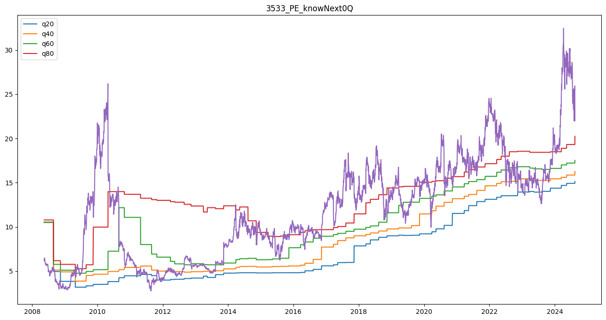
    


```python
'''
分位數的計算區間 - depends on func. quantile_q
look back 20Q = 5y 區間

'''

sub = res[(res['股票代號']=='8069') & (res['period']>='2018Q1')]

fig = plt.figure(figsize=(16, 8))
ax1 = fig.add_subplot(111)
i = 4
ax1.set_title('{}_PE_knowNext{}Q'.format(sub['股票代號'].iloc[-1], i))
# ax1.plot(sub['日期_dt'], sub['PE_1Q'],  label='PE_1Q')
ax1.plot(sub['日期_dt'], sub[f'q20_{i}Q_G'],  label='q20')
ax1.plot(sub['日期_dt'], sub[f'q40_{i}Q_G'],  label='q40')
ax1.plot(sub['日期_dt'], sub[f'q60_{i}Q_G'],  label='q60')
ax1.plot(sub['日期_dt'], sub[f'q80_{i}Q_G'],  label='q80')

ax1.plot(sub['日期_dt'], sub[f'PEG_{i}Q'])
ax1.legend()
```


    <matplotlib.legend.Legend at 0x124c216d0>


    
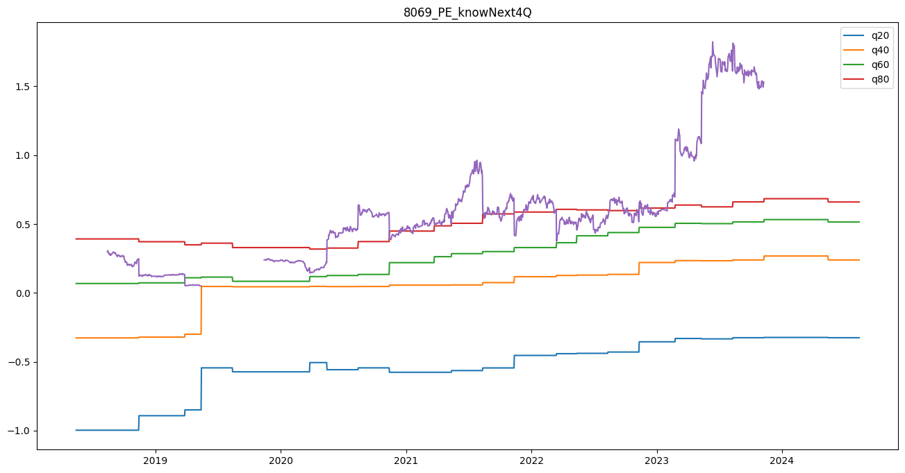
    


```python
for i in range(0, 5):
    for idx, row in res.iterrows():
        if row[f'PEG_{i}Q'] <= row[f'q20_{i}Q_G']:
            res.loc[idx, f'cata_{i}Q_G'] = f'0~20_{i}Q_G'
        if (row[f'PEG_{i}Q'] > row[f'q20_{i}Q_G']) & (row[f'PEG_{i}Q'] <= row[f'q40_{i}Q_G']):
            res.loc[idx, f'cata_{i}Q_G'] = f'20~40_{i}Q_G'
        if (row[f'PEG_{i}Q'] > row[f'q40_{i}Q_G']) & (row[f'PEG_{i}Q'] <= row[f'q60_{i}Q_G']):
            res.loc[idx, f'cata_{i}Q_G'] = f'40~60_{i}Q_G'
        if (row[f'PEG_{i}Q'] > row[f'q60_{i}Q_G']) & (row[f'PEG_{i}Q'] <= row[f'q80_{i}Q_G']):
            res.loc[idx, f'cata_{i}Q_G'] = f'60~80_{i}Q_G'
        if row[f'PEG_{i}Q'] > row[f'q80_{i}Q_G']:
            res.loc[idx, f'cata_{i}Q_G'] = f'80~100_{i}Q_G'    
```


```python
for i in range(0, 5):
    for idx, row in res.iterrows():
        if row[f'PE_{i}Q'] <= row[f'q20_{i}Q']:
            res.loc[idx, f'cata_{i}Q'] = f'0~20_{i}Q'
        if (row[f'PE_{i}Q'] > row[f'q20_{i}Q']) & (row[f'PE_{i}Q'] <= row[f'q40_{i}Q']):
            res.loc[idx, f'cata_{i}Q'] = f'20~40_{i}Q'
        if (row[f'PE_{i}Q'] > row[f'q40_{i}Q']) & (row[f'PE_{i}Q'] <= row[f'q60_{i}Q']):
            res.loc[idx, f'cata_{i}Q'] = f'40~60_{i}Q'
        if (row[f'PE_{i}Q'] > row[f'q60_{i}Q']) & (row[f'PE_{i}Q'] <= row[f'q80_{i}Q']):
            res.loc[idx, f'cata_{i}Q'] = f'60~80_{i}Q'
        if row[f'PE_{i}Q'] > row[f'q80_{i}Q']:
            res.loc[idx, f'cata_{i}Q'] = f'80~100_{i}Q'    
```


```python
res[res['cata_0Q']=='0~20_0Q']
```


<div>
<style scoped>
    .dataframe tbody tr th:only-of-type {
        vertical-align: middle;
    }

    .dataframe tbody tr th {
        vertical-align: top;
    }

    .dataframe thead th {
        text-align: right;
    }
</style>
<table border="1" class="dataframe">
  <thead>
    <tr style="text-align: right;">
      <th></th>
      <th>日期</th>
      <th>股票代號</th>
      <th>股票名稱_x</th>
      <th>開盤價</th>
      <th>最高價</th>
      <th>最低價</th>
      <th>收盤價</th>
      <th>漲跌</th>
      <th>漲幅(%)</th>
      <th>振幅(%)</th>
      <th>...</th>
      <th>q80_3Q</th>
      <th>q20_4Q</th>
      <th>q40_4Q</th>
      <th>q60_4Q</th>
      <th>q80_4Q</th>
      <th>cata_0Q</th>
      <th>cata_1Q</th>
      <th>cata_2Q</th>
      <th>cata_3Q</th>
      <th>cata_4Q</th>
    </tr>
  </thead>
  <tbody>
    <tr>
      <th>849</th>
      <td>20080926</td>
      <td>2059</td>
      <td>川湖</td>
      <td>90.0000</td>
      <td>90.9100</td>
      <td>83.6300</td>
      <td>83.9400</td>
      <td>-9.5000</td>
      <td>-6.4200</td>
      <td>8.1100</td>
      <td>...</td>
      <td>11.0642</td>
      <td>7.6258</td>
      <td>8.9830</td>
      <td>10.3521</td>
      <td>11.1588</td>
      <td>0~20_0Q</td>
      <td>0~20_1Q</td>
      <td>20~40_2Q</td>
      <td>40~60_3Q</td>
      <td>40~60_4Q</td>
    </tr>
    <tr>
      <th>850</th>
      <td>20080930</td>
      <td>2059</td>
      <td>川湖</td>
      <td>78.1800</td>
      <td>78.1800</td>
      <td>78.1800</td>
      <td>78.1800</td>
      <td>-9.5000</td>
      <td>-6.8600</td>
      <td>0.0000</td>
      <td>...</td>
      <td>11.0642</td>
      <td>7.6258</td>
      <td>8.9830</td>
      <td>10.3521</td>
      <td>11.1588</td>
      <td>0~20_0Q</td>
      <td>0~20_1Q</td>
      <td>20~40_2Q</td>
      <td>20~40_3Q</td>
      <td>40~60_4Q</td>
    </tr>
    <tr>
      <th>851</th>
      <td>20081001</td>
      <td>2059</td>
      <td>川湖</td>
      <td>80.6000</td>
      <td>81.2100</td>
      <td>72.7200</td>
      <td>78.1800</td>
      <td>0.0000</td>
      <td>0.0000</td>
      <td>10.8500</td>
      <td>...</td>
      <td>11.0642</td>
      <td>7.6258</td>
      <td>8.9830</td>
      <td>10.3521</td>
      <td>11.1588</td>
      <td>0~20_0Q</td>
      <td>0~20_1Q</td>
      <td>20~40_2Q</td>
      <td>20~40_3Q</td>
      <td>40~60_4Q</td>
    </tr>
    <tr>
      <th>852</th>
      <td>20081002</td>
      <td>2059</td>
      <td>川湖</td>
      <td>75.7500</td>
      <td>78.7800</td>
      <td>72.7200</td>
      <td>74.5400</td>
      <td>-6.0000</td>
      <td>-4.6500</td>
      <td>7.7500</td>
      <td>...</td>
      <td>11.0642</td>
      <td>7.6258</td>
      <td>8.9830</td>
      <td>10.3521</td>
      <td>11.1588</td>
      <td>0~20_0Q</td>
      <td>0~20_1Q</td>
      <td>0~20_2Q</td>
      <td>20~40_3Q</td>
      <td>20~40_4Q</td>
    </tr>
    <tr>
      <th>853</th>
      <td>20081003</td>
      <td>2059</td>
      <td>川湖</td>
      <td>74.5400</td>
      <td>74.5400</td>
      <td>69.3900</td>
      <td>74.5400</td>
      <td>0.0000</td>
      <td>0.0000</td>
      <td>6.9100</td>
      <td>...</td>
      <td>11.0642</td>
      <td>7.6258</td>
      <td>8.9830</td>
      <td>10.3521</td>
      <td>11.1588</td>
      <td>0~20_0Q</td>
      <td>0~20_1Q</td>
      <td>0~20_2Q</td>
      <td>20~40_3Q</td>
      <td>20~40_4Q</td>
    </tr>
    <tr>
      <th>...</th>
      <td>...</td>
      <td>...</td>
      <td>...</td>
      <td>...</td>
      <td>...</td>
      <td>...</td>
      <td>...</td>
      <td>...</td>
      <td>...</td>
      <td>...</td>
      <td>...</td>
      <td>...</td>
      <td>...</td>
      <td>...</td>
      <td>...</td>
      <td>...</td>
      <td>...</td>
      <td>...</td>
      <td>...</td>
      <td>...</td>
      <td>...</td>
    </tr>
    <tr>
      <th>42585</th>
      <td>20200420</td>
      <td>8069</td>
      <td>元太</td>
      <td>25.3400</td>
      <td>25.4300</td>
      <td>25.0800</td>
      <td>25.2100</td>
      <td>0.1000</td>
      <td>0.3500</td>
      <td>1.3900</td>
      <td>...</td>
      <td>16.0809</td>
      <td>7.0302</td>
      <td>8.3478</td>
      <td>9.4539</td>
      <td>12.1913</td>
      <td>0~20_0Q</td>
      <td>0~20_1Q</td>
      <td>0~20_2Q</td>
      <td>40~60_3Q</td>
      <td>20~40_4Q</td>
    </tr>
    <tr>
      <th>42586</th>
      <td>20200421</td>
      <td>8069</td>
      <td>元太</td>
      <td>25.2100</td>
      <td>25.2600</td>
      <td>24.2500</td>
      <td>24.2900</td>
      <td>-1.0500</td>
      <td>-3.6400</td>
      <td>3.9900</td>
      <td>...</td>
      <td>16.0809</td>
      <td>7.0302</td>
      <td>8.3478</td>
      <td>9.4539</td>
      <td>12.1913</td>
      <td>0~20_0Q</td>
      <td>0~20_1Q</td>
      <td>0~20_2Q</td>
      <td>20~40_3Q</td>
      <td>20~40_4Q</td>
    </tr>
    <tr>
      <th>42587</th>
      <td>20200422</td>
      <td>8069</td>
      <td>元太</td>
      <td>24.0800</td>
      <td>24.5600</td>
      <td>23.6800</td>
      <td>24.5600</td>
      <td>0.3000</td>
      <td>1.0800</td>
      <td>3.6000</td>
      <td>...</td>
      <td>16.0809</td>
      <td>7.0302</td>
      <td>8.3478</td>
      <td>9.4539</td>
      <td>12.1913</td>
      <td>0~20_0Q</td>
      <td>0~20_1Q</td>
      <td>0~20_2Q</td>
      <td>20~40_3Q</td>
      <td>20~40_4Q</td>
    </tr>
    <tr>
      <th>42588</th>
      <td>20200423</td>
      <td>8069</td>
      <td>元太</td>
      <td>24.8200</td>
      <td>24.9100</td>
      <td>24.5600</td>
      <td>24.7700</td>
      <td>0.2500</td>
      <td>0.8900</td>
      <td>1.4200</td>
      <td>...</td>
      <td>16.0809</td>
      <td>7.0302</td>
      <td>8.3478</td>
      <td>9.4539</td>
      <td>12.1913</td>
      <td>0~20_0Q</td>
      <td>0~20_1Q</td>
      <td>0~20_2Q</td>
      <td>20~40_3Q</td>
      <td>20~40_4Q</td>
    </tr>
    <tr>
      <th>42589</th>
      <td>20200424</td>
      <td>8069</td>
      <td>元太</td>
      <td>24.6400</td>
      <td>25.5200</td>
      <td>24.6000</td>
      <td>25.3000</td>
      <td>0.6000</td>
      <td>2.1200</td>
      <td>3.7000</td>
      <td>...</td>
      <td>16.0809</td>
      <td>7.0302</td>
      <td>8.3478</td>
      <td>9.4539</td>
      <td>12.1913</td>
      <td>0~20_0Q</td>
      <td>0~20_1Q</td>
      <td>0~20_2Q</td>
      <td>40~60_3Q</td>
      <td>20~40_4Q</td>
    </tr>
  </tbody>
</table>
<p>5648 rows × 223 columns</p>
</div>


```python
preview_res = res.groupby(['股票代號', 'cata_4Q'])[['hold_5Days_ret', 'hold_10Days_ret', 'hold_20Days_ret', 'hold_60Days_ret', 'hold_120Days_ret']].mean()
```


```python
preview_res = res.groupby(['股票代號', 'cata_0Q'])[['hold_5Days_winrate', 'hold_10Days_winrate', 'hold_20Days_winrate', 'hold_60Days_winrate', 'hold_120Days_winrate']].mean()
```


```python
preview_res['day_ratio'] = res.groupby(['股票代號', 'cata_4Q'])['收盤價'].count()/6275
```


```python
preview_res
```


<div>
<style scoped>
    .dataframe tbody tr th:only-of-type {
        vertical-align: middle;
    }

    .dataframe tbody tr th {
        vertical-align: top;
    }

    .dataframe thead th {
        text-align: right;
    }
</style>
<table border="1" class="dataframe">
  <thead>
    <tr style="text-align: right;">
      <th></th>
      <th></th>
      <th>hold_5Days_winrate</th>
      <th>hold_10Days_winrate</th>
      <th>hold_20Days_winrate</th>
      <th>hold_60Days_winrate</th>
      <th>hold_120Days_winrate</th>
      <th>day_ratio</th>
    </tr>
    <tr>
      <th>股票代號</th>
      <th>cata_0Q</th>
      <th></th>
      <th></th>
      <th></th>
      <th></th>
      <th></th>
      <th></th>
    </tr>
  </thead>
  <tbody>
    <tr>
      <th rowspan="5" valign="top">2059</th>
      <th>0~20_0Q</th>
      <td>0.5300</td>
      <td>0.5733</td>
      <td>0.5933</td>
      <td>0.6717</td>
      <td>0.7383</td>
      <td>NaN</td>
    </tr>
    <tr>
      <th>20~40_0Q</th>
      <td>0.5134</td>
      <td>0.5433</td>
      <td>0.5552</td>
      <td>0.6149</td>
      <td>0.6060</td>
      <td>NaN</td>
    </tr>
    <tr>
      <th>40~60_0Q</th>
      <td>0.5033</td>
      <td>0.5333</td>
      <td>0.5412</td>
      <td>0.5490</td>
      <td>0.5948</td>
      <td>NaN</td>
    </tr>
    <tr>
      <th>60~80_0Q</th>
      <td>0.5216</td>
      <td>0.5336</td>
      <td>0.5624</td>
      <td>0.5528</td>
      <td>0.6163</td>
      <td>NaN</td>
    </tr>
    <tr>
      <th>80~100_0Q</th>
      <td>0.4854</td>
      <td>0.4944</td>
      <td>0.4949</td>
      <td>0.4896</td>
      <td>0.5104</td>
      <td>NaN</td>
    </tr>
    <tr>
      <th rowspan="5" valign="top">2330</th>
      <th>0~20_0Q</th>
      <td>0.5231</td>
      <td>0.5350</td>
      <td>0.5516</td>
      <td>0.6216</td>
      <td>0.7367</td>
      <td>NaN</td>
    </tr>
    <tr>
      <th>20~40_0Q</th>
      <td>0.5166</td>
      <td>0.5208</td>
      <td>0.5769</td>
      <td>0.7547</td>
      <td>0.8732</td>
      <td>NaN</td>
    </tr>
    <tr>
      <th>40~60_0Q</th>
      <td>0.5225</td>
      <td>0.5569</td>
      <td>0.5740</td>
      <td>0.5011</td>
      <td>0.6084</td>
      <td>NaN</td>
    </tr>
    <tr>
      <th>60~80_0Q</th>
      <td>0.5304</td>
      <td>0.5422</td>
      <td>0.5937</td>
      <td>0.6803</td>
      <td>0.6546</td>
      <td>NaN</td>
    </tr>
    <tr>
      <th>80~100_0Q</th>
      <td>0.5277</td>
      <td>0.5629</td>
      <td>0.5935</td>
      <td>0.6323</td>
      <td>0.6774</td>
      <td>NaN</td>
    </tr>
    <tr>
      <th rowspan="5" valign="top">2383</th>
      <th>0~20_0Q</th>
      <td>0.5147</td>
      <td>0.5566</td>
      <td>0.5752</td>
      <td>0.5597</td>
      <td>0.5442</td>
      <td>NaN</td>
    </tr>
    <tr>
      <th>20~40_0Q</th>
      <td>0.4746</td>
      <td>0.4527</td>
      <td>0.4143</td>
      <td>0.3717</td>
      <td>0.5144</td>
      <td>NaN</td>
    </tr>
    <tr>
      <th>40~60_0Q</th>
      <td>0.5284</td>
      <td>0.5262</td>
      <td>0.5162</td>
      <td>0.5630</td>
      <td>0.6076</td>
      <td>NaN</td>
    </tr>
    <tr>
      <th>60~80_0Q</th>
      <td>0.5271</td>
      <td>0.5415</td>
      <td>0.5716</td>
      <td>0.6324</td>
      <td>0.6946</td>
      <td>NaN</td>
    </tr>
    <tr>
      <th>80~100_0Q</th>
      <td>0.5389</td>
      <td>0.5726</td>
      <td>0.5674</td>
      <td>0.5859</td>
      <td>0.6334</td>
      <td>NaN</td>
    </tr>
    <tr>
      <th rowspan="5" valign="top">2454</th>
      <th>0~20_0Q</th>
      <td>0.4735</td>
      <td>0.5149</td>
      <td>0.5066</td>
      <td>0.4222</td>
      <td>0.6490</td>
      <td>NaN</td>
    </tr>
    <tr>
      <th>20~40_0Q</th>
      <td>0.5437</td>
      <td>0.5589</td>
      <td>0.5767</td>
      <td>0.6236</td>
      <td>0.5729</td>
      <td>NaN</td>
    </tr>
    <tr>
      <th>40~60_0Q</th>
      <td>0.5136</td>
      <td>0.5465</td>
      <td>0.5147</td>
      <td>0.5590</td>
      <td>0.4444</td>
      <td>NaN</td>
    </tr>
    <tr>
      <th>60~80_0Q</th>
      <td>0.5050</td>
      <td>0.5325</td>
      <td>0.5487</td>
      <td>0.5613</td>
      <td>0.5850</td>
      <td>NaN</td>
    </tr>
    <tr>
      <th>80~100_0Q</th>
      <td>0.5420</td>
      <td>0.5795</td>
      <td>0.6012</td>
      <td>0.6513</td>
      <td>0.6552</td>
      <td>NaN</td>
    </tr>
    <tr>
      <th rowspan="5" valign="top">3008</th>
      <th>0~20_0Q</th>
      <td>0.5412</td>
      <td>0.5541</td>
      <td>0.5636</td>
      <td>0.6847</td>
      <td>0.6864</td>
      <td>NaN</td>
    </tr>
    <tr>
      <th>20~40_0Q</th>
      <td>0.4869</td>
      <td>0.4911</td>
      <td>0.5121</td>
      <td>0.5624</td>
      <td>0.5331</td>
      <td>NaN</td>
    </tr>
    <tr>
      <th>40~60_0Q</th>
      <td>0.5047</td>
      <td>0.5036</td>
      <td>0.5420</td>
      <td>0.5876</td>
      <td>0.6497</td>
      <td>NaN</td>
    </tr>
    <tr>
      <th>60~80_0Q</th>
      <td>0.5337</td>
      <td>0.5481</td>
      <td>0.5337</td>
      <td>0.5511</td>
      <td>0.5746</td>
      <td>NaN</td>
    </tr>
    <tr>
      <th>80~100_0Q</th>
      <td>0.5126</td>
      <td>0.5244</td>
      <td>0.5446</td>
      <td>0.6010</td>
      <td>0.5640</td>
      <td>NaN</td>
    </tr>
    <tr>
      <th rowspan="5" valign="top">3529</th>
      <th>0~20_0Q</th>
      <td>0.5956</td>
      <td>0.6289</td>
      <td>0.6267</td>
      <td>0.6644</td>
      <td>0.6222</td>
      <td>NaN</td>
    </tr>
    <tr>
      <th>20~40_0Q</th>
      <td>0.3727</td>
      <td>0.3913</td>
      <td>0.3758</td>
      <td>0.4068</td>
      <td>0.3447</td>
      <td>NaN</td>
    </tr>
    <tr>
      <th>40~60_0Q</th>
      <td>0.5266</td>
      <td>0.5160</td>
      <td>0.5426</td>
      <td>0.6968</td>
      <td>0.7394</td>
      <td>NaN</td>
    </tr>
    <tr>
      <th>60~80_0Q</th>
      <td>0.5386</td>
      <td>0.5983</td>
      <td>0.6419</td>
      <td>0.6798</td>
      <td>0.6215</td>
      <td>NaN</td>
    </tr>
    <tr>
      <th>80~100_0Q</th>
      <td>0.4861</td>
      <td>0.5062</td>
      <td>0.5035</td>
      <td>0.5687</td>
      <td>0.5624</td>
      <td>NaN</td>
    </tr>
    <tr>
      <th rowspan="5" valign="top">3533</th>
      <th>0~20_0Q</th>
      <td>0.4481</td>
      <td>0.4708</td>
      <td>0.4773</td>
      <td>0.4383</td>
      <td>0.5974</td>
      <td>NaN</td>
    </tr>
    <tr>
      <th>20~40_0Q</th>
      <td>0.5267</td>
      <td>0.5598</td>
      <td>0.6081</td>
      <td>0.6209</td>
      <td>0.4784</td>
      <td>NaN</td>
    </tr>
    <tr>
      <th>40~60_0Q</th>
      <td>0.4755</td>
      <td>0.4708</td>
      <td>0.4550</td>
      <td>0.4929</td>
      <td>0.4708</td>
      <td>NaN</td>
    </tr>
    <tr>
      <th>60~80_0Q</th>
      <td>0.5375</td>
      <td>0.5721</td>
      <td>0.6011</td>
      <td>0.6657</td>
      <td>0.7491</td>
      <td>NaN</td>
    </tr>
    <tr>
      <th>80~100_0Q</th>
      <td>0.5156</td>
      <td>0.5288</td>
      <td>0.5413</td>
      <td>0.6151</td>
      <td>0.6965</td>
      <td>NaN</td>
    </tr>
    <tr>
      <th rowspan="5" valign="top">5274</th>
      <th>0~20_0Q</th>
      <td>0.8696</td>
      <td>0.9565</td>
      <td>1.0000</td>
      <td>1.0000</td>
      <td>1.0000</td>
      <td>NaN</td>
    </tr>
    <tr>
      <th>20~40_0Q</th>
      <td>0.6637</td>
      <td>0.7168</td>
      <td>0.8053</td>
      <td>0.9823</td>
      <td>1.0000</td>
      <td>NaN</td>
    </tr>
    <tr>
      <th>40~60_0Q</th>
      <td>0.5989</td>
      <td>0.6538</td>
      <td>0.7143</td>
      <td>0.8352</td>
      <td>0.9670</td>
      <td>NaN</td>
    </tr>
    <tr>
      <th>60~80_0Q</th>
      <td>0.5429</td>
      <td>0.5466</td>
      <td>0.6063</td>
      <td>0.7276</td>
      <td>0.8619</td>
      <td>NaN</td>
    </tr>
    <tr>
      <th>80~100_0Q</th>
      <td>0.5172</td>
      <td>0.5336</td>
      <td>0.5868</td>
      <td>0.6316</td>
      <td>0.6957</td>
      <td>NaN</td>
    </tr>
    <tr>
      <th rowspan="5" valign="top">8069</th>
      <th>0~20_0Q</th>
      <td>0.5252</td>
      <td>0.5480</td>
      <td>0.5183</td>
      <td>0.4708</td>
      <td>0.5213</td>
      <td>NaN</td>
    </tr>
    <tr>
      <th>20~40_0Q</th>
      <td>0.4575</td>
      <td>0.4178</td>
      <td>0.4310</td>
      <td>0.4197</td>
      <td>0.2250</td>
      <td>NaN</td>
    </tr>
    <tr>
      <th>40~60_0Q</th>
      <td>0.5296</td>
      <td>0.5427</td>
      <td>0.5889</td>
      <td>0.6040</td>
      <td>0.6432</td>
      <td>NaN</td>
    </tr>
    <tr>
      <th>60~80_0Q</th>
      <td>0.5440</td>
      <td>0.5369</td>
      <td>0.5405</td>
      <td>0.6679</td>
      <td>0.6464</td>
      <td>NaN</td>
    </tr>
    <tr>
      <th>80~100_0Q</th>
      <td>0.5182</td>
      <td>0.5211</td>
      <td>0.5538</td>
      <td>0.6039</td>
      <td>0.5661</td>
      <td>NaN</td>
    </tr>
  </tbody>
</table>
</div>


```python
'''
分位數的計算區間 - depends on func. quantile_q
look back 20Q = 5y 區間

'''
sub = res[res['股票代號']=='2330']
sub = res
sub.loc[sub['cata_0Q'] == '20~40_0Q', 'hold_120Days_ret'].values


for quantile in ['0~20', '20~40', '40~60', '60~80', '80~100']:
        
    fig = plt.figure(figsize=(16, 8))
    ax1 = fig.add_subplot(111)
    i = 0
    ax1.set_title(f'{quantile}_{i}Q holding 120 ret')

    # for i in range(0, 5):
    for i in [0, 4]:
    # ax1.plot(sub['日期_dt'], sub['PE_1Q'],  label='PE_1Q')
        
        hist_obj = ax1.hist(sub.loc[sub[f'cata_{i}Q'] == f'{quantile}_{i}Q', 'hold_120Days_ret'].values,  label=f'q{quantile}_{i}Q', bins=100,   alpha=0.5
                            )
        color = hist_obj[2][0].get_facecolor()
        ax1.axvline(sub.loc[sub[f'cata_{i}Q'] == f'{quantile}_{i}Q', 'hold_120Days_ret'].mean(), ymin=0, ymax=500,  label=f'q{quantile}_{i}Q',  color=color)


        ax1.legend()
        
```


    
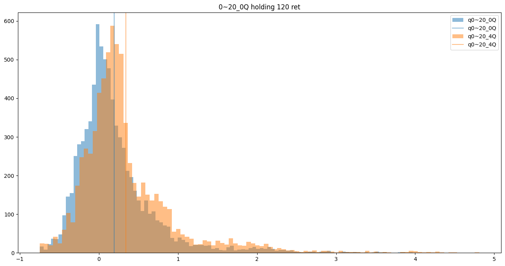
    


    
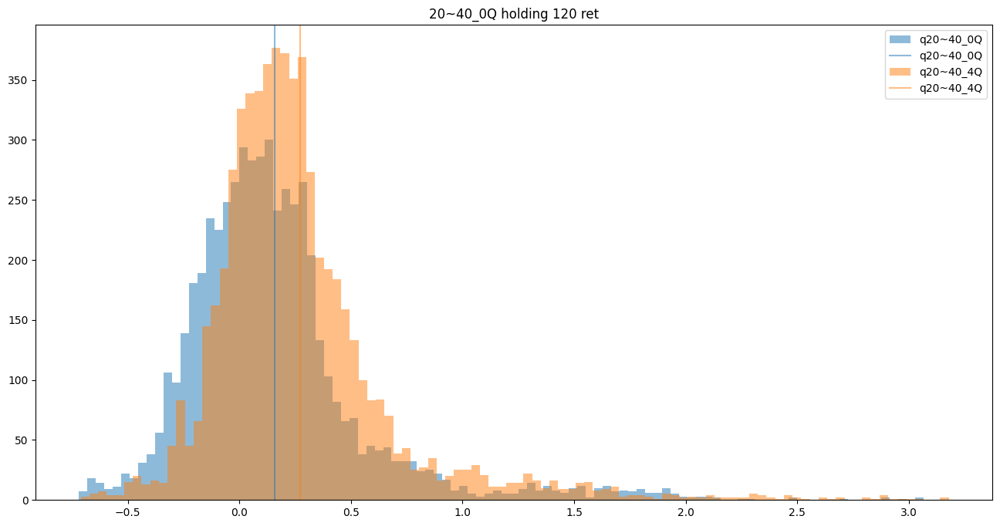
    


    
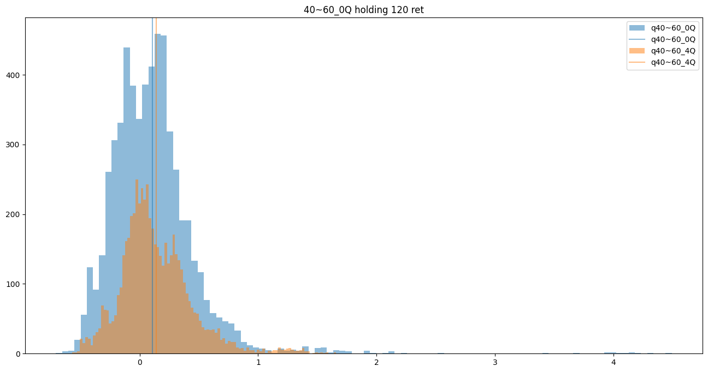
    


    
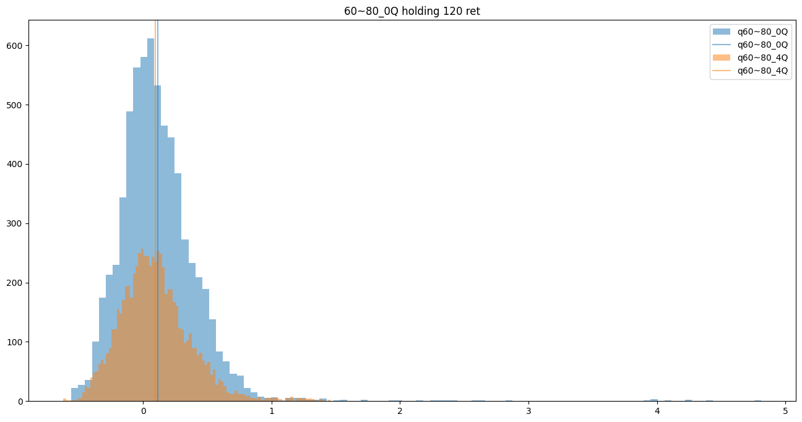
    


    
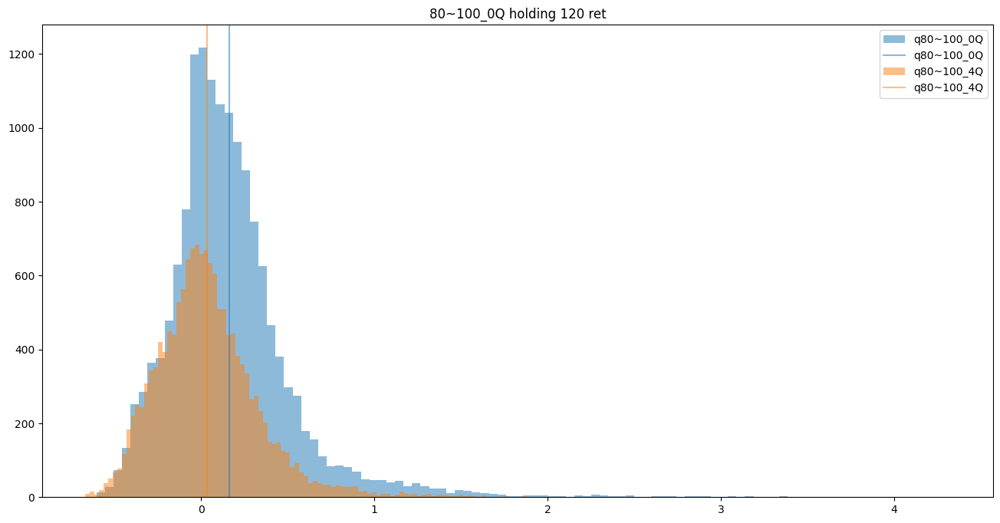
    


```python
from scipy import stats
import numpy as np

# Generate some sample data with different lengths
data1 = np.random.normal(50, 10, 100)  # Dataset 1
data2 = np.random.normal(52, 15, 150)  # Dataset 2

# Perform a two-sample t-test assuming equal variances (Student's t-test)
t_stat, p_value = stats.ttest_ind(data1, data2, equal_var=True)
print(f"Student's t-test: t-statistic = {t_stat:.4f}, p-value = {p_value:.4f}")

# Perform Welch's t-test (does not assume equal variances)
t_stat_welch, p_value_welch = stats.ttest_ind(data1, data2, equal_var=False)
print(f"Welch's t-test: t-statistic = {t_stat_welch:.4f}, p-value = {p_value_welch:.4f}")

```


```python
'''
分位數的計算區間 - depends on func. quantile_q
look back 20Q = 5y 區間

'''

sub = res
tmp = pd.DataFrame()
for quantile in ['0~20', '20~40', '40~60', '60~80', '80~100']:
        
    i = 0
    t = 1

    for days in [5, 10, 20, 60, 120]:
        data1 = sub.loc[sub[f'cata_{i}Q'] == f'{quantile}_{i}Q', f'hold_{days}Days_ret'].values
        data2 = sub.loc[sub[f'cata_{t}Q'] == f'{quantile}_{t}Q', f'hold_{days}Days_ret'].values
        
        

        t_stat, p_value = stats.ttest_ind(data1, data2, equal_var=True)
        print(f"Student's t-test: t-statistic = {t_stat:.4f}, p-value = {p_value:.4f}, {quantile}_{t}Q, 'hold_{days}Days_ret'")
        tmp.loc[f'{quantile}_{i}Q vs {t}Q', f'hold {days} mean return p-value'] = p_value
```


```python
tmp
```

有多少 forward 0 在低本益比 但其實用forward 4Q是高本益比  
反之亦然  
這類股價其實是由未來營收所帶動的 也許就是我們想要抓的?  
forward 的優勢就在於 用歷史推估 跟由研調預測得出來的結論有明顯差異 材值得做


```python
sub = res[res['股票代號']=='2330']
sub = res
mask1 = (sub['cata_0Q'] == '0~20_0Q')
mask2 =  (sub['cata_4Q'] == '60~80_4Q')
# sub.loc[mask1 & mask2, ['股票代號', '日期_dt','hold_5Days_ret', 'hold_10Days_ret', 'hold_20Days_ret', 'hold_60Days_ret', 'hold_120Days_ret']].describe()
sub.loc[mask1 & mask2, ['hold_5Days_ret', 'hold_10Days_ret', 'hold_20Days_ret', 'hold_60Days_ret', 'hold_120Days_ret']].describe()

```


```python
sub = res[res['股票代號']=='2330']
sub = res
mask1 = (sub['cata_0Q'] == '80~100_0Q')
mask2 =  (sub['cata_4Q'] == '40~60_4Q')
# sub.loc[mask1 & mask2, ['股票代號', '日期_dt','hold_5Days_ret', 'hold_10Days_ret', 'hold_20Days_ret', 'hold_60Days_ret', 'hold_120Days_ret']].describe()
show_df = sub.loc[mask1 & mask2, ['hold_5Days_ret', 'hold_10Days_ret', 'hold_20Days_ret', 'hold_60Days_ret', 'hold_120Days_ret']].describe()
show_df.loc['precision', ['hold_5Days_ret', 'hold_10Days_ret', 'hold_20Days_ret', 'hold_60Days_ret', 'hold_120Days_ret']] = sub.loc[mask1 & mask2, ['hold_5Days_winrate', 'hold_10Days_winrate', 'hold_20Days_winrate', 'hold_60Days_winrate', 'hold_120Days_winrate']].mean().tolist()
show_df
```


```python
sub = res[res['股票代號']=='2330']
sub = res
mask1 = (sub['cata_0Q'] == '80~100_0Q')
mask2 =  (sub['cata_4Q'] == '80~100_4Q')
# sub.loc[mask1 & mask2, ['股票代號', '日期_dt','hold_5Days_ret', 'hold_10Days_ret', 'hold_20Days_ret', 'hold_60Days_ret', 'hold_120Days_ret']].describe()
show_df = sub.loc[mask2, ['hold_5Days_ret', 'hold_10Days_ret', 'hold_20Days_ret', 'hold_60Days_ret', 'hold_120Days_ret']].describe()
show_df.loc['precision', ['hold_5Days_ret', 'hold_10Days_ret', 'hold_20Days_ret', 'hold_60Days_ret', 'hold_120Days_ret']] = sub.loc[mask1, ['hold_5Days_winrate', 'hold_10Days_winrate', 'hold_20Days_winrate', 'hold_60Days_winrate', 'hold_120Days_winrate']].mean().tolist()
show_df

```


<div>
<style scoped>
    .dataframe tbody tr th:only-of-type {
        vertical-align: middle;
    }

    .dataframe tbody tr th {
        vertical-align: top;
    }

    .dataframe thead th {
        text-align: right;
    }
</style>
<table border="1" class="dataframe">
  <thead>
    <tr style="text-align: right;">
      <th></th>
      <th>hold_5Days_ret</th>
      <th>hold_10Days_ret</th>
      <th>hold_20Days_ret</th>
      <th>hold_60Days_ret</th>
      <th>hold_120Days_ret</th>
    </tr>
  </thead>
  <tbody>
    <tr>
      <th>count</th>
      <td>15146.0000</td>
      <td>15146.0000</td>
      <td>15146.0000</td>
      <td>15146.0000</td>
      <td>15146.0000</td>
    </tr>
    <tr>
      <th>mean</th>
      <td>0.0004</td>
      <td>0.0014</td>
      <td>0.0035</td>
      <td>0.0119</td>
      <td>0.0348</td>
    </tr>
    <tr>
      <th>std</th>
      <td>0.0589</td>
      <td>0.0806</td>
      <td>0.1129</td>
      <td>0.1994</td>
      <td>0.2955</td>
    </tr>
    <tr>
      <th>min</th>
      <td>-0.2787</td>
      <td>-0.3607</td>
      <td>-0.4376</td>
      <td>-0.6319</td>
      <td>-0.6695</td>
    </tr>
    <tr>
      <th>25%</th>
      <td>-0.0321</td>
      <td>-0.0442</td>
      <td>-0.0649</td>
      <td>-0.1098</td>
      <td>-0.1565</td>
    </tr>
    <tr>
      <th>50%</th>
      <td>0.0000</td>
      <td>-0.0013</td>
      <td>-0.0019</td>
      <td>0.0029</td>
      <td>0.0060</td>
    </tr>
    <tr>
      <th>75%</th>
      <td>0.0310</td>
      <td>0.0426</td>
      <td>0.0631</td>
      <td>0.1150</td>
      <td>0.1851</td>
    </tr>
    <tr>
      <th>max</th>
      <td>0.4435</td>
      <td>0.5295</td>
      <td>0.6722</td>
      <td>1.4594</td>
      <td>1.9575</td>
    </tr>
    <tr>
      <th>precision</th>
      <td>0.5195</td>
      <td>0.5415</td>
      <td>0.5607</td>
      <td>0.6076</td>
      <td>0.6391</td>
    </tr>
  </tbody>
</table>
</div>


```python
sub = res[res['股票代號']=='2330']
sub = res
# mask1 = (sub['cata_0Q_G'] == '80~100_0Q_G')
mask2 =  (sub['cata_4Q'] == '40~60_4Q')
# sub.loc[mask1 & mask2, ['股票代號', '日期_dt','hold_5Days_ret', 'hold_10Days_ret', 'hold_20Days_ret', 'hold_60Days_ret', 'hold_120Days_ret']].describe()
show_df = sub.loc[mask2, ['hold_5Days_ret', 'hold_10Days_ret', 'hold_20Days_ret', 'hold_60Days_ret', 'hold_120Days_ret']].describe()
show_df.loc['precision', ['hold_5Days_ret', 'hold_10Days_ret', 'hold_20Days_ret', 'hold_60Days_ret', 'hold_120Days_ret']] = sub.loc[mask2, ['hold_5Days_winrate', 'hold_10Days_winrate', 'hold_20Days_winrate', 'hold_60Days_winrate', 'hold_120Days_winrate']].mean().tolist()
show_df

```


<div>
<style scoped>
    .dataframe tbody tr th:only-of-type {
        vertical-align: middle;
    }

    .dataframe tbody tr th {
        vertical-align: top;
    }

    .dataframe thead th {
        text-align: right;
    }
</style>
<table border="1" class="dataframe">
  <thead>
    <tr style="text-align: right;">
      <th></th>
      <th>hold_5Days_ret</th>
      <th>hold_10Days_ret</th>
      <th>hold_20Days_ret</th>
      <th>hold_60Days_ret</th>
      <th>hold_120Days_ret</th>
    </tr>
  </thead>
  <tbody>
    <tr>
      <th>count</th>
      <td>6333.0000</td>
      <td>6333.0000</td>
      <td>6333.0000</td>
      <td>6333.0000</td>
      <td>6333.0000</td>
    </tr>
    <tr>
      <th>mean</th>
      <td>0.0096</td>
      <td>0.0191</td>
      <td>0.0373</td>
      <td>0.1051</td>
      <td>0.1892</td>
    </tr>
    <tr>
      <th>std</th>
      <td>0.0637</td>
      <td>0.0922</td>
      <td>0.1398</td>
      <td>0.2245</td>
      <td>0.3005</td>
    </tr>
    <tr>
      <th>min</th>
      <td>-0.3466</td>
      <td>-0.3383</td>
      <td>-0.5246</td>
      <td>-0.5666</td>
      <td>-0.5376</td>
    </tr>
    <tr>
      <th>25%</th>
      <td>-0.0232</td>
      <td>-0.0318</td>
      <td>-0.0396</td>
      <td>-0.0257</td>
      <td>-0.0016</td>
    </tr>
    <tr>
      <th>50%</th>
      <td>0.0065</td>
      <td>0.0134</td>
      <td>0.0281</td>
      <td>0.0829</td>
      <td>0.1617</td>
    </tr>
    <tr>
      <th>75%</th>
      <td>0.0384</td>
      <td>0.0621</td>
      <td>0.1000</td>
      <td>0.2195</td>
      <td>0.3377</td>
    </tr>
    <tr>
      <th>max</th>
      <td>0.3983</td>
      <td>0.7654</td>
      <td>1.2486</td>
      <td>1.6617</td>
      <td>1.6799</td>
    </tr>
    <tr>
      <th>precision</th>
      <td>0.5490</td>
      <td>0.5743</td>
      <td>0.6076</td>
      <td>0.6922</td>
      <td>0.7475</td>
    </tr>
  </tbody>
</table>
</div>


```python
sub = res[res['股票代號']=='2330']
sub = res
mask1 = (sub['cata_0Q_G'] == '80~100_0Q_G')
mask2 =  (sub['PEG_4Q'] > 0) & (sub['PEG_4Q'] < 1)
# mask2 =  (sub['PEG_4Q'] > 0) 
# sub.loc[mask1 & mask2, ['股票代號', '日期_dt','hold_5Days_ret', 'hold_10Days_ret', 'hold_20Days_ret', 'hold_60Days_ret', 'hold_120Days_ret']].describe()
show_df = sub.loc[mask2, ['hold_5Days_ret', 'hold_10Days_ret', 'hold_20Days_ret', 'hold_60Days_ret', 'hold_120Days_ret']].describe()
show_df.loc['precision', ['hold_5Days_ret', 'hold_10Days_ret', 'hold_20Days_ret', 'hold_60Days_ret', 'hold_120Days_ret']] = sub.loc[mask2, ['hold_5Days_winrate', 'hold_10Days_winrate', 'hold_20Days_winrate', 'hold_60Days_winrate', 'hold_120Days_winrate']].mean().tolist()
show_df

```


<div>
<style scoped>
    .dataframe tbody tr th:only-of-type {
        vertical-align: middle;
    }

    .dataframe tbody tr th {
        vertical-align: top;
    }

    .dataframe thead th {
        text-align: right;
    }
</style>
<table border="1" class="dataframe">
  <thead>
    <tr style="text-align: right;">
      <th></th>
      <th>hold_5Days_ret</th>
      <th>hold_10Days_ret</th>
      <th>hold_20Days_ret</th>
      <th>hold_60Days_ret</th>
      <th>hold_120Days_ret</th>
    </tr>
  </thead>
  <tbody>
    <tr>
      <th>count</th>
      <td>16537.0000</td>
      <td>16537.0000</td>
      <td>16537.0000</td>
      <td>16537.0000</td>
      <td>16537.0000</td>
    </tr>
    <tr>
      <th>mean</th>
      <td>0.0076</td>
      <td>0.0151</td>
      <td>0.0304</td>
      <td>0.0883</td>
      <td>0.1716</td>
    </tr>
    <tr>
      <th>std</th>
      <td>0.0560</td>
      <td>0.0790</td>
      <td>0.1156</td>
      <td>0.2188</td>
      <td>0.3225</td>
    </tr>
    <tr>
      <th>min</th>
      <td>-0.3466</td>
      <td>-0.4904</td>
      <td>-0.5248</td>
      <td>-0.5779</td>
      <td>-0.6695</td>
    </tr>
    <tr>
      <th>25%</th>
      <td>-0.0216</td>
      <td>-0.0271</td>
      <td>-0.0334</td>
      <td>-0.0308</td>
      <td>-0.0116</td>
    </tr>
    <tr>
      <th>50%</th>
      <td>0.0051</td>
      <td>0.0107</td>
      <td>0.0213</td>
      <td>0.0689</td>
      <td>0.1385</td>
    </tr>
    <tr>
      <th>75%</th>
      <td>0.0342</td>
      <td>0.0524</td>
      <td>0.0849</td>
      <td>0.1790</td>
      <td>0.3016</td>
    </tr>
    <tr>
      <th>max</th>
      <td>0.4748</td>
      <td>0.7654</td>
      <td>1.2486</td>
      <td>2.2198</td>
      <td>2.9156</td>
    </tr>
    <tr>
      <th>precision</th>
      <td>0.5434</td>
      <td>0.5699</td>
      <td>0.5995</td>
      <td>0.6736</td>
      <td>0.7339</td>
    </tr>
  </tbody>
</table>
</div>


```python
import numpy as np

sub = res
mask1 = (sub['cata_0Q_G'] == '80~100_0Q_G')
mask2 =  (sub['PEG_4Q'] > 0) & (sub['PEG_4Q'] < 1)


show_df = pd.DataFrame()

for i in np.arange(0.1, 1, 0.1):
    mask2 =  (sub['PEG_0Q'] >= i) & (sub['PEG_0Q'] < (i + 0.1))
    show_df.loc[f'{i:.1f}~{i+0.1:.1f}_mean return', ['hold_5Days_ret', 'hold_10Days_ret', 'hold_20Days_ret', 'hold_60Days_ret', 'hold_120Days_ret']] = sub.loc[mask2, ['hold_5Days_ret', 'hold_10Days_ret', 'hold_20Days_ret', 'hold_60Days_ret', 'hold_120Days_ret']].mean()
    show_df.loc[f'{i:.1f}~{i+0.1:.1f}_precision', ['hold_5Days_ret', 'hold_10Days_ret', 'hold_20Days_ret', 'hold_60Days_ret', 'hold_120Days_ret']] = sub.loc[mask2, ['hold_5Days_winrate', 'hold_10Days_winrate', 'hold_20Days_winrate', 'hold_60Days_winrate', 'hold_120Days_winrate']].mean().tolist()

    show_df.loc[f'{i:.1f}~{i+0.1:.1f}_mean return', 'count'] = len(sub.loc[mask2])
show_df

```


<div>
<style scoped>
    .dataframe tbody tr th:only-of-type {
        vertical-align: middle;
    }

    .dataframe tbody tr th {
        vertical-align: top;
    }

    .dataframe thead th {
        text-align: right;
    }
</style>
<table border="1" class="dataframe">
  <thead>
    <tr style="text-align: right;">
      <th></th>
      <th>hold_5Days_ret</th>
      <th>hold_10Days_ret</th>
      <th>hold_20Days_ret</th>
      <th>hold_60Days_ret</th>
      <th>hold_120Days_ret</th>
      <th>count</th>
    </tr>
  </thead>
  <tbody>
    <tr>
      <th>0.1~0.2_mean return</th>
      <td>0.0050</td>
      <td>0.0115</td>
      <td>0.0254</td>
      <td>0.0768</td>
      <td>0.1656</td>
      <td>1279.0000</td>
    </tr>
    <tr>
      <th>0.1~0.2_precision</th>
      <td>0.5113</td>
      <td>0.5278</td>
      <td>0.5575</td>
      <td>0.6052</td>
      <td>0.6419</td>
      <td>NaN</td>
    </tr>
    <tr>
      <th>0.2~0.3_mean return</th>
      <td>0.0058</td>
      <td>0.0111</td>
      <td>0.0213</td>
      <td>0.0769</td>
      <td>0.1560</td>
      <td>1931.0000</td>
    </tr>
    <tr>
      <th>0.2~0.3_precision</th>
      <td>0.5230</td>
      <td>0.5391</td>
      <td>0.5526</td>
      <td>0.6183</td>
      <td>0.6665</td>
      <td>NaN</td>
    </tr>
    <tr>
      <th>0.3~0.4_mean return</th>
      <td>0.0060</td>
      <td>0.0112</td>
      <td>0.0225</td>
      <td>0.0464</td>
      <td>0.1176</td>
      <td>1869.0000</td>
    </tr>
    <tr>
      <th>0.3~0.4_precision</th>
      <td>0.5479</td>
      <td>0.5575</td>
      <td>0.5907</td>
      <td>0.6244</td>
      <td>0.7100</td>
      <td>NaN</td>
    </tr>
    <tr>
      <th>0.4~0.5_mean return</th>
      <td>0.0050</td>
      <td>0.0085</td>
      <td>0.0206</td>
      <td>0.0837</td>
      <td>0.1330</td>
      <td>1415.0000</td>
    </tr>
    <tr>
      <th>0.4~0.5_precision</th>
      <td>0.5216</td>
      <td>0.5491</td>
      <td>0.5929</td>
      <td>0.6869</td>
      <td>0.6678</td>
      <td>NaN</td>
    </tr>
    <tr>
      <th>0.5~0.6_mean return</th>
      <td>0.0073</td>
      <td>0.0161</td>
      <td>0.0283</td>
      <td>0.0696</td>
      <td>0.0977</td>
      <td>1670.0000</td>
    </tr>
    <tr>
      <th>0.5~0.6_precision</th>
      <td>0.5299</td>
      <td>0.5713</td>
      <td>0.6120</td>
      <td>0.6880</td>
      <td>0.6539</td>
      <td>NaN</td>
    </tr>
    <tr>
      <th>0.6~0.7_mean return</th>
      <td>0.0096</td>
      <td>0.0174</td>
      <td>0.0327</td>
      <td>0.0853</td>
      <td>0.1487</td>
      <td>1222.0000</td>
    </tr>
    <tr>
      <th>0.6~0.7_precision</th>
      <td>0.5532</td>
      <td>0.5736</td>
      <td>0.6342</td>
      <td>0.7267</td>
      <td>0.7406</td>
      <td>NaN</td>
    </tr>
    <tr>
      <th>0.7~0.8_mean return</th>
      <td>0.0044</td>
      <td>0.0103</td>
      <td>0.0265</td>
      <td>0.1011</td>
      <td>0.2340</td>
      <td>1103.0000</td>
    </tr>
    <tr>
      <th>0.7~0.8_precision</th>
      <td>0.5467</td>
      <td>0.5793</td>
      <td>0.5684</td>
      <td>0.6981</td>
      <td>0.8359</td>
      <td>NaN</td>
    </tr>
    <tr>
      <th>0.8~0.9_mean return</th>
      <td>0.0061</td>
      <td>0.0162</td>
      <td>0.0347</td>
      <td>0.0948</td>
      <td>0.1726</td>
      <td>1245.0000</td>
    </tr>
    <tr>
      <th>0.8~0.9_precision</th>
      <td>0.5486</td>
      <td>0.5912</td>
      <td>0.6064</td>
      <td>0.6803</td>
      <td>0.7454</td>
      <td>NaN</td>
    </tr>
    <tr>
      <th>0.9~1.0_mean return</th>
      <td>0.0041</td>
      <td>0.0073</td>
      <td>0.0137</td>
      <td>0.0526</td>
      <td>0.1090</td>
      <td>1323.0000</td>
    </tr>
    <tr>
      <th>0.9~1.0_precision</th>
      <td>0.5503</td>
      <td>0.5661</td>
      <td>0.5548</td>
      <td>0.6546</td>
      <td>0.7286</td>
      <td>NaN</td>
    </tr>
  </tbody>
</table>
</div>


```python
show_df = pd.DataFrame()
sub = res

for quantile in ['0~20', '20~40', '40~60', '60~80', '80~100']:
    mask1 = (sub['cata_4Q'] == f'{quantile}_4Q')
    show_df.loc[f'mean_{quantile}', ['hold_5Days_ret', 'hold_10Days_ret', 'hold_20Days_ret', 'hold_60Days_ret', 'hold_120Days_ret']] = sub.loc[mask1, ['hold_5Days_ret', 'hold_10Days_ret', 'hold_20Days_ret', 'hold_60Days_ret', 'hold_120Days_ret']].mean()
    show_df.loc[f'precision_{quantile}', ['hold_5Days_ret', 'hold_10Days_ret', 'hold_20Days_ret', 'hold_60Days_ret', 'hold_120Days_ret']] = sub.loc[mask1, ['hold_5Days_winrate', 'hold_10Days_winrate', 'hold_20Days_winrate', 'hold_60Days_winrate', 'hold_120Days_winrate']].mean().tolist()

```


```python
show_df
```


<div>
<style scoped>
    .dataframe tbody tr th:only-of-type {
        vertical-align: middle;
    }

    .dataframe tbody tr th {
        vertical-align: top;
    }

    .dataframe thead th {
        text-align: right;
    }
</style>
<table border="1" class="dataframe">
  <thead>
    <tr style="text-align: right;">
      <th></th>
      <th>hold_5Days_ret</th>
      <th>hold_10Days_ret</th>
      <th>hold_20Days_ret</th>
      <th>hold_60Days_ret</th>
      <th>hold_120Days_ret</th>
    </tr>
  </thead>
  <tbody>
    <tr>
      <th>mean_0~20</th>
      <td>0.0109</td>
      <td>0.0197</td>
      <td>0.0418</td>
      <td>0.1415</td>
      <td>0.3239</td>
    </tr>
    <tr>
      <th>precision_0~20</th>
      <td>0.5491</td>
      <td>0.5712</td>
      <td>0.5873</td>
      <td>0.6229</td>
      <td>0.6291</td>
    </tr>
    <tr>
      <th>mean_20~40</th>
      <td>0.0128</td>
      <td>0.0272</td>
      <td>0.0594</td>
      <td>0.2105</td>
      <td>0.4238</td>
    </tr>
    <tr>
      <th>precision_20~40</th>
      <td>0.5648</td>
      <td>0.6142</td>
      <td>0.6600</td>
      <td>0.7461</td>
      <td>0.8420</td>
    </tr>
    <tr>
      <th>mean_40~60</th>
      <td>0.0093</td>
      <td>0.0183</td>
      <td>0.0354</td>
      <td>0.1030</td>
      <td>0.1889</td>
    </tr>
    <tr>
      <th>precision_40~60</th>
      <td>0.5453</td>
      <td>0.5719</td>
      <td>0.6024</td>
      <td>0.6905</td>
      <td>0.7498</td>
    </tr>
    <tr>
      <th>mean_60~80</th>
      <td>0.0068</td>
      <td>0.0131</td>
      <td>0.0262</td>
      <td>0.0731</td>
      <td>0.1513</td>
    </tr>
    <tr>
      <th>precision_60~80</th>
      <td>0.5304</td>
      <td>0.5525</td>
      <td>0.5811</td>
      <td>0.6500</td>
      <td>0.6870</td>
    </tr>
    <tr>
      <th>mean_80~100</th>
      <td>0.0005</td>
      <td>0.0013</td>
      <td>0.0025</td>
      <td>0.0075</td>
      <td>0.0285</td>
    </tr>
    <tr>
      <th>precision_80~100</th>
      <td>0.4808</td>
      <td>0.4856</td>
      <td>0.4874</td>
      <td>0.4951</td>
      <td>0.5119</td>
    </tr>
  </tbody>
</table>
</div>


```python
res.columns
```


```python
import pandas as pd
import matplotlib.pyplot as plt

# Example data with 8 categories
data = {'Date': pd.date_range(start='2024-01-01', periods=10, freq='D'),
        'Signal': [0, 1, 0, 1, 0, 0, 1, 0, 1, 0],
        'Category': ['A', 'B', 'C', 'D', 'E', 'F', 'G', 'H', 'A', 'B']}

df = pd.DataFrame(data)

# Get unique categories (suppose you have exactly 8 categories)
categories = df['Category'].unique()

# Define the number of rows and columns for the subplots
n_rows, n_cols = 2, 4

# Create subplots for each category in a 2x4 grid
fig, axes = plt.subplots(n_rows, n_cols, figsize=(15, 8), sharex=True)

# Flatten the axes array for easier indexing
axes = axes.flatten()

# Loop through each category and plot
for i, category in enumerate(categories):
    # Filter DataFrame by category
    category_df = df[df['Category'] == category]
    
    # Get dates where Signal == 1 for that category
    signal_dates = category_df.loc[category_df['Signal'] == 1, 'Date']
    
    # Plot vertical lines on the respective subplot
    axes[i].vlines(x=signal_dates, ymin=0, ymax=1, color='b', linestyle='--', label=f'Signal {category}')
    axes[i].set_title(f'Category {category}')
    axes[i].set_ylabel('Signal')
    
    # Format the x-axis for dates (shared x-axis)
    axes[i].xaxis.set_major_formatter(plt.matplotlib.dates.DateFormatter('%Y-%m-%d'))
    axes[i].tick_params(axis='x', rotation=45)

# Hide empty subplots if any (for cases when the grid is larger than needed)
for j in range(i + 1, n_rows * n_cols):
    fig.delaxes(axes[j])

# Set the xlabel for the subplots in the last row
for ax in axes[-n_cols:]:
    ax.set_xlabel('Date')

# Adjust layout
plt.tight_layout()

plt.show()

```


```python
len(res['股票代號'].unique())
```


```python

'''
Plot 不同組合的signal

'''
n_rows, n_cols = 3, 3

# Create subplots for each category in a 2x4 grid
fig, axes = plt.subplots(n_rows, n_cols, figsize=(15, 8), sharex=True)

# Flatten the axes array for easier indexing
axes = axes.flatten()

for i, ticker in enumerate(res['股票代號'].unique()):
    sub = res[res['股票代號']==ticker]
    mask1 = (sub['cata_0Q'] == '0~20_0Q')
    mask2 =  (sub['cata_4Q'] == '0~20_4Q')
    # sub.loc[mask1 & mask2, ['股票代號', '日期_dt','hold_5Days_ret', 'hold_10Days_ret', 'hold_20Days_ret', 'hold_60Days_ret', 'hold_120Days_ret']].describe()
    sub['signal'] = 0
    # sub.loc[mask1 & mask2, 'signal'] = 1
    sub.loc[mask2, 'signal'] = 1
            
    fig = plt.figure(figsize=(16, 8))
    ax1 = fig.add_subplot(331)

    # axes[i].set_title(f'{ticker}_0Q 80~100, 4Q 0~20')
    axes[i].set_title(f'{ticker}_4Q 0~20')
    
    axes[i].plot(sub['日期_dt'], sub['收盤價'], label='price')
    ax2 = axes[i].twinx()
    ax2.vlines(sub.loc[sub['signal'] == 1, '日期_dt'], ymin=0, ymax=1,  label='signal', colors='orange')
    ax2.legend()

    

```

    /var/folders/l8/m7cjxss57kbc_bplh66qpmy40000gn/T/ipykernel_1441/2901875589.py:18: SettingWithCopyWarning: 
    A value is trying to be set on a copy of a slice from a DataFrame.
    Try using .loc[row_indexer,col_indexer] = value instead
    
    See the caveats in the documentation: https://pandas.pydata.org/pandas-docs/stable/user_guide/indexing.html#returning-a-view-versus-a-copy
      sub['signal'] = 0
    /var/folders/l8/m7cjxss57kbc_bplh66qpmy40000gn/T/ipykernel_1441/2901875589.py:18: SettingWithCopyWarning: 
    A value is trying to be set on a copy of a slice from a DataFrame.
    Try using .loc[row_indexer,col_indexer] = value instead
    
    See the caveats in the documentation: https://pandas.pydata.org/pandas-docs/stable/user_guide/indexing.html#returning-a-view-versus-a-copy
      sub['signal'] = 0
    /var/folders/l8/m7cjxss57kbc_bplh66qpmy40000gn/T/ipykernel_1441/2901875589.py:18: SettingWithCopyWarning: 
    A value is trying to be set on a copy of a slice from a DataFrame.
    Try using .loc[row_indexer,col_indexer] = value instead
    
    See the caveats in the documentation: https://pandas.pydata.org/pandas-docs/stable/user_guide/indexing.html#returning-a-view-versus-a-copy
      sub['signal'] = 0
    /var/folders/l8/m7cjxss57kbc_bplh66qpmy40000gn/T/ipykernel_1441/2901875589.py:18: SettingWithCopyWarning: 
    A value is trying to be set on a copy of a slice from a DataFrame.
    Try using .loc[row_indexer,col_indexer] = value instead
    
    See the caveats in the documentation: https://pandas.pydata.org/pandas-docs/stable/user_guide/indexing.html#returning-a-view-versus-a-copy
      sub['signal'] = 0
    /var/folders/l8/m7cjxss57kbc_bplh66qpmy40000gn/T/ipykernel_1441/2901875589.py:18: SettingWithCopyWarning: 
    A value is trying to be set on a copy of a slice from a DataFrame.
    Try using .loc[row_indexer,col_indexer] = value instead
    
    See the caveats in the documentation: https://pandas.pydata.org/pandas-docs/stable/user_guide/indexing.html#returning-a-view-versus-a-copy
      sub['signal'] = 0
    /var/folders/l8/m7cjxss57kbc_bplh66qpmy40000gn/T/ipykernel_1441/2901875589.py:18: SettingWithCopyWarning: 
    A value is trying to be set on a copy of a slice from a DataFrame.
    Try using .loc[row_indexer,col_indexer] = value instead
    
    See the caveats in the documentation: https://pandas.pydata.org/pandas-docs/stable/user_guide/indexing.html#returning-a-view-versus-a-copy
      sub['signal'] = 0
    /var/folders/l8/m7cjxss57kbc_bplh66qpmy40000gn/T/ipykernel_1441/2901875589.py:18: SettingWithCopyWarning: 
    A value is trying to be set on a copy of a slice from a DataFrame.
    Try using .loc[row_indexer,col_indexer] = value instead
    
    See the caveats in the documentation: https://pandas.pydata.org/pandas-docs/stable/user_guide/indexing.html#returning-a-view-versus-a-copy
      sub['signal'] = 0
    /var/folders/l8/m7cjxss57kbc_bplh66qpmy40000gn/T/ipykernel_1441/2901875589.py:18: SettingWithCopyWarning: 
    A value is trying to be set on a copy of a slice from a DataFrame.
    Try using .loc[row_indexer,col_indexer] = value instead
    
    See the caveats in the documentation: https://pandas.pydata.org/pandas-docs/stable/user_guide/indexing.html#returning-a-view-versus-a-copy
      sub['signal'] = 0
    /var/folders/l8/m7cjxss57kbc_bplh66qpmy40000gn/T/ipykernel_1441/2901875589.py:18: SettingWithCopyWarning: 
    A value is trying to be set on a copy of a slice from a DataFrame.
    Try using .loc[row_indexer,col_indexer] = value instead
    
    See the caveats in the documentation: https://pandas.pydata.org/pandas-docs/stable/user_guide/indexing.html#returning-a-view-versus-a-copy
      sub['signal'] = 0


    
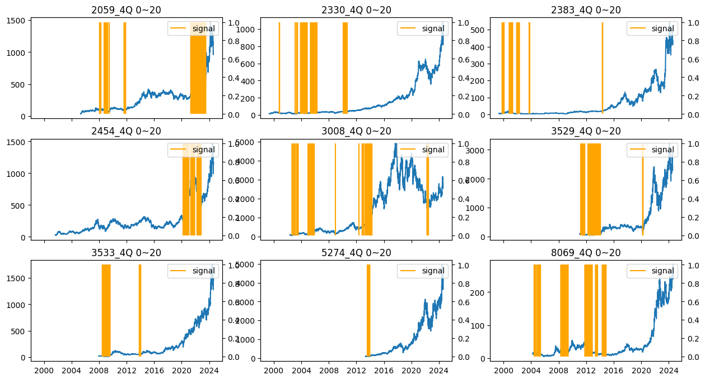
    


    

    


    

    


    

    


    

    


    

    


    

    


    

    


    

    


    

    


```python

'''
Plot 不同組合的signal
PEG ver.

'''
n_rows, n_cols = 3, 3

# Create subplots for each category in a 2x4 grid
fig, axes = plt.subplots(n_rows, n_cols, figsize=(15, 8), sharex=True)

# Flatten the axes array for easier indexing
axes = axes.flatten()

for i, ticker in enumerate(res['股票代號'].unique()):
    sub = res[res['股票代號']==ticker]
    
    mask2 =  (sub['PEG_4Q'] >= 0.7) & (sub['PEG_4Q'] <= 0.9) 
    # sub.loc[mask1 & mask2, ['股票代號', '日期_dt','hold_5Days_ret', 'hold_10Days_ret', 'hold_20Days_ret', 'hold_60Days_ret', 'hold_120Days_ret']].describe()
    sub['signal'] = 0
    # sub.loc[mask1 & mask2, 'signal'] = 1
    sub.loc[mask2, 'signal'] = 1
            
    fig = plt.figure(figsize=(16, 8))
    ax1 = fig.add_subplot(331)

    # axes[i].set_title(f'{ticker}_0Q 80~100, 4Q 0~20')
    axes[i].set_title(f'{ticker}_4Q, PEG 0.7~0.9')
    
    axes[i].plot(sub['日期_dt'], sub['收盤價'], label='price')
    ax2 = axes[i].twinx()
    ax2.vlines(sub.loc[sub['signal'] == 1, '日期_dt'], ymin=0, ymax=1,  label='signal', colors='orange')
    ax2.legend()

    

```

    /var/folders/l8/m7cjxss57kbc_bplh66qpmy40000gn/T/ipykernel_1441/2280781.py:19: SettingWithCopyWarning: 
    A value is trying to be set on a copy of a slice from a DataFrame.
    Try using .loc[row_indexer,col_indexer] = value instead
    
    See the caveats in the documentation: https://pandas.pydata.org/pandas-docs/stable/user_guide/indexing.html#returning-a-view-versus-a-copy
      sub['signal'] = 0
    /var/folders/l8/m7cjxss57kbc_bplh66qpmy40000gn/T/ipykernel_1441/2280781.py:19: SettingWithCopyWarning: 
    A value is trying to be set on a copy of a slice from a DataFrame.
    Try using .loc[row_indexer,col_indexer] = value instead
    
    See the caveats in the documentation: https://pandas.pydata.org/pandas-docs/stable/user_guide/indexing.html#returning-a-view-versus-a-copy
      sub['signal'] = 0
    /var/folders/l8/m7cjxss57kbc_bplh66qpmy40000gn/T/ipykernel_1441/2280781.py:19: SettingWithCopyWarning: 
    A value is trying to be set on a copy of a slice from a DataFrame.
    Try using .loc[row_indexer,col_indexer] = value instead
    
    See the caveats in the documentation: https://pandas.pydata.org/pandas-docs/stable/user_guide/indexing.html#returning-a-view-versus-a-copy
      sub['signal'] = 0
    /var/folders/l8/m7cjxss57kbc_bplh66qpmy40000gn/T/ipykernel_1441/2280781.py:19: SettingWithCopyWarning: 
    A value is trying to be set on a copy of a slice from a DataFrame.
    Try using .loc[row_indexer,col_indexer] = value instead
    
    See the caveats in the documentation: https://pandas.pydata.org/pandas-docs/stable/user_guide/indexing.html#returning-a-view-versus-a-copy
      sub['signal'] = 0
    /var/folders/l8/m7cjxss57kbc_bplh66qpmy40000gn/T/ipykernel_1441/2280781.py:19: SettingWithCopyWarning: 
    A value is trying to be set on a copy of a slice from a DataFrame.
    Try using .loc[row_indexer,col_indexer] = value instead
    
    See the caveats in the documentation: https://pandas.pydata.org/pandas-docs/stable/user_guide/indexing.html#returning-a-view-versus-a-copy
      sub['signal'] = 0
    /var/folders/l8/m7cjxss57kbc_bplh66qpmy40000gn/T/ipykernel_1441/2280781.py:19: SettingWithCopyWarning: 
    A value is trying to be set on a copy of a slice from a DataFrame.
    Try using .loc[row_indexer,col_indexer] = value instead
    
    See the caveats in the documentation: https://pandas.pydata.org/pandas-docs/stable/user_guide/indexing.html#returning-a-view-versus-a-copy
      sub['signal'] = 0
    /var/folders/l8/m7cjxss57kbc_bplh66qpmy40000gn/T/ipykernel_1441/2280781.py:19: SettingWithCopyWarning: 
    A value is trying to be set on a copy of a slice from a DataFrame.
    Try using .loc[row_indexer,col_indexer] = value instead
    
    See the caveats in the documentation: https://pandas.pydata.org/pandas-docs/stable/user_guide/indexing.html#returning-a-view-versus-a-copy
      sub['signal'] = 0
    /var/folders/l8/m7cjxss57kbc_bplh66qpmy40000gn/T/ipykernel_1441/2280781.py:19: SettingWithCopyWarning: 
    A value is trying to be set on a copy of a slice from a DataFrame.
    Try using .loc[row_indexer,col_indexer] = value instead
    
    See the caveats in the documentation: https://pandas.pydata.org/pandas-docs/stable/user_guide/indexing.html#returning-a-view-versus-a-copy
      sub['signal'] = 0
    /var/folders/l8/m7cjxss57kbc_bplh66qpmy40000gn/T/ipykernel_1441/2280781.py:19: SettingWithCopyWarning: 
    A value is trying to be set on a copy of a slice from a DataFrame.
    Try using .loc[row_indexer,col_indexer] = value instead
    
    See the caveats in the documentation: https://pandas.pydata.org/pandas-docs/stable/user_guide/indexing.html#returning-a-view-versus-a-copy
      sub['signal'] = 0


    
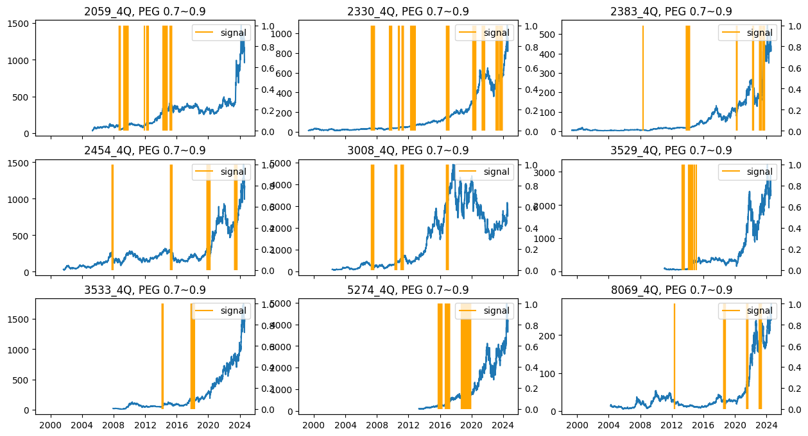
    


    
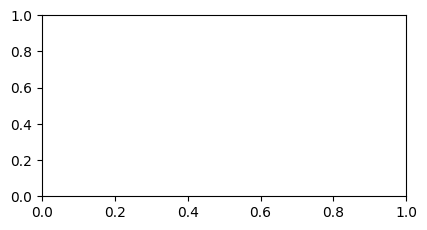
    


    

    


    

    


    

    


    

    


    

    


    

    


    

    


    

    


```python
sub = res[res['股票代號']=='2330']
mask1 = (sub['cata_0Q'] == '80~100_0Q')
mask2 =  (sub['cata_4Q'] == '0~20_4Q')
# sub.loc[mask1 & mask2, ['股票代號', '日期_dt','hold_5Days_ret', 'hold_10Days_ret', 'hold_20Days_ret', 'hold_60Days_ret', 'hold_120Days_ret']].describe()
sub['signal'] = 0
sub.loc[mask1 & mask2, 'signal'] = 1
```


```python
fig = plt.figure(figsize=(16, 8))
ax1 = fig.add_subplot(111)
i = 0
ax1.set_title(f'{quantile}_{i}Q holding 120 ret')

ax1.plot(sub['日期_dt'], sub['收盤價'], label='price')
ax2 = ax1.twinx()
ax2.vlines(sub.loc[sub['signal'] == 1, '日期_dt'], ymin=0, ymax=1,  label='signal', colors='orange')
ax1.legend()
```


```python
signal_dates = sub.loc[sub['signal'] == 1, '日期_dt'].values
```


```python
ax1.vlines(x=signal_dates,  label='signal')
```


```python
sub.loc[mask1, ['hold_5Days_winrate', 'hold_10Days_winrate', 'hold_20Days_winrate', 'hold_60Days_winrate', 'hold_120Days_winrate']].mean()
```


```python
sub.loc[sub['cata_0Q'] == '0~20_0Q', 'hold_120Days_ret'].values
```


```python
preview_res.loc['2330']
```


```python
res_indexPE = res.merge(IndexPE_res, how='left', left_on=(['日期_dt']), right_on=(['日期_dt']))
```


```python
IndexPE_res.columns
```


```python
res_indexPE['股票代號'].unique()
```


```python
sub = IndexPE_res.loc[(IndexPE_res['日期_dt']>'20030701') & (IndexPE_res['日期_dt']<'20101231'), ['日期_dt','agg_PE_0Q', 'agg_PE_1Q', 'agg_PE_2Q', 'agg_PE_3Q', 'agg_PE_4Q']]
sub = IndexPE_res.loc[(IndexPE_res['日期_dt']>'20101231') & (IndexPE_res['日期_dt']<'20191231'), ['日期_dt','agg_PE_0Q', 'agg_PE_1Q', 'agg_PE_2Q', 'agg_PE_3Q', 'agg_PE_4Q']]


i = 1
sub = res_indexPE.loc[(res_indexPE['日期_dt']>'20121231') & (res_indexPE['日期_dt']<'20240509') & (res_indexPE['股票代號']=='2330'), ['日期_dt', '股票代號',f'agg_PE_{i}Q', f'PE_{i}Q']]


i = 4
sub = res_indexPE.loc[(res_indexPE['日期_dt']>'20161231') & (res_indexPE['日期_dt']<'20231109') & (res_indexPE['股票代號']=='8069'), ['日期_dt', '股票代號',f'agg_PE_{i}Q', f'PE_{i}Q']]


fig = plt.figure(figsize=(16, 8))
ax1 = fig.add_subplot(111)
ticker = sub['股票代號'].iloc[-1]
ax1.set_title(f'Index PE vs {ticker}_forward{i}Q')

ax1.plot(sub['日期_dt'], sub[f'PE_{i}Q'],  label=f'{ticker}_PE_{i}Q')

ax1.plot(sub['日期_dt'], sub[f'agg_PE_{i}Q'],  label=f'index_PE_{i}Q')


ax1.legend()
```


```python
ticker = (res_indexPE['股票代號']=='2330')
q = 4
tmp = pd.DataFrame()
for i in [2, 4, 6, 8]:
    signal = (res_indexPE[f'PE_{q}Q']>res_indexPE[f'agg_PE_{q}Q']) & (res_indexPE[f'PE_{q}Q']<res_indexPE[f'q{i}0'])
    # tmp.loc[f'<q{i}0', ['hold_5Days_ret', 'hold_10Days_ret', 'hold_20Days_ret', 'hold_60Days_ret', 'hold_120Days_ret']] = res_indexPE.loc[signal, ['hold_5Days_ret', 'hold_10Days_ret', 'hold_20Days_ret', 'hold_60Days_ret', 'hold_120Days_ret']].mean()
    tmp.loc[f'<q{i}0', ['hold_5Days_winrate', 'hold_10Days_winrate', 'hold_20Days_winrate', 'hold_60Days_winrate', 'hold_120Days_winrate']] = res_indexPE.loc[signal, ['hold_5Days_winrate', 'hold_10Days_winrate', 'hold_20Days_winrate', 'hold_60Days_winrate', 'hold_120Days_winrate']].mean()
    # res_indexPE.loc[signal, ['hold_5Days_winrate', 'hold_10Days_winrate', 'hold_20Days_winrate', 'hold_60Days_winrate', 'hold_120Days_winrate']].describe()
```


```python
tmp
```

cumsum or rolling min/max + shift 就可以了


```python
def rolling_max(df):
    '''
    groupby ticker
    '''
    for i in range(1, 5):
        df[f'{i}_cummax_PE'] = pe_res[f'{i}_max_PE'].cummax().shift(1)
        df[f'{i}_cummin_PE'] = pe_res[f'{i}_min_PE'].cummin().shift(1)
        df[f'{i}_cummean_PE'] = pe_res[f'{i}_min_PE'].expanding().mean().shift(1)

        df[f'{i}_rolling5ymax_PE'] = pe_res[f'{i}_max_PE'].rolling(20).max().shift(1)
        df[f'{i}_rolling5ymin_PE'] = pe_res[f'{i}_min_PE'].rolling(20).min().shift(1)
        df[f'{i}_rolling5ymean_PE'] = pe_res[f'{i}_min_PE'].rolling(20).mean().shift(1)

        df[f'{i}_rolling3ymax_PE'] = pe_res[f'{i}_max_PE'].rolling(12).max().shift(1)
        df[f'{i}_rolling3ymin_PE'] = pe_res[f'{i}_min_PE'].rolling(12).min().shift(1)
        df[f'{i}_rolling3ymean_PE'] = pe_res[f'{i}_min_PE'].rolling(12).mean().shift(1)

        df[f'{i}_rolling10ymax_PE'] = pe_res[f'{i}_max_PE'].rolling(40).max().shift(1)
        df[f'{i}_rolling10ymin_PE'] = pe_res[f'{i}_min_PE'].rolling(40).min().shift(1)
        df[f'{i}_rolling10ymean_PE'] = pe_res[f'{i}_min_PE'].rolling(40).mean().shift(1)

    return df
        
```


```python
pe_res = pe_res.groupby('股票代號').apply(rolling_max).reset_index(drop=True)
```


```python
# cumsum 至上一季 PE最高值, cumsum 至上一季 PE最低值, rolling 5y 至上一季 PE最高值,  rolling 5y 至上一季 PE最低值
pe_res.loc[(pe_res['股票代號']=='2330') , ['年季', '1_cummax_PE', '1_cummin_PE', '1_rolling5ymax_PE', '1_rolling5ymin_PE']]
```

### 把 截至上一季 PE的高低點 算出來後 與股價merge


```python
combine_df = combine_df.merge(pe_res, how='left', left_on=(['股票代號', '年季']), right_on=(['股票代號', '年季']), suffixes=('', '_MINMAX'))
```


```python
combine_df.loc[(combine_df['股票代號']=='2330') & (combine_df['年季']=='202301') , ['日期','PE_1Q' ,'1_cummax_PE', '1_cummin_PE', '1_rolling5ymax_PE', '1_rolling5ymin_PE']]
```


```python
combine_df.loc[(combine_df['股票代號']=='2454'), ['日期', '收盤價', 'PE_1Q', 'knowNext1Q', '1_rolling5ymax_PE', '1_rolling5ymin_PE', '1_rolling5ymean_PE']].dropna()
```


```python
for i in range(1, 5):
    combine_df[f'knowNext{i}Q_5y最高價'] = combine_df[f'knowNext{i}Q'] * combine_df[f'{i}_rolling5ymax_PE']
    combine_df[f'knowNext{i}Q_5y最低價'] = combine_df[f'knowNext{i}Q'] * combine_df[f'{i}_rolling5ymin_PE']
    combine_df[f'knowNext{i}Q_5y平均價'] = combine_df[f'knowNext{i}Q'] * combine_df[f'{i}_rolling5ymean_PE']

    combine_df[f'knowNext{i}Q_3y最高價'] = combine_df[f'knowNext{i}Q'] * combine_df[f'{i}_rolling3ymax_PE']
    combine_df[f'knowNext{i}Q_3y最低價'] = combine_df[f'knowNext{i}Q'] * combine_df[f'{i}_rolling3ymin_PE']
    combine_df[f'knowNext{i}Q_3y平均價'] = combine_df[f'knowNext{i}Q'] * combine_df[f'{i}_rolling3ymean_PE']

    combine_df[f'knowNext{i}Q_10y最高價'] = combine_df[f'knowNext{i}Q'] * combine_df[f'{i}_rolling10ymax_PE']
    combine_df[f'knowNext{i}Q_10y最低價'] = combine_df[f'knowNext{i}Q'] * combine_df[f'{i}_rolling10ymin_PE']
    combine_df[f'knowNext{i}Q_10y平均價'] = combine_df[f'knowNext{i}Q'] * combine_df[f'{i}_rolling10ymean_PE']

    combine_df[f'knowNext{i}Q_cumsum最高價'] = combine_df[f'knowNext{i}Q'] * combine_df[f'{i}_cummax_PE']
    combine_df[f'knowNext{i}Q_cumsum最低價'] = combine_df[f'knowNext{i}Q'] * combine_df[f'{i}_cummin_PE']
    combine_df[f'knowNext{i}Q_cumsum平均價'] = combine_df[f'knowNext{i}Q'] * combine_df[f'{i}_cummean_PE']    
```


```python
#  在知曉下一季EPS後 利用過往3季 + 未來1季 去算年度EPS
#  在用該EPS 與當下股價計算 預知PE
# 期間預知PE的min, max 將獨立出來
combine_df.loc[(combine_df['股票代號']=='8069') & (combine_df['年季']=='202301'), ['日期', 'PE_1Q', '1_max_PE', '1_min_PE', '1_mean_PE', 'hold_20Days_ret', 'hold_60Days_ret', 'hold_120Days_ret']]
```

### 繪製本益比河流圖時 河流應為過去一段時間的min, max
ex : under 知曉下一Q EPS的情況下  
過去10年 所有在知曉下一Q對應的EPS  
min, max 作為河流 對照如今的 預知PE  

可以try 的財務指標
1. 存貨(千)
2. 研發費用(千)
3. PPE (不動產相關的變化)

先做圖 在想要怎麼辦


```python
combine_df.columns[0:30]
```


```python
combine_df.columns[30:60]
```


```python
combine_df.columns[60:90]
```


```python
combine_df.columns[90:120]
```


```python
combine_df.columns[120:150]
```


```python
combine_df.columns[150:180]
```


```python
combine_df.columns[180:210]
```


```python
combine_df['股票代號'].unique()
```


```python
sub = combine_df[combine_df['股票代號']=='2330']
```


```python
sub.reset_index(drop=True, inplace=True)
```


```python
def set_signal(data):
    # Initialize the signal and state
    i = 4
    data['signal'] = 0
    data.loc[(data[f'PE_{i}Q'] <= data[f'{i}_rolling5ymean_PE']), 'signal'] = 1
    state = 0  # 0: Normal, 1: Lower bound hit, 2: Rebounding

    for idx, row in data.iterrows():
        
        if state == 0:
            # Normal period
            if row[f'PE_{i}Q'] <= row[f'{i}_rolling5ymean_PE']:
                data.at[idx, 'signal'] = 1
                state = 1
        elif state == 1:
            # After hitting the lower bound, waiting for rebound
            if row[f'PE_{i}Q'] > row[f'{i}_rolling5ymean_PE']:
                data.at[idx, 'signal'] = 1
                state = 2
        elif state == 2:
            # Rebounding, waiting for upper bound
            if row[f'PE_{i}Q'] >= row[f'{i}_rolling5ymax_PE']:
                data.at[idx, 'signal'] = 0
                state = 0
            else:
                data.at[idx, 'signal'] = 1
    
    return data
```


```python
def set_signal(data):
    # Initialize the signal and state
    i = 4
    data['signal'] = 0
    data.loc[(data[f'PE_{i}Q'] <= data[f'{i}_rolling5ymin_PE']), 'signal'] = 1
    state = 0  # 0: Normal, 1: Lower bound hit, 2: Rebounding

    for idx, row in data.iterrows():
        
        if state == 0:
            # Normal period
            if row[f'PE_{i}Q'] <= row[f'{i}_rolling5ymin_PE']:
                data.at[idx, 'signal'] = 1
                state = 1
        elif state == 1:
            # After hitting the lower bound, waiting for rebound
            if row[f'PE_{i}Q'] > row[f'{i}_rolling5ymin_PE']:
                data.at[idx, 'signal'] = 1
                state = 2
        elif state == 2:
            # Rebounding, waiting for upper bound
            if row[f'PE_{i}Q'] >= row[f'{i}_rolling5ymax_PE']:
                data.at[idx, 'signal'] = 0
                state = 0
            else:
                data.at[idx, 'signal'] = 1
    
    return data
```


```python
# 反向
def set_signal_reverse(data):
    # Initialize the signal and state
    i = 1
    data['signal'] = 0
    data.loc[(data[f'PE_{i}Q'] >= (data[f'{i}_rolling5ymax_PE'] * 0.7)), 'signal'] = 1
    state = 0  # 0: Normal, 1: Lower bound hit, 2: Rebounding

    for idx, row in data.iterrows():
        
        if state == 0:
            # Normal period
            if row[f'PE_{i}Q'] >= (row[f'{i}_rolling5ymax_PE'] * 0.7):
                data.at[idx, 'signal'] = 1
                state = 1
        elif state == 1:
            # After hitting the lower bound, waiting for rebound
            if row[f'PE_{i}Q'] >= row[f'{i}_rolling5ymean_PE']:
                data.at[idx, 'signal'] = 1
                state = 2
        elif state == 2:
            # Rebounding, waiting for upper bound
            if row[f'PE_{i}Q'] <= row[f'{i}_rolling5ymean_PE']:
                data.at[idx, 'signal'] = 0
                state = 0
            else:
                data.at[idx, 'signal'] = 1
    
    return data
```


```python
# 反向
def set_signal_reverse(data):
    # Initialize the signal and state
    i = 1
    data['signal'] = 0
    data.loc[(data[f'PE_{i}Q'] >= (data[f'{i}_rolling5ymean_PE'] * 1.2)) * (data[f'PE_{i}Q'] <= (data[f'{i}_rolling5ymax_PE'] * 0.9)), 'signal'] = 1
    state = 0  # 0: Normal, 1: Lower bound hit, 2: Rebounding

    for idx, row in data.iterrows():
        
        if state == 0:
            # Normal period
            if row[f'PE_{i}Q'] >= (row[f'{i}_rolling5ymean_PE'] * 1.2):
                data.at[idx, 'signal'] = 1
                state = 1
        elif state == 1:
            # After hitting the lower bound, waiting for rebound
            if row[f'PE_{i}Q'] >= (row[f'{i}_rolling5ymax_PE'] * 0.9):
                data.at[idx, 'signal'] = 0
                state = 2
        elif state == 2:
            # Rebounding, waiting for upper bound
            if row[f'PE_{i}Q'] >= (row[f'{i}_rolling5ymean_PE'] * 1.2):
                data.at[idx, 'signal'] = 0
                
            else:
                data.at[idx, 'signal'] = 1
                state = 0
    
    return data
```


```python
signal_df = combine_df.groupby('股票代號').apply(set_signal).reset_index(drop=True)
```


```python
signal_df = combine_df.groupby('股票代號').apply(set_signal_reverse).reset_index(drop=True)
```


```python

def vector_backtest_delay_entering(df, delay_days):
    # prodction ver.

    # input: df, 需要有signal columns, output : [{trade_data1}, {trade_data2}, ...] (list中包含多個dict)
    # df['signal'] != df['signal'].shift(1) 會return boolean, 對此用cumsum
    # 在false的時候 就不會+1 就可以讓連續的組出現一樣的數字
    # [0  , 1, 1, 0, 0, 1, 1, 1] (df['signal'])
    # [nan, 0, 1, 1, 0, 0, 1, 1] (df['signal'].shift(1))
    # [T, T, F, T, F, T, F, F] -> [1, 2, 2, 3, 3, 4, 4, 4](cumsum)
    # 然而連續組 同時包含signal==1 & signal==0 部分
    # 利用df[signal]==1 來取得signal==1的index

    ## 想要include 最新持有的狀態 -> 若是最後一個row 的連續持有日期 >=4 (3個訊號 隔日才會買進 目前沒有持有)
    ## return的計算 要改

    if not all(col in df.columns for col in ['日期', '股票代號', '收盤價', 'signal']):
        raise KeyError("df.columns should have 日期, 股票代號, 收盤價, signal")

    df['次日收盤價'] = df['收盤價'].shift(-1)
    df['次二日收盤價'] = df['收盤價'].shift(-2)
    
    
    # 用來確認退場reaso

    # 將所有連續的事件相同數字表示, 而事件轉換時, 數字不相同
    change_indices = (df['signal'] != df['signal'].shift(1)).cumsum() 
    # 只想要group signal==1的事件
    groups = df[df['signal'] == 1].groupby(change_indices[df['signal'] == 1])

    event_list_all = []
    for _, group in groups:
        '''
        盤後才知道訊號, 故操作都會在後續日期...
        訊號開始日期(start_date): 該日收盤後有符合訊號, 故買入價會是隔一日的收盤價
        訊號最後日期(end_date): 代表隔日收盤後就無訊號, 故賣出價是訊號最後日的隔二日收盤價
        ex: date=[10/1, 10/2, 10/3, 10/4], signal = [1, 1, 0, 0]
        則10/1為訊號開始日期 -> 10/2收盤價買入
        10/2為訊號最後日期 -> 10/3收盤才知道訊號結束 -> 10/4收盤賣出 
        '''
        if len(group) <= delay_days:
            # 訊號數不足 不會進場
            continue
        else:
            group.reset_index(drop=True, inplace=True)
            group = group.iloc[delay_days::]
        
        # extract info from group
        trading_dict = {
           '股票代號': group['股票代號'].iloc[-1],
           '買入日期': group['日期'].iloc[0],
           '賣出日期': group['日期'].iloc[-1],
           '買入價' : group['次日收盤價'].iloc[0],
           '賣出價' : group['次二日收盤價'].iloc[-1],
           '期間最高價' : group['次日收盤價'].max(),
           '持有天數' : len(group),
           '持有狀態' : 'history',
           'return' :  (group['次二日收盤價'].iloc[-1]/group['次日收盤價'].iloc[0]) - 1,
        }
        
        event_list_all.append(trading_dict)
    
    # production情況下 每日最新一個group的狀況不一定
    '''
    原本是收盤後跑 下午3點跑
    改為開盤前 早上8點跑 這樣昨天的data一定更新好了 故 持有狀態的用詞修改
    從buy_tomorrow -> buy_today
    '''
    
    return event_list_all
```


```python
vector_backtest_delay_entering(sub, 0)
```


```python
res = signal_df.groupby('股票代號').apply(lambda df : vector_backtest_delay_entering(df, 0))
```


```python
res
```


```python
import pandas as pd
import numpy as np

# Simulated data with multiple cycles
dates = pd.to_datetime([
    '2024-01-01', '2024-01-02', '2024-01-03', '2024-01-04', '2024-01-05',  
    '2024-01-06', '2024-01-07', '2024-01-08',  
    '2024-01-09', '2024-01-10', '2024-01-11', '2024-01-12',  
    '2024-01-13', '2024-01-14',  
    '2024-01-15', '2024-01-16', '2024-01-17',  
    '2024-01-18', '2024-01-19', '2024-01-20'
])

# Simulated P/E ratios
data = pd.DataFrame({
    'PE_ratio': [20, 21, 19, 22, 23,  
                 10, 9, 11,  
                 14, 16, 18, 20,  
                 35, 36,  
                 10, 9, 12,  
                 15, 18, 20],  
    'Adj Close': np.random.randn(len(dates)) * 10 + 100  
}, index=dates)

# Parameters
lower_bound = 10
upper_bound = 35

# Initialize the signal and state
data['Signal'] = 0
data.loc[(data['PE_ratio'] <= lower_bound), 'Signal'] = 1
state = 0  # 0: Normal, 1: Lower bound hit, 2: Rebounding

for i in range(len(data)):
    pe_ratio = data.iloc[i]['PE_ratio']
    
    if state == 0:
        # Normal period
        if pe_ratio <= lower_bound:
            data.at[data.index[i], 'Signal'] = 1
            state = 1
    elif state == 1:
        # After hitting the lower bound, waiting for rebound
        if pe_ratio > lower_bound:
            data.at[data.index[i], 'Signal'] = 1
            state = 2
    elif state == 2:
        # Rebounding, waiting for upper bound
        if pe_ratio >= upper_bound:
            data.at[data.index[i], 'Signal'] = 0
            state = 0
        else:
            data.at[data.index[i], 'Signal'] = 1

print("Filtered Data with Signals:")
print(data)

```


```python
trading_dict = signal_df.groupby('股票代號').apply(lambda df : vector_backtest_delay_entering(df, 0))
```


```python
 # 整理backtest result
code = signal_df['股票代號'].unique().tolist()
res_df = pd.DataFrame()
for c in code:
    tmp = trading_dict[c]
    tmp_df = pd.DataFrame(tmp)
    if not tmp_df.empty:
        res_df = pd.concat([res_df, tmp_df], ignore_index=True)
```


```python
code
```


```python
res_df['precision'] = res_df['return'].apply(lambda x : 1 if x > 0 else 0)
```


```python
res_df[['return', 'precision','持有天數']].describe()
```


```python
res_df.loc[res_df['股票代號']=='2383', ['return', '持有天數']].describe()
```


```python
for i in code:
    print(i)
    print(res_df.loc[res_df['股票代號']==i, ['return', '持有天數']].describe())
```


```python
trading_dict['2059']
```


```python
sub['forwardPE'].expanding().std()
```


```python
# combine_df = price_df.merge(resample_mon_df, how='left', left_on=(['日期_dt', '股票代號']), right_on=(['公告日_dt', '股票代號']))
```

## columns 展示


```python
combine_df.columns[0:30]
```


```python
combine_df.columns[30:60]
```


```python
combine_df.columns[60:90]
```


```python
combine_df.columns[90:120]
```


```python
combine_df.columns[120:150]
```


```python
combine_df.columns[150:180]
```


```python


# Create subplots without shared axes
fig, axes = plt.subplots(3, 3, figsize=(12, 8))

# Flatten the axes array for easy iteration
axes = axes.flatten()

# Group by 'Stock' and plot each group in a separate subplot
for ax, (name, group) in zip(axes, combine_df.groupby('股票代號')):
    ax.plot(group['日期_dt'], group['收盤價'], label='Price')
    ax.set_title(name)
    ax.set_xlabel('Date')
    # ax.set_ylabel('Price', color='blue')
    ax.legend(loc=2)
    
    # Create a secondary y-axis and plot 'Volume'
    ax2 = ax.twinx()
    ax2.plot(group['日期_dt'], group['稅後純益率(%)'], label='net profit ratio', color='orange', alpha=0.6)
    # ax2.set_ylabel('monthly rev', color='green')
    ax2.legend(loc=3)
    # Set axis colors to match the data they represent
    ax.tick_params(axis='y', labelcolor='blue')
    ax2.tick_params(axis='y', labelcolor='green')

# Adjust layout to prevent overlap
plt.tight_layout()

# Show the plot
plt.show()

```


```python
combine_df.loc[combine_df['股票代號']=='8069', '近三月合併營收(千)'].plot()
```


```python
combine_df['股票代號'].unique()
```


```python
sub = combine_df.loc[combine_df['股票代號']=='3529']
```

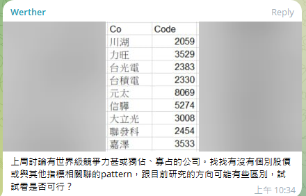


```python
fig = plt.figure(figsize=(16, 8))
ax1 = fig.add_subplot(111)
ax1.set_title('2317')
ax1.plot(sub['公告日_dt'], sub['收盤價'],  label='price')
ax2 = ax1.twinx()
ax2.plot(sub['公告日_dt'], sub['近12月累計合併營收(千)'], label='12m_rev_agg', color='orange')


ax1.legend(loc=1)
```

指標相關聯 我覺得應該不只是財務數據 也有其他的東西但我們無法access  
籌碼相關, 分析師估值等  
但以我目前的情況 應該是做估值 並建立買賣點  
-> 存貨

大概看了一下 營收的趨勢整體多為向上，股價也是 但若將週期縮小至2-3個月 營收與股價背離的情況很常發生  
判斷營收成長 or 衰退的趨勢 其time frame也要抓好  
畢竟營收整個趨勢變化較慢 但方向較穩定 但股價有更多雜訊因素


```python
sub = combine_df[combine_df['股票代號']=='2330']
sub = sub[(~sub['3m_diff'].isna()) & (~sub['12m_diff'].isna())]
```


```python
sub.isna().sum()
```


```python
combine_df.columns[-60:-30]
```


```python
sub['optimize'] = (sub['3m_diff'] > sub['12m_diff']).apply(lambda x : 1 if x else 0)
```


```python
sub['近三月合併營收(千)']
```


```python
sub['3m_diff']
```


```python
694442123 - 673510177
```


```python

```
